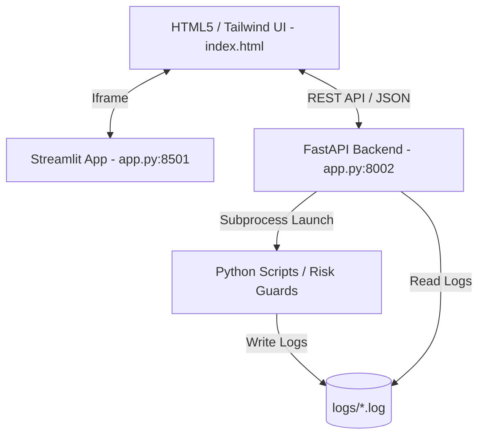

# CustodiaCloud MVP — Technical & Architectural Documentation

CustodiaCloud is a **B2B risk-first quantitative research and deployment platform** designed for systematic trading organizations. This document details the technical architecture, component interactions, dynamic UI mechanics, state synchronization, and execution patterns implemented in the MVP.

---

## 1. System Architecture & Components

The MVP operates as a decoupled client-server application hosted locally:



### FastAPI Backend Server (`app.py` - Port 8002)
Serves as the central API gateway. It handles:
- **System State Management**: Persistent tracking of the active asset class and broker adapter.
- **Background Job Execution**: Spawning async subprocesses to run data pipeline stages, training, risk audits, or option Greek calculations.
- **Log Streaming**: Reading and tailing log files from the local filesystem to stream real-time events to the frontend.

### Streamlit Frontend Wrapper (`app.py` - Port 8501)
Binds the user interface. It acts as an entrypoint for the Streamlit server and embeds `index.html` inside a responsive fullscreen iframe. This allows developers to leverage python-based servers while presenting a custom, high-fidelity Web UI.

### Web Interface (`index.html`)
A premium, dark-themed, glassmorphic single-page application (SPA). Built with Vanilla CSS and Tailwind CSS, it orchestrates system interactions via standard Fetch API calls to the FastAPI backend.

---

## 2. Active Context Selection (Asset & Adapter Routing)

To prevent systematic confusion and ensure clean deployment parameters, the Home page features an **Active Context Selector**:

```
+-----------------------------------------------------------------------------------+
|                           ACTIVE CONTEXT (ASSET & ADAPTER)                        |
|                                                                                   |
|  [US Equities]   [Forex OTC]   [CME Futures]   [Digital Assets]   [Listed Options]|
|     (EQUITY)       (FOREX)       (FUTURES)         (CRYPTO)          (OPTIONS)    |
|                                                                                   |
|  Active Adapter (Broker): [ ALPACA                             [v] ]              |
+-----------------------------------------------------------------------------------+
```

### Supported Mappings

When a user clicks on an asset card, the interface dynamically filters the available broker adapters in the dropdown list:

| Asset Class | Identifier | Allowed Adapters (Brokers) | Default Adapter |
|-------------|------------|----------------------------|-----------------|
| **US Equities** | `equity` | `alpaca`, `polygon`, `yahoo` | `alpaca` |
| **Forex OTC** | `forex` | `oanda`, `dukascopy` | `oanda` |
| **CME Futures** | `futures` | `ib`, `binance_futures` | `ib` |
| **Digital Assets** | `crypto` | `binance`, `deribit` | `binance` |
| **Listed Options** | `options` | `ib`, `theta_data`, `deribit`, `polygon` | `ib` |

### State Synchronization Flow
1. **Select Asset Card**: The user selects an asset class card.
2. **Filter & Populate**: JavaScript updates `activeAsset`, selects the default adapter, and repopulates the `#adapter-select` select options.
3. **POST State**: The frontend sends a JSON payload to `POST /api/system_state`:
   ```json
   {
     "active_asset": "forex",
     "active_adapter": "oanda"
   }
   ```
4. **Backend Persist**: FastAPI updates the global `ACTIVE_ASSET` and `ACTIVE_ADAPTER` variables in memory.
5. **Toast Confirmation**: A system toast notification pops up indicating the updated context.
6. **Fetch Status**: A state refresh query updates the dashboard KPI metrics cards based on the selected asset class values.

---

## 3. Dynamic Side Panel & Sidebar Filtering

To simplify the user interface, sidebar navigation buttons and categories automatically adapt to the active context:

- **Filtering Attributes**: Navigation buttons are declared with a `data-assets` attribute:
  ```html
  <button id="btn-pdt-margin-guard" data-assets="equity" ...>PDT & Margin Guard</button>
  <button id="btn-forex-swaps" data-assets="forex" ...>Forex Swaps Monitor</button>
  ```
- **Tab Toggling**: When the context changes, `updateUIContext()` reads the `data-assets` list. If the active asset is not allowed, the button is hidden (`.hidden`). If the user was currently viewing the hidden tab, they are automatically routed back to the Home tab.
- **Empty Category Cleanup**: If all nested buttons in a sidebar category block (e.g. `📊 Панель управления`) are hidden, the block container itself is hidden.

---

## 4. Adaptive Configuration Overrides

Changing the active asset class updates the configuration path inputs inside the training and backtesting pipelines:

- **Config Path Mapping**:
  - `equity` -> Train: `configs/config_train_stocks.yaml` | Backtest: `configs/config_backtest_stocks.yaml`
  - `forex` -> Train: `configs/config_train_forex.yaml` | Backtest: `configs/config_backtest_forex.yaml`
  - `futures` -> Train: `configs/config_train_futures.yaml` | Backtest: `configs/config_live_futures.yaml`
  - `crypto`/`options` -> Fallback to generic: `configs/config_train.yaml` | `configs/sandbox.yaml`
- **Dynamic Field Modification**: When rendering generic module forms, input fields like `input-config` automatically load the correct default path mapping.
- **Backend Fallback Validation**: When calling `/api/run_job`, if the submitted config parameter is generic (e.g. `configs/sandbox.yaml` or `configs/ingest.yaml`), the backend dynamically replaces it with the asset-specific YAML path to prevent invalid configuration executions.

---

## 5. Job Subprocesses & Log Tailing

When a module action is triggered (e.g., executing the Option Greeks calculations or running a backtest):

1. **Subprocess Spawn**: The backend runs the corresponding python script in a shell subprocess via `subprocess.Popen` in `app.py`.
2. **Logging Destination**: Execution output (stdout/stderr) is redirected to a specific log file in the `logs/` directory (e.g. `logs/forex_swaps_check.log` or `logs/backtest.log`).
3. **Log Dropdown Filtering**: The Logs module dropdown list (`#log-selector`) dynamically filters options to show only logs that match the current asset context:
   - Equities: adds `pdt_guard_check.log`
   - Forex: adds `forex_swaps_check.log`
   - Futures: adds `futures_span_check.log`
   - Options: adds `options_greeks_calc.log`
4. **Tailing & Streaming**: Clicking a log file streams the last 200 lines to the `#log-console-output` window inside the UI using periodic fetch polls (`GET /api/logs?name=...`).

---

## 6. How to Run the MVP System

To launch the MVP platform with the dynamic selector active, run the backend and frontend servers in separate terminal instances:

### 1. Launch FastAPI Backend
Ensure you provide a placeholder or valid token for `SEASONALITY_API_TOKEN` so the check passes:
```bash
SEASONALITY_API_TOKEN=mock_token .venv/bin/python -m uvicorn app:api --port 8002 --host 127.0.0.1
```

### 2. Launch Streamlit Frontend
```bash
SEASONALITY_API_TOKEN=mock_token .venv/bin/streamlit run app.py --server.port 8501 --server.address 127.0.0.1
```

### 3. Open Browser
Open your browser and navigate to the local Streamlit wrapper:
```
http://127.0.0.1:8501/
```
From here, you can select different asset classes on the Home tab, verify sidebar button toggles, inspect configuration inputs, run calculations, and watch streamed logs.
