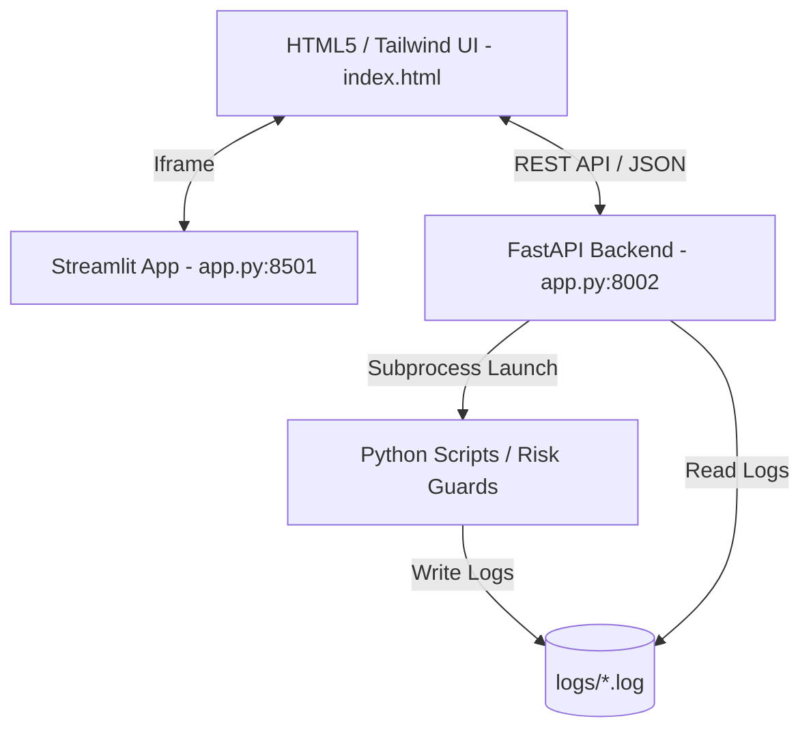

# CustodiaCloud MVP — Technical & Architectural Documentation

CustodiaCloud is a **B2B risk-first quantitative research and deployment platform** designed for systematic trading organizations. This document details the technical architecture, component interactions, dynamic UI mechanics, state synchronization, and execution patterns implemented in the MVP.

---

## 1. System Architecture & Components

The MVP operates as a decoupled client-server application hosted locally:



### FastAPI Backend Server (`app.py` - Port 8002)
Serves as the central API gateway. It handles:
- **System State Management**: Persistent tracking of the active asset class and broker adapter.
- **Background Job Execution**: Spawning async subprocesses to run data pipeline stages, training, risk audits, or option Greek calculations.
- **Log Streaming**: Reading and tailing log files from the local filesystem to stream real-time events to the frontend.

### Streamlit Frontend Wrapper (`app.py` - Port 8501)
Binds the user interface. It acts as an entrypoint for the Streamlit server and embeds `index.html` inside a responsive fullscreen iframe. This allows developers to leverage python-based servers while presenting a custom, high-fidelity Web UI.

### Web Interface (`index.html`)
A premium, dark-themed, glassmorphic single-page application (SPA). Built with Vanilla CSS and Tailwind CSS, it orchestrates system interactions via standard Fetch API calls to the FastAPI backend.

---

## 2. Active Context Selection (Asset & Adapter Routing)

To prevent systematic confusion and ensure clean deployment parameters, the Home page features an **Active Context Selector**:

```
+-----------------------------------------------------------------------------------+
|                           ACTIVE CONTEXT (ASSET & ADAPTER)                        |
|                                                                                   |
|  [US Equities]   [Forex OTC]   [CME Futures]   [Digital Assets]   [Listed Options]|
|     (EQUITY)       (FOREX)       (FUTURES)         (CRYPTO)          (OPTIONS)    |
|                                                                                   |
|  Active Adapter (Broker): [ ALPACA                             [v] ]              |
+-----------------------------------------------------------------------------------+
```

### Supported Mappings

When a user clicks on an asset card, the interface dynamically filters the available broker adapters in the dropdown list:

| Asset Class | Identifier | Allowed Adapters (Brokers) | Default Adapter |
|-------------|------------|----------------------------|-----------------|
| **US Equities** | `equity` | `alpaca`, `polygon`, `yahoo` | `alpaca` |
| **Forex OTC** | `forex` | `oanda`, `dukascopy` | `oanda` |
| **CME Futures** | `futures` | `ib`, `binance_futures` | `ib` |
| **Digital Assets** | `crypto` | `binance`, `deribit` | `binance` |
| **Listed Options** | `options` | `ib`, `theta_data`, `deribit`, `polygon` | `ib` |

### State Synchronization Flow
1. **Select Asset Card**: The user selects an asset class card.
2. **Filter & Populate**: JavaScript updates `activeAsset`, selects the default adapter, and repopulates the `#adapter-select` select options.
3. **POST State**: The frontend sends a JSON payload to `POST /api/system_state`:
   ```json
   {
     "active_asset": "forex",
     "active_adapter": "oanda"
   }
   ```
4. **Backend Persist**: FastAPI updates the global `ACTIVE_ASSET` and `ACTIVE_ADAPTER` variables in memory.
5. **Toast Confirmation**: A system toast notification pops up indicating the updated context.
6. **Fetch Status**: A state refresh query updates the dashboard KPI metrics cards based on the selected asset class values.

---

## 3. Dynamic Side Panel & Sidebar Filtering

To simplify the user interface, sidebar navigation buttons and categories automatically adapt to the active context:

- **Filtering Attributes**: Navigation buttons are declared with a `data-assets` attribute:
  ```html
  <button id="btn-pdt-margin-guard" data-assets="equity" ...>PDT & Margin Guard</button>
  <button id="btn-forex-swaps" data-assets="forex" ...>Forex Swaps Monitor</button>
  ```
- **Tab Toggling**: When the context changes, `updateUIContext()` reads the `data-assets` list. If the active asset is not allowed, the button is hidden (`.hidden`). If the user was currently viewing the hidden tab, they are automatically routed back to the Home tab.
- **Empty Category Cleanup**: If all nested buttons in a sidebar category block (e.g. `📊 Панель управления`) are hidden, the block container itself is hidden.

---

## 4. Adaptive Configuration Overrides

Changing the active asset class updates the configuration path inputs inside the training and backtesting pipelines:

- **Config Path Mapping**:
  - `equity` -> Train: `configs/config_train_stocks.yaml` | Backtest: `configs/config_backtest_stocks.yaml`
  - `forex` -> Train: `configs/config_train_forex.yaml` | Backtest: `configs/config_backtest_forex.yaml`
  - `futures` -> Train: `configs/config_train_futures.yaml` | Backtest: `configs/config_live_futures.yaml`
  - `crypto`/`options` -> Fallback to generic: `configs/config_train.yaml` | `configs/sandbox.yaml`
- **Dynamic Field Modification**: When rendering generic module forms, input fields like `input-config` automatically load the correct default path mapping.
- **Backend Fallback Validation**: When calling `/api/run_job`, if the submitted config parameter is generic (e.g. `configs/sandbox.yaml` or `configs/ingest.yaml`), the backend dynamically replaces it with the asset-specific YAML path to prevent invalid configuration executions.

---

## 5. Job Subprocesses & Log Tailing

When a module action is triggered (e.g., executing the Option Greeks calculations or running a backtest):

1. **Subprocess Spawn**: The backend runs the corresponding python script in a shell subprocess via `subprocess.Popen` in `app.py`.
2. **Logging Destination**: Execution output (stdout/stderr) is redirected to a specific log file in the `logs/` directory (e.g. `logs/forex_swaps_check.log` or `logs/backtest.log`).
3. **Log Dropdown Filtering**: The Logs module dropdown list (`#log-selector`) dynamically filters options to show only logs that match the current asset context:
   - Equities: adds `pdt_guard_check.log`
   - Forex: adds `forex_swaps_check.log`
   - Futures: adds `futures_span_check.log`
   - Options: adds `options_greeks_calc.log`
4. **Tailing & Streaming**: Clicking a log file streams the last 200 lines to the `#log-console-output` window inside the UI using periodic fetch polls (`GET /api/logs?name=...`).

---

## 6. How to Run the MVP System

To launch the MVP platform with the dynamic selector active, run the backend and frontend servers in separate terminal instances:

### 1. Launch FastAPI Backend
Ensure you provide a placeholder or valid token for `SEASONALITY_API_TOKEN` so the check passes:
```bash
SEASONALITY_API_TOKEN=mock_token .venv/bin/python -m uvicorn app:api --port 8002 --host 127.0.0.1
```

### 2. Launch Streamlit Frontend
```bash
SEASONALITY_API_TOKEN=mock_token .venv/bin/streamlit run app.py --server.port 8501 --server.address 127.0.0.1
```

### 3. Open Browser
Open your browser and navigate to the local Streamlit wrapper:
```
http://127.0.0.1:8501/
```
From here, you can select different asset classes on the Home tab, verify sidebar button toggles, inspect configuration inputs, run calculations, and watch streamed logs.

---

## 7. P0/P1 Capabilities (Honesty, MLOps, Real Backtests, Live Risk & Execution)

These were added on top of the base MVP and are surfaced in the UI.

### 7.1 Security & honesty (P0)
- **Global API auth** (`app.py`): middleware on every `/api/*`. Env `RIVEN_API_AUTH_MODE`:
  `loopback` (default — local browser works without a key, remote requires `X-API-Key`),
  `strict`, `off`. Frontend auto-attaches `X-API-Key` from `window.RIVEN_API_KEY`/localStorage.
- **Honesty flags**: mock/demo data is never presented as real. Responses carry
  `simulated`/`demo`/`data_source` flags; UI shows a 🟡 **SIMULATED** badge (trades, holdings),
  a demo banner (compliance MiFID/DORA), and a `rule_based_advisory` label on the copilot.
  `/api/ai-act/explain/{id}` returns **404** instead of synthesizing fake evidence.
  Verifier: `tools/check_mvp_honesty.py` (9/9 checks).

### 7.2 Experiment tracking & model registry (P0)
MLflow-like local backend (`core_experiment.py`, `service_experiment_tracking.py`): runs,
metrics, **lineage** (model→data→config→git), versions, stages, rollback, **Ed25519** artifact
signing. CLI: `tools/experiment_cli.py`.

| Endpoint | Purpose |
|----------|---------|
| `GET /api/experiments`, `/api/experiments/{exp}/runs`, `/.../runs/{id}` | runs + lineage |
| `GET /api/models`, `/api/models/{name}/versions`, `/api/models/{name}/production` | registry |
| `POST /api/models/{name}/transition`, `/api/models/{name}/rollback` | stage / rollback |
| `GET /api/models/{name}/verify/{version}` | re-verify signature |

UI: sidebar **"3b. MLOps & Model Registry"**.

### 7.3 Real backtests on live free data (P0)
`POST /api/xs/real/run {kind: crypto|equity|edgar}` — background job; UI streams the log and
shows the Trust-Report. Sources: Binance (crypto), Yahoo + SEC EDGAR PIT fundamentals (equity).
Reports: `reports/XS_CRYPTO_REAL_TRUST_REPORT.md`, `reports/XS_EQUITY_REAL_TRUST_REPORT.md`.
UI: pro-backtest → **Cross-Sectional** tab, card "▶ Реальные бэктесты".

### 7.4 Live pre-trade risk + execution (P1)
| Endpoint | Purpose |
|----------|---------|
| `POST /api/xs/real/analyze` | pre-trade VaR/CVaR/scenario grid + impact-aware execution plan for latest weights; accepts optimizer overrides (`tcost_aware`, `sizing`, `target_vol`, `kelly_fraction`, `include_rl`) |
| `POST /api/xs/pretrade_risk` | VaR/CVaR/stress/factor-exposure of target weights |
| `POST /api/xs/execution_plan` | TWAP/VWAP/POV slice schedule with impact cost |
| `GET /api/agent/recovery/status` | execution circuit-breaker / retry state (Agent zone) |

UI: pro-backtest → **Cross-Sectional** tab, card "🛡️ Live-риск + Execution-план" (with optimizer
toggles); auto-recovery badge in **pro-risk**. Engine modules: `service_pretrade_risk.py`,
`service_optimizer.py` (tcost-aware/sizing), `service_xs_execution.py`,
`packages/agent/execution/resilience.py`; wired in `CrossSectionalLiveRunner.rebalance`.

### 7.5 Institutional scale & ops (P2)
| Endpoint | Purpose |
|----------|---------|
| `POST /api/exec/route` | Smart Order Routing (multi-venue split) + FIX 4.4 message preview |
| `GET /api/xs/signal_catalog` | full signal catalog by asset class (33 factors incl. P2 additions) |
| `GET /api/automation/status` | drift-driven retrain decision + TS-DB backend in use |
| `GET /api/features/store` | Feature Store contents (features + versions) |
| `POST /api/xs/cross_asset` (C1), `POST /api/xs/options/construct` (B5) | unified cross-asset portfolio / options greeks-neutral constructor |

UI: pro-backtest → **Cross-Sectional** tab, card "🏛️ Институциональный масштаб (P2)"; cross-asset
and options have their own Lab cards (C1/B5). Engine modules: `signals/common_signals.py`,
`loaders/altdata_enrich.py`, `service_feature_store.py`, `services/tsdb.py`,
`services/automation/*`, `packages/agent/execution/{fix_protocol,smart_order_router}.py`,
`service_cross_asset.py`, `service_options_portfolio.py`.

> Closure records: [P0_BLOCKERS_CLOSURE.md](P0_BLOCKERS_CLOSURE.md), [P1_BLOCKERS_CLOSURE.md](P1_BLOCKERS_CLOSURE.md), [P2_BLOCKERS_CLOSURE.md](P2_BLOCKERS_CLOSURE.md).

### 7.6 Pro-pipeline: firm-wide risk, P&L ledger, books-and-records, surveillance, instrument master

Institutional gaps from the full quant-fund pipeline audit ([PRO_PIPELINE_GAP_ANALYSIS.md](PRO_PIPELINE_GAP_ANALYSIS.md)),
all implemented, tested and wired into the MVP (REST + Pro-dashboard cards).

| Endpoint | Purpose |
|----------|---------|
| `POST /api/firm_risk/aggregate` | **Firm-wide consolidated VaR/CVaR** over posted books → strategy→desk→firm tree; Euler component/marginal/incremental VaR per sub-book, diversification benefit, hierarchical limits (real data, `simulated=false`) |
| `GET /api/firm_risk/demo` | representative multi-desk firm view (real engine, model covariance, `simulated=true`); folds in the live Agent ledger book when CCEA runs |
| `GET /api/agent/pnl/status` | live Agent **P&L ledger** snapshot (realized/unrealized/fees/financing, NAV, positions) — the Agent's own books, not echoed from the broker |
| `GET /api/agent/pnl/nav_history` · `POST /api/agent/pnl/eod_close` | EOD NAV snapshots / take an EOD snapshot and roll the day |
| `GET /api/agent/blotter` | **immutable, hash-chained trade blotter** (trade economics + FIGI + settlement T+N) + chain integrity |
| `GET /api/agent/cash_ledger` | append-only, hash-chained **cash general-ledger** (running balance, by-type) + integrity |
| `GET /api/agent/journal/integrity` | **tamper-evident order-journal** audit-chain verification (HMAC-keyed, hash-linked) |
| `GET /api/surveillance/market_abuse` | live **MAR surveillance** alerts (spoofing/layering/wash/marking-the-close) — global flow + Agent fill stream |
| `GET /api/instruments/resolve?q=` · `/search` · `/list` · `POST /api/instruments/occ_parse` | **instrument master / symbology**: resolve ticker/FIGI/ISIN/CUSIP/SEDOL/OCC → canonical FIGI identity |

UI (Pro → Dashboard):
- **"Firm-Wide Risk"** card — consolidated VaR/CVaR, diversification benefit, per-desk Euler-component bars, breaches.
- **Live P&L Ledger** block inside the CCEA cards (Home + Pro) — NAV / realized / unrealized / day-P&L + **EOD NAV** button.
- **"Books & Records · Surveillance"** card — integrity badges (journal/blotter/cash chains, 🔑=keyed), instrument-master
  lookup, recent blotter trades, cash movements, MAR alerts.

Engine modules: `service_firm_risk.py`, `packages/agent/accounting/{pnl_ledger,blotter,books}.py`,
`services/instrument_master.py`, `packages/agent/audit/hash_chain.py`, `services/algo_integration/market_abuse.py`
(wired), `packages/agent/reconciliation/journal.py` (`order_audit` chain). The `BooksAndRecords` facade ties P&L
ledger + blotter + cash GL + instrument master + surveillance behind one `on_fill()`/`on_order()`, wired into the
CCEA supervisor (tamper-chain HMAC key = vault master key). Tests: `tests/test_{firm_risk,pnl_ledger,
instrument_master,books_and_records,journal_tamper_evident}.py` (70).

### 7.7 Pro-pipeline P1: optimizer-wiring, SOR live, anti-overfit, MC-VaR, IS/FIX-amend, data-QA

P1 institutional gaps (PRO_PIPELINE_GAP_ANALYSIS.md §8 P1) — all implemented, tested and wired into the MVP.

| Endpoint / surface | Purpose |
|--------------------|---------|
| `POST /api/xs/optimize` (+`/backtest`) | optimizer now honours **sector_caps / factor_caps / robust / bl_views / multi_period / beta_neutral** from config (P1 #6) |
| `POST /api/exec/route` `{dispatch:true}` | **Smart Order Routing** now *dispatches* child orders to (paper) venue connectors on live liquidity — SOR is in the live path, not preview-only (P1 #7) |
| `POST /api/xs/backtest` → `trust_report` | adds **block-bootstrap CIs** (Politis–Romano) on Sharpe/CAGR/maxDD + p-value; the crypto/equity real sweeps compute **CPCV-PBO** across variants (P1 #8) |
| `POST /api/xs/pretrade_risk` | adds **Monte-Carlo VaR/CVaR** (Gaussian/Student-t), **Euler component/marginal VaR**, and the **named historical stress library** (2008/2020/2010/2015/2018/2022) (P1 #9) |
| `POST /api/xs/execution_plan` `{algo:"IS"}` | **Implementation-Shortfall** (Almgren-Chriss front-loaded) slicing via `urgency`; CCEA OMS gains engine-level **cancel/replace** + FIX **35=G** amend + a **fat-finger / price-collar** pre-trade gate (P1 #10) |
| `GET /api/data_quality/demo` · `POST /api/data_quality/check` | **market-data QC** — robust spike (MAD/Hampel), staleness, frozen-feed, session-aware gap, OHLC — plus **cross-vendor reconciliation** and a **MarketDataRouter** with primary→secondary **failover + circuit breaker** (P1 #11) |

UI (Pro → Dashboard): **"Execution & Data-QA"** card (`p1-exec-card-pro`) — SOR route+dispatch (`routeDispatch()`),
data-QA status + vendor failover + cross-vendor (`loadDataQA()`); MC-VaR/Euler/named-scenarios flow through the
pre-trade risk surface; CCEA paper RUN now passes the price-collar gate and supports cancel/replace.

Engine modules: `service_pretrade_risk.py`, `service_xs_pipeline.py` + `service_optimizer.py`, `research/bootstrap.py`,
`service_xs_execution.py`, `packages/agent/execution/{engine,fix_protocol,live_factory,smart_order_router}.py`,
`services/market_data_quality.py`. Tests: `tests/test_{pretrade_risk,optimizer_config,bootstrap_pbo,execution,
sor_live,market_data_quality}_p1.py` (50).

---

## 8. Desktop App (Tauri v2 + Python sidecar) + live CCEA

The MVP is packaged as a native desktop app and hosts a **real, local CCEA**
(Cloud-Controlled Execution Architecture) — full design + verification in
[docs/CCEA_DESKTOP.md](docs/CCEA_DESKTOP.md).

### 8.1 Packaging
- **Shell**: Tauri v2 (`desktop/src-tauri/`) — renders the same `index.html` via
  the system WebView; no UI change. Splash in `desktop/app-dist/`.
- **Sidecar**: `desktop_backend.py` boots `uvicorn app:api` on a loopback port,
  provisions a writable runtime root (app-data), prints `RIVEN_PORT=` handshake.
  PyInstaller spec: `packaging/riven_backend.spec` (profiles `trader`/`research`).
- **Build**: `desktop/scripts/build_sidecar.{ps1,sh}` → `cargo tauri build` →
  NSIS installer `RivenQuant_<v>_x64-setup.exe`. Dev loop: `desktop/scripts/dev.{ps1,sh}`.
- **Cross-platform**: Windows 11 + macOS (target-triple sidecar, `Entitlements.plist`
  for the macOS hardened runtime). Full instructions: [desktop/README.md](desktop/README.md).
- **Минимальные правки MVP** (обратно-совместимые): `app.py` — Streamlit-обёртка
  под guard + опциональный импорт; `index.html` — `getApiBase()` уважает
  инъекцию `window.RIVEN_API_BASE`; `utils_time.py`/`impl_latency.py`/`ws_dedup_state.py`
  — обычный `import logging` (frozen-bundle safe).

### 8.2 Live CCEA runtime (Agent zone = the device)
On startup (`RIVEN_ENABLE_CCEA=1`, default in the desktop) `ccea/desktop_supervisor.py`
launches the real stack locally over loopback, honouring the Cloud/Agent boundary:
- **Cloud zone**: `packages.cloud.control_plane` (FastAPI, SQLite) — no secrets/orders.
- **Agent zone**: `packages.agent.daemon.agentd` — Vault (OS keychain, **stable key**),
  policy firewall + hard caps + kill switch, reconciliation, broker. Auto-enrolls,
  heartbeats, polls lifecycle commands.

### 8.3 CCEA REST (read-only status; Agent-zone actions)
| Endpoint | Purpose |
|----------|---------|
| `GET /api/ccea/status` | live status (enrolled / cloud-link / vault / broker / PnL); no secrets cross the boundary |
| `POST /api/ccea/paper_order` | **real paper RUN**: OrderIntent → policy firewall → journal → broker order → fill → mark-to-market PnL (SimBroker) |
| `POST /api/ccea/connect_broker` | store broker credentials in the local Vault + connect a real connector (Alpaca/Binance/IB/OANDA), paper/live per `sandbox` |
| `POST /api/ccea/store_credentials` | store credentials for data-only adapters in the same Agent Vault without claiming a live connection |

The Lite and Pro credential forms share the CCEA Agent Vault in desktop mode;
secrets are not persisted in browser `localStorage` or a plaintext `.env` file.

Each paper RUN now also books into the Agent **BooksAndRecords** (P&L ledger + immutable
hash-chained trade blotter + cash GL + FIGI annotation) and feeds **live MAR surveillance**
— exposed via the §7.6 endpoints (`/api/agent/{pnl,blotter,cash_ledger,journal/integrity}`,
`/api/surveillance/market_abuse`). The order journal is tamper-evident (HMAC-keyed audit chain).

UI: live **CCEA Agent** card on **Home** and **Pro → Dashboard** (status dots +
Equity/PnL + Live P&L ledger block + "▶ Paper-сделка"/"EOD NAV" buttons), plus the
**"Firm-Wide Risk"** and **"Books & Records · Surveillance"** Pro cards (§7.6).
Engine: `ccea/desktop_supervisor.py` (`BooksAndRecords` wired in).

### 8.4 Enterprise signing (CCEA-SEC-001/002 resolved)
Real **Ed25519** TUF metadata signing; `agent_updates`/`evidence_pack`/`registry_mirror`
sign+verify with Ed25519, fail-closed in production (`CCEA_ENV=production`),
graceful-degrade in dev. 105 enterprise-signing tests pass.

### 8.5 Launch note (Windows Smart App Control)
Win11 **Smart App Control / WDAC** blocks unsigned/unreputable native exes (cannot be
per-app excepted). The bundled sidecar and the trusted `python.exe` dev host run the
identical backend + CCEA. To launch the native window: run as administrator, or ship a
reputable **OV/EV code-signing** certificate (the Windows analogue of macOS notarization).
Dev/now: `RIVEN_ENABLE_CCEA=1 python desktop_backend.py --port 8002` → `http://127.0.0.1:8002/`.
