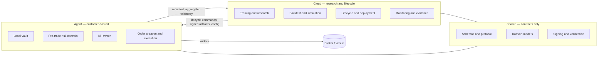

# CustodiaCloud

[](https://github.com/sultan-suyunbayev/AI-Powered-Quantitative-Research-Platform/actions/workflows/build-and-test.yml)
[](https://github.com/sultan-suyunbayev/AI-Powered-Quantitative-Research-Platform/actions/workflows/docs-quality.yml)
[](https://github.com/sultan-suyunbayev/AI-Powered-Quantitative-Research-Platform/actions/workflows/security-sast.yml)
[](LICENSE)
[](https://www.python.org/downloads/)

One pipeline from training a policy to backtesting, paper trading and running it live —
with the execution side deliberately kept out of the cloud.

## What is worth looking at

- **The cloud cannot leak an order, by construction.** Credentials stay in the
  customer-hosted Agent; the cloud sends lifecycle commands and signed artifacts, never
  order payloads. CI enforces it: seven guardrails under [`ccea/guardrails/`](ccea/guardrails/)
  (`import_check`, `intent_prohibition`, `cloud_allowlist`, `schema_check`, `protocol_check`,
  `design_doc_check`, `traceability_check`) plus seven import-linter contracts in
  [`importlinter.ini`](importlinter.ini). The build fails if the Cloud package imports a
  trading module.
- **Distributional PPO with twin critics** — CVaR-constrained objectives, PopArt value
  normalisation, an adaptive UPGD optimiser, population-based tuning with adversarial
  training: [`distributional_ppo.py`](distributional_ppo.py), [`optimizers/`](optimizers/),
  [`adversarial/`](adversarial/).
- **C++/Cython limit order book and market simulator** — 17 compiled extensions, L2 and L3
  fidelity with queue position, latency, dark pools, fees and slippage:
  [`OrderBook.cpp`](OrderBook.cpp), [`MarketSimulator.cpp`](MarketSimulator.cpp),
  [`lob_state_cython.pyx`](lob_state_cython.pyx), [`execution_sim.py`](execution_sim.py).
- **Ten venue and data adapters** behind one YAML config and a DI registry, so the same
  strategy runs against equities, FX, futures, options or crypto.
- ~1,800 commits, 208 test files, ~21,800 collected tests, built solo over 2024-2026.

## Architecture (CCEA)

Cloud-Controlled Execution Architecture splits the system so the part that can be
compromised has nothing worth taking.



Crosses the boundary: lifecycle requests, signed model artifacts, configuration, and
telemetry that passes a redaction stage first. Does not: broker credentials, order
payloads, trading instructions. The Agent turns a strategy's intent into an order locally,
behind its own risk checks.

## Quick start

```bash
git clone https://github.com/sultan-suyunbayev/AI-Powered-Quantitative-Research-Platform.git
cd AI-Powered-Quantitative-Research-Platform

python -m venv .venv && . .venv/bin/activate      # Windows: .venv\Scripts\activate
python -m pip install -U pip wheel
pip install -r requirements-build.txt
pip install -r requirements-cpu.lock.txt          # or requirements-gpu.lock.txt
pip install -r requirements-dev.lock.txt

python setup.py build_ext --inplace               # 17 C++/Cython extensions
python scripts/doctor.py --skip-network           # environment check
python prepare_demo_data.py --rows 2000 --symbols BTCUSDT,ETHUSDT
python scripts/quickstart.py list                 # presets; `check --asset crypto` says what is missing
pytest -q
```

Market data is not shipped here. `prepare_demo_data.py` generates synthetic bars so the
pipeline runs immediately; `scripts/download_*.py` fetch real data where you have vendor
access. The extensions need a C++17 toolchain — see [BUILD_INSTRUCTIONS.md](BUILD_INSTRUCTIONS.md).

## Layout

| Path | What is there |
|---|---|
| root `*.py`, `*.pyx` | Legacy flat modules — training, simulation, feature pipeline, execution. Imported by bare module name, so they stay put. |
| [`packages/`](packages/) | The CCEA split: `packages/cloud` (control plane, governance, jobs), `packages/agent` (daemon, vault, execution, telemetry). |
| [`services/`](services/) | Backtest, risk, signals, data quality, compliance, reporting. |
| [`adapters/`](adapters/) | Venue and data-vendor adapters behind a common interface. |
| [`ccea/`](ccea/) | Protocol, crypto, artifact signing, CI guardrails. |
| [`lob/`](lob/), [`execution/`](execution/) | Order book, microstructure, execution algorithms. |
| [`docs/`](docs/) | Architecture, runbooks, compliance plans. `docs/history/` is superseded material kept for context. |

## Adapters

| Venue / vendor | Asset class | Modes | Status |
|---|---|---|---|
| Alpaca | US equities, equity options | sim, paper, live | Implemented |
| Binance | Crypto spot and perpetual futures | sim, live | Implemented |
| Interactive Brokers | Futures, listed options | sim, paper, live | Implemented |
| OANDA | FX | sim, live | Implemented |
| Deribit | Crypto options | sim, live | Implemented |
| Polygon | US equities and options data | data | Implemented |
| ThetaData | Options data | data | Implemented |
| Yahoo Finance | Equities data, corporate actions | data | Implemented |
| Dukascopy | FX historical ticks (public feed) | data | Implemented |
| IG Markets | FX, CFD | — | Stub (interface only) |

## Status

Working: the research pipeline end to end (features → training → backtest → evaluation),
the L2 and L3 execution simulators, the CCEA split with its CI guardrails, the Agent's
vault, risk controls and kill switch, and the desktop shell.

Experimental: cross-sectional portfolio construction, the options and futures paths, and
live trading beyond paper accounts. Open issues, including two `NameError` paths annotated
in the source rather than quietly patched, are in [docs/AUDIT_2026-09.md](docs/AUDIT_2026-09.md).

A personal project, not commercially developed or supported.

## License

Apache-2.0 — see [LICENSE](LICENSE) and [NOTICE](NOTICE).

**Disclaimer.** Research and engineering software. Not investment advice, not a trading
recommendation, not a managed execution service. Trading carries risk of loss; backtest
and simulation results are not predictive of live performance. You are responsible for
what you run and for complying with the rules of your jurisdiction and your broker.

## Author

Sultan Suyunbayev — [GitHub](https://github.com/sultan-suyunbayev) ·
[LinkedIn](https://linkedin.com/in/sultansuyunbayev-ai)
