# Дизайн-документ: Режим Pro (Профессиональный режим интерфейса)

## Проект: CustodiaCloud Quantitative Research & Deployment Platform

**Версия спецификации**: 9.0 (Comprehensive System Coverage)  
**Статус**: Готов к ревью архитектуры  

---

## 1. Введение и Архитектурная философия

Настоящий документ описывает детальную спецификацию профессионального интерфейса (**Режим Pro**), который дополняет существующий **Режим Lite** (MVP). В то время как Lite режим скрывает сложные настройки и ориентирован на высокоуровневый мониторинг, **Режим Pro обеспечивает тотальный сквозной контроль над каждым модулем системы — от импорта сырых тиковых данных до управления криптографическими ключами и прохождения регуляторных аудитов.**

### Ключевой принцип CCEA (Cloud-Controlled Execution Architecture)

Профессиональный режим строго следует разделению зон ответственности CCEA:

- **Cloud (Исследовательская панель и мониторинг):** Отображает телеметрию, позволяет настраивать параметры исследований, генерировать код стратегий и конфигурировать пайплайны. **Категорически запрещено передавать прямые торговые команды (ордера с указанием конкретной стороны, объема или цены) из Cloud в Agent.** Передаются только жизненные команды управления жизненным циклом (`REQUEST_START_RUN`, `REQUEST_STOP_RUN`, `REQUEST_UPGRADE_ARTIFACT` и т.д.).
- **Agent (Локальный исполняемый контур):** Хранит API-ключи брокеров в локальном хранилище Vault, выполняет локальный лимит-контроль, формирует и отправляет ордера на биржи, проверяет цифровые подписи актов.

---

## 2. Иерархия Вкладок и Подвкладок (Режим Pro)

В Режиме Pro боковая панель управления (Sidebar) расширяется с 7 упрощенных вкладок до **9 многофункциональных разделов**, каждый из которых содержит структурированные подразделы (Sub-tabs).

```mermaid
graph TD
    Pro[Режим Pro]
    Pro --> Tab1[1. Dashboard & Telemetry]
    Pro --> Tab2[2. Research Pipeline]
    Pro --> Tab3[3. Model & Calibration Lab]
    Pro --> Tab4[4. Backtest & Simulation]
    Pro --> Tab5[5. OMS & Live Trading]
    Pro --> Tab6[6. Risk Firewall]
    Pro --> Tab7[7. CCEA Security & Deployment]
    Pro --> Tab8[8. Regulatory Compliance Center]
    Pro --> Tab9[9. Developer Suite]

    Tab1 --> Sub11[1.1 Node Health & psutil]
    Tab1 --> Sub12[1.2 Time Sync / RTS 25]
    Tab1 --> Sub13[1.3 API rate limits & Token Buckets]
    Tab1 --> Sub14[1.4 Macro & Earnings Calendar]
    Tab1 --> Sub15[1.5 Position Reconciliation & Sync]
    Tab1 --> Sub16[1.6 Alert Manager Configuration]
    Tab1 --> Sub17[1.7 Sector Momentum Dashboard]
    Tab1 --> Sub18[1.8 Corporate Actions & Dividends]
    Tab1 --> Sub19[1.9 Concept Drift PSI]
    Tab1 --> Sub110[1.10 System Telemetry & Prometheus]

    Tab2 --> Sub21[2.1 Ingest Engine]
    Tab2 --> Sub22[2.2 Feature Builder]
    Tab2 --> Sub23[2.3 Target Builder]
    Tab2 --> Sub24[2.4 Training Table Asof Join]
    Tab2 --> Sub25[2.5 Session & Volatility Mask]
    Tab2 --> Sub26[2.6 Walk-Forward Splits]

    Tab3 --> Sub31[3.1 RL Model Training]
    Tab3 --> Sub32[3.2 Probability & Uncertainty Calibration]
    Tab3 --> Sub33[3.3 Signal Threshold Tuner]
    Tab3 --> Sub34[3.4 T-Cost & Slippage Calibration]

    Tab4 --> Sub41[4.1 Matching Engine Settings]
    Tab4 --> Sub42[4.2 Execution Profiles]
    Tab4 --> Sub43[4.3 Sandbox Execution]
    Tab4 --> Sub44[4.4 Analytics & Multi-Run Compare]

    Tab5 --> Sub51[5.1 Realtime Runner]
    Tab5 --> Sub52[5.2 Active Order Queue]
    Tab5 --> Sub53[5.3 Net Holdings & Portfolio]
    Tab5 --> Sub54[5.4 Unified Adapter Architecture]
    Tab5 --> Sub55[5.5 Forex Trading Session & Rollover Router]
    Tab5 --> Sub56[5.6 Forex Position Sync, Swaps & Risk Guards]
    Tab5 --> Sub57[5.7 Pipeline Reliability & Feed Safety]
    Tab5 --> Sub58[5.8 Futures Live Runner Console]
    Tab5 --> Sub59[5.9 Execution Algorithms & Slice Orders]
    Tab5 --> Sub510[5.10 Treasury & Collateral Optimizer]
    Tab5 --> Sub511[5.11 Post-Trade Allocation & Clearing]

    Tab6 --> Sub61[6.1 Equities PDT & Margin]
    Tab6 --> Sub62[6.2 Forex Swaps Monitor]
    Tab6 --> Sub63[6.3 Futures CME SPAN Margin]
    Tab6 --> Sub64[6.4 Options Greeks Solver]
    Tab6 --> Sub65[6.5 Portfolio Constraints & Allocation]
    Tab6 --> Sub66[6.6 LULD Halts & Kill Switches]
    Tab6 --> Sub67[6.7 Crypto Futures Risk Guards]
    Tab6 --> Sub68[6.8 ML Feature Data Leak Guard]
    Tab6 --> Sub69[6.9 Cython Risk Manager, Core Guards & Pipeline Shims]
    Tab6 --> Sub610[6.10 Stateful Dynamic No-Trade Guard]

    Tab7 --> Sub71[7.1 Cryptographic Verifier]
    Tab7 --> Sub72[7.2 Protocol Command Auditor]
    Tab7 --> Sub73[7.3 Vault Key Storage]
    Tab7 --> Sub74[7.4 State & Database Manager]
    Tab7 --> Sub75[7.5 Pre-flight Diagnostic Engine]
    Tab7 --> Sub76[7.6 Degraded & Resilient Mode Controller]
    Tab7 --> Sub77[7.7 Local Policy Firewall & Operational Kill Switch]
    Tab7 --> Sub78[7.8 Enterprise VPC & Air-Gapped Deployment Suite]

    Tab8 --> Sub81[8.1 MiFID II Toolkit]
    Tab8 --> Sub82[8.2 DORA Operations]
    Tab8 --> Sub83[8.3 EU AI Act Auditor]
    Tab8 --> Sub84[8.4 GDPR & Data Retention]
    Tab8 --> Sub85[8.5 Market Abuse & Trade Surveillance Monitor]

    Tab9 --> Sub91[9.1 Python Strategy Coder]
    Tab9 --> Sub92[9.2 YAML Config Editor]
    Tab9 --> Sub93[9.3 Interactive CLI]
    Tab9 --> Sub94[9.4 Log Stream Explorer]
    Tab9 --> Sub95[9.5 Parameters Optimizer]
    Tab9 --> Sub96[9.6 AI Copilot Assistant]
```



---

## 3. Детальное техническое сопоставление модулей и элементов управления

Каждый логический модуль исходного кода отображается в определенный экран интерфейса Pro-режима. Ниже представлена полная спецификация элементов управления, параметров, API-запросов и CLI-команд для каждого подраздела.

---

### TAB 1. DASHBOARD & TELEMETRY (Панель управления и телеметрия)

#### Подвкладка 1.1: Node Health & Resource Telemetry (Здоровье ноды и Ресурсы)

- **Функционал:** Мониторинг общего состояния платформы (Exchange connections, data feeds, executors, risk guards, databases), Kubernetes-совместимых проверок жизнеспособности (liveness, readiness) и потребления ресурсов CPU/RAM на уровне контейнера.
- **Связанный код:** `services/healthcheck.py` (класс `HealthcheckService`), `services/core/enhanced_healthcheck.py` (класс `EnhancedHealthcheck`), `services/core/multi_az.py` (класс `MultiAZManager`), `leakguard.py`.
- **Элементы управления на UI:**
  - **Таблица компонентов здоровья (`ComponentHealth`):**
    - **Колонка Component:** Exchange client (Binance, Alpaca, OANDA), Data Feed, Executor, Risk Guard, Position Sync, System, Database, Cache.
    - **Колонка Status:** `HEALTHY` (зеленый), `DEGRADED` (желтый), `UNHEALTHY` (красный), `UNKNOWN` (серый).
    - **Колонка Latency:** Время отклика в миллисекундах (`latency_ms`).
    - **Колонка Message/Error:** Текстовая расшифровка ошибок или исключений.
  - **Виджеты Kubernetes Probes:**
    - Индикатор `/live`: Процесс запущен (`LivenessResult` - uptime, pid, memory_mb).
    - Индикатор `/ready`: Готов принимать входящий трафик (`ReadinessResult` - готовность критических зависимостей, число проверенных/здоровых компонентов).
    - Индикатор `/health`: Полный статус системы (`HealthResult` - здоровый/деградированный/нездоровый с деталями).
  - **Панель Multi-AZ & Failover:**
    - Карточки зон доступности: `ZoneStatus` (active, backup, down) и время последней синхронизации/задержки репликации (`ZoneHealthStatus`).
    - Индикатор режима отказа (`FailoverMode` - manual, automatic, scheduled).
  - **Виджет системных ресурсов (`psutil`):** Процент загрузки CPU, утилизация ОЗУ (Memory usage % и объем свободной памяти в ГБ).
  - **Параметры конфигурации здоровья:** Слайдер частоты фоновых проверок (`background_interval_seconds`), порогов предупреждений/критических значений задержки (`latency_warning_ms`, `latency_critical_ms`), порогов памяти (`memory_warning_percent`, `memory_critical_percent`).
  - **Кнопки экстренного реагирования:** `PANIC HALT` (активирует полную экстренную ликвидацию всех позиций на уровне брокера через `services/ops_kill_switch.py`) и `RESET PANIC STATE` (сброс триггера блокировки).
- **Связанные API / CLI:**
  - `GET /api/status` — возвращает системный снимок метрик.
  - `GET /health` — эндпоинт полной проверки здоровья (запускает `EnhancedHealthcheck.health`).
  - `GET /ready` — эндпоинт проверки готовности (запускает `EnhancedHealthcheck.ready`).
  - `GET /live` — эндпоинт проверки liveness (запускает `EnhancedHealthcheck.live`).
  - `POST /api/panic_halt` — экстренная остановка всех процессов.
  - `POST /api/panic_reset` — сброс аварийного триггера.
  - CLI: `rivenquant status`

#### Подвкладка 1.2: Clock Synchronization (Синхронизация времени / RTS 25)

- **Функционал:** Мониторинг сетевых задержек и дрейфа локальных часов относительно серверов точного времени бирж (NTP / Exchange Time Sync) с наносекундной точностью, ведением журналов аудита в соответствии с требованиями MiFID II RTS 25.
- **Связанный код:** [clock.py](../../clock.py), `services/core/risk_controls/time_sync.py` (класс `ComplianceClock`).
- **Элементы управления на UI:**
  - **Поле ручной синхронизации:** Кнопка запуска синхронизации с параметрами: список NTP-серверов (`time.google.com`, `pool.ntp.org`, `time.windows.com`), количество попыток опроса (`attempts`), максимальный уровень stratum (`stratum_max`, по умолчанию 3).
  - **Параметры сглаживания дрейфа:** Настройка веса сглаживания EMA (`ema_alpha`, по умолчанию 0.3) и максимального шага корректировки за один цикл (`max_step_ms`).
  - **Карточки текущего статуса:**
    - Текущее отклонение (дрейф в мс с точностью до 3 знаков, `offset_ms`).
    - Задержка сигнала (RTT в мс, `round_trip_ms`).
    - Мера дисперсии (отклонение измерений, `dispersion_ms`).
    - Текущий NTP сервер (`reference_server`) и его уровень (`stratum`).
    - Соответствие RTS 25: допуск < 100 мкс (HFT) или < 1 мс (General Algo).
    - Уровень дрейфа (`ClockDriftSeverity`: `normal`, `warning` (>50мс), `critical` (>100мс), `kill_switch` (>1000мс)).
  - **Индикатор HTTP Fallback:** Отображение использования резервного HTTP HEAD Date запроса (через Cloudflare/Google HEAD API) при отсутствии библиотеки `ntplib` или блокировке UDP/123 порта.
  - **Кнопка "Сгенерировать комплаенс-отчет":** Экспорт JSON-структуры (`generate_compliance_report()`) для предоставления аудиторам регуляторов (NCA).
  - **Лог изменения тяжести дрейфа (`ClockSyncEvent`):** Журнал с фиксацией времени, величины перехода и отправленных предупреждений/аварийных отключений.
- **Связанные API / CLI:**
  - Интегрировано в телеметрию FastAPI loop (`LATEST_TELEMETRY["clock_sync_drift_ms"]`, RTT, `last_sync_time`).
  - `POST /api/clock/sync` — запускает ручную принудительную синхронизацию (`manual_sync`).
  - `GET /api/clock/compliance_report` — возвращает полный RTS 25 отчет.
  - CLI: `pytest tests/test_clock.py`

#### Подвкладка 1.3: API Rate Limits & Token Buckets (Потребление лимитов API)

- **Функционал:** Контроль количества REST API-запросов и мониторинг ограничений rate limits брокеров/бирж с использованием Token Bucket алгоритма.
- **Связанный код:** `services/rest_budget.py` (классы `TokenBucket`, `RestBudgetSession`).
- **Элементы управления на UI:**
  - Карточки Rate Limit лимитеров:
    - Global Limits: configured RPS (запросов в секунду), burst capacity (вместимость бакета), текущее количество токенов в бакете.
    - Endpoint Specific: RPS и burst для индивидуальных путей (например, `GET /api/v3/klines`, `POST /api/v3/order`).
  - LIVE-счетчики потребления:
    - Количество отправленных запросов (`request_counts`).
    - Количество запланированных запросов (`planned_counts`) и токенов (`planned_tokens`).
    - Статистика кулдаунов: Количество запусков кулдауна (`cooldown_counts`) и текстовые причины кулдаунов (например, `HTTP 429 Too Many Requests`).
    - Текущая заполненность семафора потоков (`_max_workers` vs активные потоки в очереди `_task_semaphore`).
    - Статистика локального кэширования: количество попаданий в кэш (`cache_hits`), промахов (`cache_misses`), размер дискового кэша (`cache_stores`).
  - Слайдеры динамической корректировки лимитов: Возможность ручной перенастройки лимита RPS и Burst в реальном времени.
- **Связанные API / CLI:**
  - API: `/monitoring/snapshot` — отслеживает общую нагрузку сессий.
  - Напрямую влияет на конструктор `RestBudgetSession` на стороне агента.

#### Подвкладка 1.4: Macroeconomic & Earnings Events Calendar (Календарь событий)

- **Функционал:** Мониторинг макроэкономических показателей, корпоративной отчетности акций и торговых расписаний фьючерсных сессий.
- **Связанный код:** `services/macro_data.py`, `services/earnings_calendar.py`, `services/cme_calendar.py`.
- **Элементы управления на UI:**
  - **Таблица Macro Announcements:** Вывод ключевых показателей (FOMC Interest Rate Decisions, CPI YoY, NFP), время публикации, предыдущее/прогнозное/фактическое значения.
  - **Таблица Earnings Calendar:** Сводка отчетов о доходах акций под наблюдением, дата отчета (Before Market Open / After Market Close), флаг блокировки торговли (`earnings_blackout_mask` срабатывает автоматически при приближении релиза).
  - **CME Trading Calendar:** Статус текущей сессии (RTH - Regular Hours, ETH - Extended Hours, Holiday Close), таймер до закрытия сессии, индикатор необходимости экспирационного ролловера фьючерсных контрактов.
- **Связанные API / CLI:**
  - API: `GET /api/json/get_file?path=data/calendar_events.json`

#### Подвкладка 1.5: Position Reconciliation & Synchronization (Сверка и синхронизация позиций)

- **Функционал:** Контроль расхождений между внутренним состоянием позиций локального робота и фактическим состоянием счетов на бирже/брокере для всех классов активов.
- **Связанный код:** `services/position_sync.py` (Alpaca/Binance Spot), `services/forex_position_sync.py` (OANDA), `services/futures_position_sync.py` (Binance Futures/CME).
- **Элементы управления на UI:**
  - **Вкладка 1.5.1: Equities & Spot Crypto** (`services/position_sync.py`):
    - Индикаторы расхождений (`PositionDiscrepancy`): `QTY_MISMATCH`, `SIDE_MISMATCH`, `MISSING_POSITION`, `UNEXPECTED_POSITION`.
    - Таблица сверки: локальное vs удаленное количество (с учетом `qty_tolerance_pct` и `min_qty_diff`).
  - **Вкладка 1.5.2: Forex Units & Financing** (`services/forex_position_sync.py`):
    - Таблица валютных позиций: Units (long/short), Average price, Margin Used.
    - Своп-метрики: начисленное финансирование (`financing` / accumulated swap).
    - Автореконсиляция (`ReconciliationExecutor`): Лимит заявок в час (`max_orders_per_hour`), максимальный размер ордера (`max_units`), блокировка при перевороте стороны (`prevent_side_flip`).
  - **Вкладка 1.5.3: Futures Leverage & Mark-to-Market** (`services/futures_position_sync.py`):
    - Метрики кредитного плеча: Leverage (например, 10x, 20x), Margin Mode (Cross/Isolated).
    - Мониторинг ликвидаций: Хэшированные логи принудительного закрытия (`LIQUIDATION_DETECTED`).
    - ADL Queue Indicator: Индикатор риска авто-делевериджа (1-5 лампочек, риск-уровни: `safe`, `warning`, `danger`, `critical`).
    - Метрики начисления фандинга (Perpetual Funding Rate).
  - Кнопка `TRIGGER MANUAL RECONCILIATION` для запуска принудительной синхронизации балансов.
  - Лог автоматического исправления (`Reconciliation Resolution Log`).

#### Подвкладка 1.6: Alert Manager Configuration (Настройка каналов оповещений)

- **Функционал:** Настройка многоканального оповещения с эскалацией инцидентов, подавлением спама (cooldown/deduplication) и управлением дежурными графиками (On-call) для соответствия требованиям DORA Article 14.
- **Связанный код:** `services/alerts.py` (класс `AlertManager`), `services/core/alerting.py` (классы `AlertingService`, `AlertRule`, `Alert`, `EscalationPolicy`), `services/core/oncall_rotation.py` (классы `OnCallRotationManager`, `OnCallEngineer`, `OnCallShift`).
- **Элементы управления на UI:**
  - **Конфигурация каналов доставки уведомлений:**
    - Вкладки настройки интеграций: Telegram bot API, Slack Incoming Webhooks (с поддержкой simulation/production режимов), Email (SMTP сервер, порт, TLS, авторизация), PagerDuty (Events API v2 integration key и service_id), SMS, Generic HTTP Webhook (с JSON шаблоном и OAuth/Bearer авторизацией).
  - **Редактор правил оповещений (`AlertRule`):**
    - Таблица правил: Rule ID, Название, Метрика, Сравнение (>, <, ==), Порог, Severity (`info`, `low`, `medium`, `high`, `critical`), Направление уведомления, Политика эскалации.
    - Поля: Включение/выключение правил, интервал проверки, задержка срабатывания (`pending_duration_seconds`).
  - **Очередь активных инцидентов (`OnCallIncident`):**
    - Список сработавших алармов со статусами: `triggered`, `acknowledged`, `escalated`, `resolved`, `suppressed`.
    - Кнопки `Acknowledge` (подтвердить инцидент с вводом имени дежурного) и `Resolve` (закрыть инцидент с вводом примечаний решения).
  - **Политики эскалации (`EscalationPolicy`):**
    - Настройка цепочек передачи аларма: если L1 (первый дежурный) не взял инцидент в течение X минут → переслать на L2 (старший инженер) → L3 (менеджер).
  - **Менеджер дежурств (On-call Rotation):**
    - Список дежурных инженеров (`OnCallEngineer`): ФИО, телефон, email, приоритет связи, часовой пояс.
    - Календарный планировщик смен (`OnCallShift`): Настройка недельных, дневных или кастомных ротаций смен, экспорт в iCal/Google Calendar.
  - **Защита от спама и deduplication:**
    - Временное окно дедупликации (`dedup_window_seconds`) по уникальному хэшу аларма (SHA-256 / UUID5 от метрики и источника).
    - Лимит сообщений в минуту на канал (`rate_limit_per_channel`).
- **Связанные API / CLI:**
  - `POST /api/alerts/rules` — создать/обновить правило.
  - `GET /api/alerts/active` — получить список активных алармов.
  - `POST /api/alerts/acknowledge` — подтверждение инцидента.
  - `POST /api/alerts/resolve` — закрытие инцидента.
  - `GET /api/oncall/schedule` — получить график смен.

#### Подвкладка 1.7: Sector Momentum Dashboard (Секторальный моментум)

- **Функционал:** Мониторинг силы и доходности секторов рынка и расчет альфа-векторов для реаллокации.
- **Связанный код:** `services/sector_momentum.py`.
- **Элементы управления на UI:**
  - Тепловая карта доходности секторов (Technology, Finance, Healthcare, Energy и др.) на различных интервалах времени (1d, 5d, 1m).
  - График изменения альфа-векторов и рангов моментума (`SectorMomentumResult`).
  - Переключатель параметров вычисления моментума: размер окна расчета, скользящее среднее, веса активов.
- **Связанные API / CLI:**
  - API: `POST /api/run_job` с параметром `job: "run_momentum"`.

#### Подвкладка 1.8: Corporate Actions & Survivorship (Корпоративные события)

- **Функционал:** Мониторинг начислений дивидендов, сплитов и листинга/делистинга акций.
- **Связанный код:** `services/corporate_actions.py`, `services/survivorship.py`.
- **Элементы управления на UI:**
  - Таблица предстоящих сплитов (Ratio: например `3:1`, Symbol, Ex-Date).
  - Дивидендный календарь (Symbol, Dividend Yield %, Dividend Amount, Pay Date).
  - Survivorship Bias Manager: список делистингованных компаний из индекса для исключения ошибки выжившего (Survivorship Bias) при бэктестах.

#### Подвкладка 1.9: Concept Drift Monitoring (Мониторинг дрейфа признаков)

- **Функционал:** Мониторинг стабильности математических фичей в реальном времени на основе индекса стабильности популяции (PSI) между обучающей выборкой и рыночными потоками.
- **Связанный код:** [drift.py](../../drift.py).
- **Элементы управления на UI:**
  - График изменения PSI по времени.
  - Таблица ранжирования фичей по величине дрейфа (Feature, Average PSI, Worst PSI, Status: `stable` / `warning` / `drifted`).
  - Кнопка ручного пересчета PSI на исторических файлах.
- **Связанные API / CLI:**
  - `POST /api/run_job` с параметром `job: "run_psi"`.
  - Файл отчета: `models/drift_report.json`.

#### Подвкладка 1.10: System Telemetry & Prometheus Metrics (Аналитика шины и лимитов)

- **Функционал:** Интегрированный HFT-мониторинг сетевых HTTP-запросов, стабильности WebSocket фидов, сигнальных задержек, производительности шины событий, а также скользящих метрик исполнения сделок (проскальзывание и транзакционные издержки).
- **Связанный код:** `services/monitoring.py` (класс `MonitoringAggregator`), `services/metrics.py` (классы `TradeMetrics`, `EquityMetrics`).
- **Элементы управления на UI:**
  - **Виджет HTTP-статистики:** Live-счетчики отправленных запросов (`http_request_count`), успешных ответов с кодами состояния (`http_success_count`), ошибок (`http_error_count` с категоризацией: тайм-ауты, лимиты `429` и серверные ошибки `5xx`).
  - **Диагностика Websocket-соединений:**
    - Временная шкала переподключений и сбоев (`last_ws_failure_ms`, `last_ws_reconnect_ms`).
    - Количество последовательных сбоев соединения (`_consecutive_ws_failures`).
    - Счетчик пропущенных дубликатов сообщений (`ws_dup_skipped_count`).
    - Статистика сброса сообщений из-за перегрузки шины (`ws_backpressure_drop_count`).
  - **Панель шины событий (Event Bus):**
    - Текущая глубина очереди (`event_bus_queue_depth`).
    - Общий объем вошедших событий (`event_bus_events_in_total`).
    - Количество сброшенных событий из-за backpressure (`event_bus_dropped_backpressure_total`).
  - **Аудит задержки сигналов (Signal TTL & Latency):**
    - Гистограмма возраста сигналов в момент публикации (`age_at_publish_ms`).
    - Счетчики сброшенных сигналов по причине устаревания (`signal_boundary_count`, `signal_absolute_count`, `ttl_expired_boundary_count`).
    - Эффективность кэша идемпотентности (`signal_idempotency_skipped_count`).
    - Статистика серий отсутствия сигналов по тикерам (`zero_signal_streaks`).
  - **Метрики исполнения баров (Slippage & Cost Bias Telemetry):**
    - Графики скользящих окон (1m/5m) и кумулятивных показателей: общее количество решений (`decisions`), коэффициент немедленного исполнения (`act_now_rate`), торговый оборот (`turnover_usd`), соотношение оборота к капитализации (`turnover_vs_cap`), распределение режимов влияния на рынок (`impact_mode_counts`).
    - Метрики издержек: среднее фактическое проскальзывание (`realized_slippage_bps`), средняя моделируемая стоимость (`modeled_cost_bps`), и сдвиг стоимости (`cost_bias_bps` = realized - modeled).
    - Индикатор превышения порогового сдвига издержек со статусом предупреждения (`cost_bias_alerted` по тикерам).
  - **Виджеты очередей и кулдаунов:**
    - Текущий размер и емкость очереди ограничения запросов (`throttle_queue_depth`: size/max).
    - Статус активных ограничений (`cooldowns_active`): признак глобального кулдауна и список символов с активными кулдаунами.
    - Мониторинг суточного торгового оборота (`daily_turnover`).
  - **Панель метрик:** Отображение агрегированного в реальном времени файла `logs/snapshot_metrics.json`.
- **Связанные API / CLI:**
  - `GET /api/telemetry/live` — возвращает полные HFT и Prometheus метрики из `logs/metrics.jsonl` и системного снимка.
  - `GET /monitoring/snapshot` — возвращает текущее JSON-состояние snapshot с худшим feed-лагом, WebSocket-сбоями, серией отсутствия сигналов и ошибками по тикерам.
  - `POST /api/telemetry/reset` — сброс счетчиков аварийной защиты и дрейфа часов (`reset_kill_switch_counters`).

---

### TAB 2. QUANT LAB: RESEARCH PIPELINE (Квантовая лаборатория: Пайплайн исследований)

#### Подвкладка 2.1: Ingest Engine (Движок загрузки исторических котировок)

- **Функционал:** Потоковая и пакетная загрузка исторических котировок, ставок финансирования, стаканов и внешних данных по сентименту/макроэкономике. Поддерживает криптовалюты, форекс и фондовый рынок.
- **Связанный код:** [ingest_orchestrator.py](../../ingest_orchestrator.py), [ingest_klines.py](../../ingest_klines.py), [ingest_funding_mark.py](../../ingest_funding_mark.py), [cot_data_loader.py](../../cot_data_loader.py), [data_loader_forex.py](../../data_loader_forex.py), [data_loader_multi_asset.py](../../data_loader_multi_asset.py), [prepare_and_run.py](../../prepare_and_run.py).
- **Спецификации загружаемых данных:**
  - **Binance Klines (Public API):** Загрузка свечей Spot / Futures (USDT-M) без ключей. Сохраняет столбцы: `ts_ms`, `symbol`, `open`, `high`, `low`, `close`, `volume`, `close_time`, `quote_asset_volume`, `number_of_trades`, `taker_buy_base`, `taker_buy_quote`. Автоматически преобразует временные оси в миллисекунды.
  - **Futures Funding Rate & Mark Price:** Загрузка истории ставок финансирования (каждые 8 часов: 00:00, 08:00, 16:00 UTC) и klines по маркировочной цене (`mark_open`, `mark_high`, `mark_low`, `mark_close`) для точного расчета прибыли/издержек.
  - **CFTC Commitments of Traders (COT):** Исторический парсинг еженедельных отчетов (публикуются по пятницам, отражают позиции на вторник).
    - Поддерживаемые типы файлов/отчетов: `legacy_futures` (deacot{year}.zip), `legacy_combined` (dea_com_txt_{year}.zip), `disaggregated` (f_year{year}.zip), `tff` (tff_year{year}.zip).
    - Поддерживаемые коды контрактов CFTC: EUR (`099741`), GBP (`096742`), JPY (`097741`), CHF (`092741`), AUD (`232741`), CAD (`090741`), NZD (`112741`), BRL (`098662`), MXN (`095741`), ZAR (`096661`).
    - Расчет метрик: Чистая позиция (Net Long = Long - Short), Процент чистой позиции (Net Long % = Net Long / OI), недельное изменение (Change in Net). Нормализация Z-score по скользящему окну `zscore_lookback` (по умолчанию 52 недели).
    - Инверсия котировок: Для пар USD_JPY, USD_CHF, USD_CAD позиции автоматически инвертируются (`net_pct = -net_pct`), чтобы отражать силу quote-валюты относительно USD в нормализованном диапазоне [0, 1] (`net_normalized = (net_pct + 1.0) / 2.0`).
  - **OANDA Forex Data (REST API):** Загрузка свечей и ставок валютного свопа (`long_swap_pips`, `short_swap_pips`). Выполняет автоматический расчет временного расстояния до следующего макрособытия и рассчитывает индикаторы активности торговых сессий с фильтром выходных дней (с пятницы 21:00 UTC до воскресенья 21:00 UTC):
    - *Сидней:* 21:00 - 06:00 UTC (Liquidity: 0.6)
    - *Токио:* 00:00 - 09:00 UTC (Liquidity: 0.8)
    - *Лондон:* 07:00 - 16:00 UTC (Liquidity: 1.3)
    - *Нью-Йорк:* 12:00 - 21:00 UTC (Liquidity: 1.2)
    - *Перекрытие Лондон/NY:* 12:00 - 16:00 UTC (Liquidity: 1.5)
    - *Перекрытие Токио/Лондон:* 07:00 - 09:00 UTC (Liquidity: 1.0)
    - *Низкая ликвидность:* Остальное время (Liquidity: 0.4)
  - **Unified Multi-Asset Loader (data_loader_multi_asset.py):** Единый загрузчик для поддержки мульти-активного режима (крипта, акции, форекс). Обеспечивает интеграцию внешних API и локальных файлов в стандартизированном формате для `TradingEnv`.
    - *Провайдеры данных:* Binance, Alpaca (REST API для акций), Polygon.io (свечи акций), OANDA, IG, Dukascopy.
    - *Специфическая фильтрация сессий (Equities):* Метод `filter_trading_hours` осуществляет фильтрацию времени под регулярную сессию США (с 09:30 до 16:00 EST / 14:30 до 21:00 UTC) с опциональной поддержкой pre-market и post-market.
    - *Сплиты и корпоративные действия:* Метод `apply_split_adjustment` корректирует OHLC цены и объемы по историческим коэффициентам сплитов. Метод `add_corporate_action_features` вычисляет количество дней до следующего отчета (earnings), исторический сюрприз прибыли (earnings surprise) и дивидендную доходность (dividend yield).
    - *Атомарная валидация (validate_data):* Проверяет отсутствие пропусков (NaN/inf), корректность типов (целочисленные секунды timestamp), отсутствие отрицательных цен и объемов, соблюдение OHLC-инвариантов (High >= Low/Open/Close), монотонное возрастание меток времени и их непрерывность (continuity check) без разрывов шага.
  - **Пайплайн подготовки исторических данных (prepare_and_run.py):** Скрипт-оркестратор для сборки финальных feather-файлов в директорию `data/processed/`, используемых для обучения.
    - *Слияние с сентиментом и макро-календарем:* Объединяет OHLCV-котировки с индексом Fear & Greed (`data/fear_greed.csv`) и экономическими новостями (`data/economic_events.csv`) по временным меткам.
    - *Временная привязка свечей:* Конвертирует метки времени `open_time`/`close_time` к единой временной оси по цене закрытия (CLOSE TIME) во избежание сдвига на 4 часа при миграции на 4h таймфрейм.
    - *Асинхронная генерация офлайн-фичей:* Запускает функцию `apply_offline_features` для расчета базовых технических фичей (CVD, GARCH, Yang-Zhang, RSI) перед сохранением итогового датасета.
- **Элементы управления на UI:**
  - **Панель источника данных (Source Selector):**
    - Переключатель типа биржи / провайдера (Binance Spot, Binance Futures, CFTC COT, OANDA Forex).
    - Текстовое поле ввода символов (например, `BTCUSDT,ETHUSDT` или `EUR_USD,USD_JPY`).
  - **Настройки временного диапазона:**
    - Поля ввода даты начала (`Start Date`) и окончания (`End Date`) в форматах YYYY-MM-DD или ISO.
    - Поле выбора интервала свечей (`Interval`): `1m`, `3m`, `5m`, `15m`, `1h`, `4h`, `1d` (по умолчанию `4h` для Pro-конфигурации).
  - **Конфигурация запроса:**
    - Лимит свечей в одном API-батче (`API Batch Limit`, по умолчанию `1500`).
    - Задержка между запросами в миллисекундах (`Sleep MS`, по умолчанию `350`).
    - Поле пути к конфигурационному файлу загрузчика (по умолчанию: `configs/ingest.yaml`).
    - Чекбокс `Dry Run` (Тестовая проверка доступности API без записи на диск).
  - **Панель CFTC COT:**
    - Селектор типа отчетов: `Legacy` / `TFF` / `Disaggregated` / `Combined`.
    - Lookback-период для Z-score (в неделях, по умолчанию `52`).
    - Чекбокс `Invert USD-Quote Pairs` (Автоматически инвертировать позиции для пар JPY, CHF, CAD).
  - **Панель Forex OANDA & FRED:**
    - Поля ввода API Key и Account ID для OANDA.
    - FRED Series ID mapper (ассоциация валют с ключевыми процентными ставками центробанков: USD -> `FEDFUNDS`, EUR -> `ECBDFR`, GBP -> `IUDSOIA`, JPY -> `IRSTCI01JPM156N`, CHF -> `IRSTCI01CHM156N`, AUD -> `RBATCTR`, CAD -> `IRSTCB01CAM156N`, NZD -> `RBNZCTR`).
    - Чекбокс `Sync Swap Rates` (Загружать свопы по OANDA).
    - Чекбокс `Include Macro Calendar Events` (Синхронизация экономического календаря).
  - **Интерактивный Data Previewer:**
    - Таблица предпросмотра скачанных файлов Parquet/Feather/CSV.
    - Отображение метаданных файла: количество строк, размер на диске, список полей, начальный и конечный таймстемп.
- **Связанные API / CLI:**
  - `POST /api/run_job` с телом `{"job": "run_ingest", "config": "configs/ingest.yaml", "dry_run": false}` — запуск фонового процесса импорта.
  - `GET /api/data/preview?path=data/klines_4h/BTCUSDT_4h.parquet` — получение заголовка таблицы (первых/последних N строк) для отображения на UI.
  - `GET /api/ingest/status` — текущий статус активных задач импорта (процент завершения, количество загруженных байт/строк, текущая дата загрузки).
  - CLI: `rivenquant ingest --market <spot|futures> --symbols <list> --start <date> --end <date> --out-dir <path>`
  - CLI: `python cot_data_loader.py --symbols <list> --lookback 52`
  - CLI: `python data_loader_forex.py --config configs/forex.yaml`

#### Подвкладка 2.2: Feature Builder (Генерация математических фичей)

- **Функционал:** Масштабируемый расчет технических признаков, статистических индикаторов волатильности, сентимента и микроструктуры для оффлайн-обучения и онлайн-инференса. Гарантирует абсолютную идентичность расчетов в обоих режимах.
- **Связанный код:** [make_features.py](../../make_features.py), [features_pipeline.py](../../features_pipeline.py), [stock_features.py](../../stock_features.py), [forex_features.py](../../forex_features.py), [transformers.py](../../transformers.py), [feature_config.py](../../feature_config.py), [prepare_and_run.py](../../prepare_and_run.py).
- **Спецификации пространства признаков (Observation Space):**
  - Вектор признаков имеет фиксированную структуру размером `EXT_NORM_DIM = 35` (с возможностью расширения флагами валидности):
  - **Пайплайн нормализации признаков (FeaturePipeline):**
    - *Предотвращение утечек (Leakage Prevention):* Пайплайн при вызове `fit()` и `transform_df()` автоматически сдвигает все числовые фичи на 1 период назад (`shift(1)`) независимо по каждому активу (groupby symbol). Это гарантирует, что при расчете технических индикаторов торговые сигналы строятся строго на информации, известной *до* текущего бара.
    - *Сохранение исходных цен (preserve_close_orig):* Сохраняет оригинальную (несдвинутую) цену close в колонку `close_orig` (критично для расчета наград в `TradingEnv`, иначе первый бар эпизода возвращает 0.0 награды).
    - *Защита от повторного сдвига (Strict Idempotency):* При включенном `strict_idempotency=True` повторный вызов `transform_df()` на уже трансформированном DataFrame генерирует `ValueError` (для выявления ошибок двойного сдвига в цикле обучения). При `False` возвращает DataFrame без изменений с предупреждением.
    - *Устойчивость к выбросам (Winsorization):* Метод `winsorize_array` ограничивает экстремальные хвосты (по умолчанию `(1.0, 99.0)` процентили), вычисляя границы на обучающей выборке. Это предотвращает искажение нормализации при флэш-крешах или аномальных шпильках.
    - *Обработка констант и NaN:* Константные фичи с нулевой дисперсией нормализуются в строго 0.0 (std принудительно выставляется в 1.0 для исключения деления на ноль). Колонки, состоящие полностью из NaN во время тренировки, помечаются флагом `is_all_nan=True` и нормализуются в NaN (не 0.0), чтобы избежать семантической подмены отсутствующих данных нулевым значением.
  - **Структура вектора состояний (FEATURES_LAYOUT):** Описывает жесткую разметку вектора признаков (всего 113 измерений в стандартной конфигурации multi-asset), которая строится в Cython-модуле `obs_builder.pyx`:
    - `bar` (размер 3): price, log_volume_norm, rel_volume.
    - `ma5` (размер 2): значение MA5, флаг валидности.
    - `ma20` (размер 2): значение MA20, флаг валидности.
    - `indicators` (размер 14): rsi14, macd, macd_signal, momentum, atr, cci, obv (каждый со своим флагом валидности 1.0/0.0).
    - `derived` (размер 2): return бара, волатильность vol_proxy.
    - `agent` (размер 7): cash_ratio, position_ratio, дисбаланс объемов, интенсивность сделок, реализованный спред, fill_ratio, текущая целевая позиция `signal_pos` (критично для режима signal_only).
    - `microstructure` (размер 3): price_momentum, сжатие Bollinger Bands (bb_squeeze), сила тренда.
    - `bb_context` (размер 2): bb_position (цена относительно полос), bb_width_norm (ширина полос).
    - `metadata` (размер 5): важность событий, время с последнего события, флаг risk-off, значение Fear & Greed Index, текстовый индикатор F&G.
    - `external` (размер 35): Внешние фичи (VIX regime, RS vs SPY/QQQ, Sector Momentum, FRED yields, carry differential, swap rates, COT positions).
    - `external_validity` (размер 35): Индивидуальные флаги валидности для каждой внешней фичи (1.0 = валидно, 0.0 = NaN/отсутствует).
    - `token_meta` (размер 2): num_tokens_norm, token_id_norm.
    - `token` (размер 1): one-hot представление токена (актива).
  - **Оптимизированный Cython-модуль сборки Observation Vector (obs_builder.pyx):**
    - *Многоуровневая валидация данных (Fail-Fast Layer):* На уровне C-кода перед расчетами проверяется корректность входящих параметров (`_validate_price` для цен, `_validate_portfolio_value` для портфеля, `_validate_volume_metric` для объемов). Исключения (`ValueError`) пробрасываются немедленно, защищая систему от скрытых сбоев.
    - *Симметричное нормирование Bollinger Bands:* Вычисление `bb_position` происходит через `_clipf((price - bb_lower) / (bb_upper - bb_lower + 1e-9), -1.0, 1.0)`. Симметричный диапазон `[-1.0, 1.0]` устраняет искусственное распределительное смещение при обучении моделей.
    - *Защита от распространения NaN-значений (Warm-up Protection):* При отсутствии достаточной истории для индикаторов (например, первых 14 баров для ATR) применяются безопасные заглушки: `rsi14 = 50.0`, `macd = 0.0`, `atr = 0.01 * price` совместно с установкой бинарных флагов валидности.
    - *Математика candlestick-индикаторов (для таймфрейма 4h):*
      - `price_momentum = tanh(momentum / (price * 0.01 + 1e-8))`
      - `bb_squeeze = tanh((bb_upper - bb_lower) / (price + 1e-8))`
      - `trend_strength = tanh((macd - macd_signal) / (price * 0.01 + 1e-8))`
    - *Внешние индикаторы и маскирование:* Внешние признаки нормализуются функцией `_clipf(tanh(value), -3.0, 3.0)`. Если данные отсутствуют (NaN), они переводятся в `0.0`, но сопровождаются флагами в `external_validity = 0.0`, что дает моделям сигнал игнорировать этот признак.
    - *Доходность и волатильность:*
      - Доходность текущего бара: `ret_bar = tanh((price - prev_price) / (prev_price + 1e-8))`
      - Волатильность: `vol_proxy = tanh(log1p(atr / (price + 1e-8)))` при валидном ATR, иначе используется ATR-fallback в размере 1% от цены.
    - *Состояние агента:* `cash_ratio = _clipf(cash / total_worth, 0.0, 1.0)`, `position_ratio = tanh(position_value / (total_worth + 1e-8))`.
    - **Индексы [0-20] (Crypto / Core):** Базовые цены и объемы, технические индикаторы (MACD, Stochastic %K/%D, ATR, CCI, CMO, ROC, EMA, Williams %R, Keltner Channels, OBV, MFI, линейный наклон регрессии, ADX, Awesome Oscillator, PVT, волатильность лог-доходностей, Momentum, Donchian Channels, Chaikin Money Flow).
    - **Индексы [21-27] (Stock-specific):**
      - Волатильность VIX (tanh-нормированная: $tanh((VIX - 20)/10)$).
      - Режим волатильности VIX (категории: Complacency (< 12.0) / Normal (12.0 - 20.0) / Elevated (20.0 - 30.0) / Extreme (> 30.0/40.0)).
      - Рыночный режим (Bull / Bear / Sideways по кроссоверу SPY SMA 20 / SMA 50 с фильтрацией через VIX).
      - Относительная сила RS vs SPY (20д и 50д) и RS vs QQQ (20д).
      - Секторный моментум (Sector Momentum по GICS-группам относительно SPY).
    - **Индексы [28-34] (Macro & Corporate):** Нормированный индекс доллара DXY, доходность 10-летних облигаций США, Real Yield Proxy (доходность за вычетом инфляции), Days Until Earnings (нормированные дни до отчета), Dividend Yield, Earnings Surprise (последний сюрприз прибыли), Blackout Flag (флаг blackout-периода отчетов < 14 дней).
    - **Флаги валидности (Validity Flags):** Дополнительные бинарные флаги (1.0 = данные верны, 0.0 = NaN/пропуски) для всех внешних, макро- и корпоративных признаков для защиты от искажений при работе с кросс-активами.
  - **Валютные фичи (Forex Features):**
    - *Carry:* процентные ставки базовой/котируемой валюты, carry differential (base - quote) и carry regime.
    - *DXY:* нормированное значение DXY, дневная и недельная доходности DXY, RS пары относительно DXY.
    - *Session:* бинарные флаги (is_sydney, is_tokyo, is_london, is_new_york, is_overlap), session_liquidity.
    - *Spread:* текущий спред в пипсах, spread z-score, spread regime (0.0 = узкий, 1.0 = широкий).
    - *COT:* cot_net_long_pct, cot_zscore, cot_change_1w.
    - *Calendar:* hours_to_next_event (часы до макроновости), next_event_impact (0-3), is_news_window (выставляется в 1.0 в диапазоне ±2 часа от события для блокировки сделок/risk-off режима).
    - *Volatility:* realized_vol_5d, realized_vol_20d, vol_ratio (5d / 20d), implied_vol (FX VIX эквивалент, отражает расхождение текущей опционной волатильности относительно 30-дневного исторического медианного уровня реализованной волатильности).
  - **Математика волатильности:**
    - **Yang-Zhang:** Метод оценки волатильности, учитывающий ночные гэпы (open-to-close и close-to-open).
    - **Parkinson:** Оценка волатильности на основе разброса High-Low.
    - **GARCH(1,1):** Расчет условной волатильности с каскадным механизмом отката (cascading fallback): если данных мало или модель GARCH не сходится (например, при оптимизации параметров), расчет автоматически переключается на EWMA (с коэффициентом затухания $\lambda = 0.94$), а затем на классическую историческую волатильность с применением волатильного пола (`VOLATILITY_FLOOR = 1e-10`).
  - **Объемы и Дельты:**
    - **Taker Buy Ratio:** Отношение объема покупок по рынку к общему объему. Моментум рассчитывается как относительный темп изменения (Rate of Change) вместо простой разницы, что нормализует масштаб.
    - **CVD (Cumulative Volume Delta):** Кумулятивная сумма дельты объемов покупок/продаж за скользящее окно.
- **Элементы управления на UI:**
  - **Конфигуратор путей файлов:**
    - Поле ввода входного файла Parquet/CSV с ценами (например, `data/prices.parquet`).
    - Поле ввода выходного файла фичей (например, `data/features.parquet`).
  - **Таблица настройки окон сглаживания (Lookbacks):**
    - Поле ввода скользящих окон SMA/Returns в минутах (по умолчанию: `240,720,1200,1440,5040,10080,12000` для 4h интервала).
    - Поле периода индикатора RSI (по умолчанию `14`).
  - **Настройки статистических окон:**
    - Окна волатильности Yang-Zhang (в минутах, по умолчанию: `2880,10080,43200`).
    - Окна волатильности Parkinson (в минутах, по умолчанию: `2880,10080`).
    - Окна волатильности GARCH(1,1) (в минутах, по умолчанию: `12000,20160,43200`).
  - **Параметры микроструктуры стакана:**
    - Окна SMA Taker Buy Ratio (в минутах, по умолчанию: `480,960,1440`).
    - Окна Momentum Taker Buy Ratio (в минутах, по умолчанию: `240,480,720,1440`).
    - Окна дельты CVD (в минутах, по умолчанию: `1440,10080`).
  - **Выбор дополнительных модулей фичей (Feature Modules Checkboxes):**
    - Включить фондовые фичи (VIX, Relative Strength SPY/QQQ, Sector Momentum).
    - Включить макроэкономические фичи (DXY, 10Y Yields, FRED Rates).
    - Включить корпоративные фичи (Earnings Calendar, Dividends).
    - Включить валютные фичи (FRED Carry Rates, OANDA Swaps, Calendar events).
    - Поле ввода списка сохраняемых фичей (`Selected Features` через запятую).
  - **Секция тестирования паритета фичей (Feature Parity Test Panel):**
    - Поле ввода количества тестируемых баров.
    - Кнопка запуска проверки паритета признаков.
    - Графическая консоль вывода расхождений (выводит таблицу разностей оффлайн- и онлайн-признаков, подсвечивая расхождения > `1e-6` красным цветом).
- **Связанные API / CLI:**
  - `POST /api/run_job` с телом `{"job": "run_features", "params": {...}}` — расчет фичей в фоновом режиме.
  - `POST /api/run_job` с телом `{"job": "run_parity", "in_path": "..."}` — запуск тестирования паритета.
  - `GET /api/features/specs` — получить текущие спецификации признаков и их размерность из `feature_config.py`.
  - CLI: `python make_features.py --in data/prices.parquet --out data/features.parquet --lookbacks 240,720 --rsi-period 14`
  - CLI: `python tools/check_feature_parity.py --data data/prices.parquet`

#### Подвкладка 2.3: Target Builder (Создание целевых переменных для обучения)

- **Функционал:** Расчет финансово скорректированной доходности (effective return) сделки с учетом комиссии биржи и динамически расширяющегося спреда.
- **Связанный код:** [make_costaware_targets.py](../../make_costaware_targets.py), [trainingtcost.py](../../trainingtcost.py).
- **Математика эффективной доходности:**
  - Формула эффективного ретерна:
    $$r_{eff} = r_{raw} - (Fees_{bps\_total}  imes 10^{-4}) - (Slippage_{bps}  imes 10^{-4})$$
  - Где $r_{raw}$ — сырая доходность за горизонт планирования: $(Price_{t+h} - Price_t) / Price_t$.
  - $Fees_{bps\_total}$ — полная кругорейсовая комиссия (roundtrip). Автоматически вычисляется из `config_sim.yaml` на основе режимов:
    - `maker` $
ightarrow 2  imes Maker_{bps}$
    - `taker` $
ightarrow 2  imes Taker_{bps}$
    - `mixed` $
ightarrow Maker_{bps} + Taker_{bps}$
    - Дефолтное значение: `10.0` bps roundtrip (тейкер с обеих сторон).
  - $Slippage_{bps}$ — динамический спред (dynamic spread), вычисляемый для каждого бара:
    $$Spread_{bps} = Base_{bps} + lpha_{vol}  imes VF  imes 10000 + eta_{illiquidity}  imes \left(rac{Liq_{ref} - Liq}{Liq_{ref}}

ight)  imes Base_{bps}$$
    *$VF$ (Volatility Factor) — фактор волатильности: $(High - Low) / Ref\_Price$, с откатом к $|log(Ref\_Price / Prev\_Price)|$ при отсутствии свечных экстремумов.
    * $Liq$ — объем торгов (`volume`) или количество сделок (`number_of_trades`).
    *$Liq_{ref}$ — референсный уровень ликвидности (по умолчанию `240000` для 4h бара, масштабируется от `1000.0` для 1m бара).
    * Итоговое значение $Spread_{bps}$ жестко ограничивается границами $[Min_{bps}, Max_{bps}]$ (по умолчанию от `1.0` до `25.0`).
    * В режиме `roundtrip_spread` проскальзывание принимается равным полному спреду $Spread_{bps}$, иначе половине ($0.5  imes Spread_{bps}$).

- **Элементы управления на UI:**
  - **Конфигурация путей:**
    - Поле пути к входному Parquet с фичами (по умолчанию `data/features.parquet`).
    - Поле пути сохранения выходного файла таргетов (по умолчанию `data/targets.parquet`).
    - Пути к файлам параметров: Sandbox Config (`configs/legacy_sandbox.yaml`) and Simulation Config (`configs/config_sim.yaml`).
  - **Параметры расчета издержек:**
    - Ввод прогнозируемого горизонта удержания в барах (`Horizon Bars`, по умолчанию `60`).
    - Поле ручного переопределения комиссии в базисных пунктах (`Fees Bps Total`, отключает авторасчет).
    - Чекбокс `Roundtrip Spread` (применять полный спред в качестве издержки проскальзывания).
  - **Ввод динамических параметров спреда:**
    - Базовый спред (`Base Bps`).
    - Коэффициент влияния волатильности (`Alpha Vol`).
    - Коэффициент влияния ликвидности (`Beta Illiquidity`).
    - Референсная ликвидность (`Liq Ref`).
    - Ограничители спреда (`Min Bps`, `Max Bps`).
  - **Ввод порога классификации (Threshold):**
    - Числовое поле ввода порога доходности. Если задано, то в итоговую таблицу добавляется бинарный класс $y_{eff\_h} \in \{0, 1\}$ по условию $r_{eff} > Threshold$.
- **Связанные API / CLI:**
  - `POST /api/run_job` с телом `{"job": "run_targets", "params": {...}}` — расчет таргетов в фоновом режиме.
  - CLI: `python make_costaware_targets.py --data data/features.parquet --out data/targets.parquet --horizon_bars 60 --fees_bps_total 10.0`

#### Подвкладка 2.4: Training Table Assembly (Сборка матрицы обучения)

- **Функционал:** Объединение разрозненных признаков и таргетов по времени с учетом задержки принятия решений торговой системой (Temporal Asof Join) и защита от утечки будущих данных (Lookahead Leak Guard).
- **Связанный код:** [build_training_table.py](../../build_training_table.py), [asof_join.py](../../asof_join.py), [leakguard.py](../../leakguard.py), [labels.py](../../labels.py).
- **Технические особенности сборщика:**
  - **Asof Join Engine (`AsofMerger`):** Производит слияние таблиц без заглядывания вперед. Для каждого временного среза базовой таблицы (`base_df`) находит последнюю доступную строку в присоединяемых источниках по времени и ключу `symbol`. Поддерживает направления: `backward` (значение в прошлом или равное), `forward` (ближайшее будущее), `nearest` (ближайшее по модулю). Разрешает лимит разрыва времени через `tolerance_ms`.
  - **Защита от утечек (`LeakGuard`):**
    - Вводит концепцию времени принятия решения: `decision_ts = ts_ms + decision_delay_ms` (по умолчанию `8000 ms`). Фичи считаются известными в `ts_ms`, но торговый сигнал и метка доходности формируются строго на отметке `decision_ts`.
    - Если активирован строгий режим `STRICT_LEAK_GUARD=true`, запуск сборщика с задержкой менее `8000 ms` приведет к ошибке сборки (защита от переобучения на данных, которые физически не успели бы рассчитаться в проде). При нулевой задержке выдается критическое предупреждение о стопроцентном Forward-Looking Bias.
    - Фильтрация устаревших данных (`ffill gap protector`): метод `validate_ffill_gaps` заменяет значения на `NaN`, если они форвард-филлились (держались без изменений) дольше, чем `max_gap_ms` (защита от устаревших данных в неликвидные периоды), и проверяет выполнение `min_lookback_ms` (первая доступная точка истории).
  - **Построение меток (`LabelBuilder`):**
    - Рассчитывает доходность строго от `t0 = decision_ts` до `t1 = decision_ts + horizon_ms` по ценам, взятым строго из будущего по отношению к этим точкам (с использованием AsOf Forward direction).
    - Поддерживает расчет логарифмических доходностей $\ln(Price_{t1} / Price_{t0})$ и арифметических $(Price_{t1} / Price_{t0}) - 1$.
- **Элементы управления на UI:**
  - **Менеджер Asof источников (Asof Sources Grid):**
    - Интерактивная таблица для добавления путей к файлам источников фич (книга ордеров, лента сделок, ставки свопов).
    - Поля настроек для каждого источника: `Name` (префикс колонок), `Path`, `Time Column` (default: `ts_ms`), `Keys` (default: `symbol`), `Direction` (`backward` / `forward` / `nearest`), `Tolerance MS` (пороговый разрыв во времени).
  - **Конфигурация параметров Leak Guard:**
    - Ввод задержки принятия решения (`Decision Delay MS`, по умолчанию `8000`).
    - Чекбокс `Strict Leak Guard Mode` (передает системный флаг `STRICT_LEAK_GUARD=true`).
    - Лимит удержания данных (`Ffill Max Gap MS`, по умолчанию `0` — без ограничений).
  - **Настройка разметки меток (Label Config):**
    - Длина горизонта удержания в миллисекундах (`Label Horizon MS`, по умолчанию `14400000` = 4 часа).
    - Выбор типа расчета доходностей: `log` (логарифмический) / `arith` (арифметический).
    - Имя колонки цены в файле цен (по умолчанию `price`).
- **Связанные API / CLI:**
  - `POST /api/run_job` с телом `{"job": "run_training_table", "params": {...}}` — запуск объединения таблиц.
  - CLI: `python build_training_table.py --base data/features.parquet --prices data/prices.parquet --out data/training_table.parquet --decision-delay-ms 8000 --label-horizon-ms 14400000`

#### Подвкладка 2.5: Session & Volatility Mask (No-Trade Mask)

- **Функционал:** Расчет масок периодов повышенного риска, технических работ, низкой ликвидности и аномальной волатильности для фильтрации обучающей выборки и блокировки живой торговли.
- **Связанный код:** [apply_no_trade_mask.py](../../apply_no_trade_mask.py), [no_trade.py](../../no_trade.py), [dynamic_no_trade_guard.py](../../dynamic_no_trade_guard.py), [no_trade_config.py](../../no_trade_config.py).
- **Логика блокировок (Blackouts & Guards):**
  - **Глобальный выключатель:** Переменная среды `NO_TRADE_FEATURES_DISABLED` (по умолчанию `True` для стабильности обучения, так как жесткие фильтры могут свести количество обучающих паттернов к нулю).
  - **Временные окна (Blackout Windows):**
    - *Daily UTC:* Блокировка внутри суток, например во время технических клирингов (парсинг строк `HH:MM-HH:MM`).
    - *Funding Rate Buffer:* Блокировка за N минут до и после начисления фандинга (криптофьючерсы, 00:00, 08:00, 16:00 UTC).
    - *Custom Windows:* Кастомные окна по меткам времени `{start_ts_ms, end_ts_ms}` для обхода праздников и форс-мажоров.
    - *Maintenance Calendar:* Автоматическое чтение и парсинг внешних календарей регламентных работ биржи (JSON/CSV) с проверкой возраста файла (`max_age_sec`, по умолчанию 24 часа).
    - *Earnings Blackout:* Блокировка торгов по акциям за `pre_earnings_bars` до и `post_earnings_bars` после даты финансовых отчетов. Данные загружаются через Yahoo Adapter.
  - **Динамический защитный экран (Dynamic Guard):**
    - Мониторинг волатильности: расчет скользящего стандартного отклонения лог-доходностей за окно `Sigma Window` (по умолчанию `42` бара). Если текущее отклонение (абсолютный доход / скользящая сигма) превышает `vol_pctile` (или абсолютный порог `vol_abs`), система переходит в режим блокировки.
    - Мониторинг спреда: Блокировка при расширении спреда выше порога `spread_pctile` (или абсолютного порога `spread_abs_bps`).
    - Гистерезис и Кулдаун: выход из режима блокировки происходит только при падении метрики ниже порога, скорректированного на коэффициент `hysteresis` (или `hysteresis.ratio`), и по истечении `cooldown_bars` баров безопасности.
  - **Контроль закрытия свечей (Bar Closure Check):**
    - Фильтрация незакрытых баров: строки, у которых время закрытия опережает текущее системное время с учетом лага `close_lag_ms` (проверяется функцией `is_bar_closed`), блокируются во избежание частичного наполнения объемами и ложных сигналов.
- **Элементы управления на UI:**
  - **Интерактивный переключатель (Global Mask Toggle):**
    - Чекбокс активации No-Trade маскирования.
    - Выбор режима применения (`Apply Mode`): `drop` (физическое удаление заблокированных строк из обучающей таблицы) / `weight` (добавление колонки веса `train_weight` со значением `0.0` для заблокированных и `1.0` для разрешенных строк).
  - **Конфигуратор расписаний:**
    - Ввод времени буфера ставок финансирования (`Funding Buffer Minutes`, по умолчанию `0`).
    - Список ежедневных UTC-окон блокировки (редактируемый список строк "HH:MM-HH:MM").
    - Поле пути к календарю тех. обслуживания бирж (`Maintenance Calendar Path`) и максимальный возраст файла в часах.
  - **Панель Earnings Blackout:**
    - Чекбокс включения фильтрации отчетов.
    - Поля ввода баров блокировки до (`Pre-Earnings Bars`) и после (`Post-Earnings Bars`).
    - Список исключений/тикеров и время жизни кэша отчетов (`Cache TTL Seconds`).
  - **Форма настройки Dynamic Guard:**
    - Параметры волатильности: размер окна расчета (`Sigma Window`, default `42`), абсолютный лимит (`Volatility Abs Limit`), процентильный лимит (`Volatility Percentile`).
    - Параметры спреда: окно ATR (`ATR Window`), абсолютный лимит (`Spread Abs Bps`), процентильный лимит (`Spread Percentile`).
    - Коэффициент гистерезиса (`Hysteresis Ratio`) и количество баров удержания блокировки (`Cooldown Bars`).
  - **Аналитическая сводка и гистограмма блокировок:**
    - Статистика блокировок: круговая диаграмма соотношения заблокированных/разрешенных строк в процентах.
    - Расшифровка причин: таблица, показывающая какой процент строк был заблокирован из-за волатильности, спреда, клиринга или незакрытых баров.
    - Панель экспорта гистограммы длительности непрерывных блокировок.
- **Связанные API / CLI:**
  - `POST /api/run_job` с телом `{"job": "run_no_trade", "mode": "drop", "config": "..."}` — применение маски к файлу.
  - CLI: `python apply_no_trade_mask.py --data data/training_table.parquet --mode weight --timeframe 4h --with-reasons --histogram logs/blocked_hist.txt`

#### Подвкладка 2.6: Walk-Forward Splits (Генерация кросс-валидационных фолдов)

- **Функционал:** Разделение исторического датасета на обучающие и валидационные фолды методом скользящего окна с применением процедур очистки (Purging) и эмбарго (Embargo) для предотвращения утечек информации между выборками.
- **Связанный код:** [make_walkforward_splits.py](../../make_walkforward_splits.py), [splits.py](../../splits.py), [diag_val_split.py](../../diag_val_split.py).
- **Математика сплитования (Purged-Embargo Walk-Forward):**
  - Для каждого фолда $i$:
    - Определяются границы сырого обучающего окна: $[Train_{start\_i}, Train_{end\_raw\_i}]$.
    - **Purging (Очистка):** Конец обучающей выборки урезается на горизонт планирования $h$, чтобы исключить из обучения бары, чьи таргеты рассчитывались по ценам из периода валидации:
      $$Train_{end\_eff\_i} = Train_{end\_raw\_i} - Horizon_{ms}$$
    - **Embargo (Эмбарго):** Начало валидационного окна сдвигается вправо от сырого конца обучения на буферный интервал $embargo\_bars$ для исключения эффекта автокорреляции в признаках (особенно при расчете скользящих средних с большими окнами):
      $$Val_{start\_i} = Train_{end\_raw\_i} + Embargo_{ms}$$
    - Границы валидационного окна: $[Val_{start\_i}, Val_{end\_i}]$.
    - Шаг смещения окна для следующего фолда: $Step_{ms}$.
  - Итоговые строки получают метки фолда (`wf_fold` = ID фолда) и роли (`wf_role` = `train` / `val` / `none`). Если строка попадает под очистку или эмбарго, она помечается как `none`.
  - **Автоопределение интервала:** Если `interval_ms` не задан, он автоматически рассчитывается как медиана разностей временных меток (или медиана медиан для многосимвольных выборок).
- **Диагностический модуль валидации (Validation Coverage Check):**
  - Скрипт `diag_val_split.py` проверяет физическое пересечение таймстемпов обработанных feather-файлов с границами обучения и валидации, заданными в конфигурационном файле обучения (например, `configs/config_train_spot_bar.yaml`).
  - Предотвращает критические ошибки обучения (например, `ValueError` при нулевом количестве пересечений данных с окном валидации), формируя отчет в файлах `diag_val_split.json` / `diag_val_split.txt`.
- **Элементы управления на UI:**
  - **Конфигурация параметров кросс-валидации:**
    - Ввод длины окна обучения в барах (`Train Span Bars`, по умолчанию `42` бара ≈ 7 дней при таймфрейме 4h).
    - Ввод длины окна валидации в барах (`Val Span Bars`, по умолчанию `6` баров ≈ 1 день при 4h).
    - Величина шага скольжения (`Step Bars`, по умолчанию `6` баров).
    - Окно очистки (`Horizon Bars`, по умолчанию `15` баров ≈ 2.5 дня).
    - Окно эмбарго (`Embargo Bars`, по умолчанию `2` бара ≈ 8 часов).
    - Поле выбора интервала баров (`Interval MS`, если не задан — рассчитывается автоматически).
  - **Интерактивный Fold Visualizer:**
    - График (таймлайн Ганта), отображающий фолды по вертикали и время по горизонтали.
    - Блоки каждого фолда раскрашены разными цветами: Обучение (зеленый), Очистка и Эмбарго (серый/красный), Валидация (синий).
    - Интерактивная подсветка выбранного фолда с детальной текстовой статистикой (количество строк в обучении/валидации, процент исключенных данных).
- **Связанные API / CLI:**
  - `POST /api/run_job` с телом `{"job": "run_splits", "config": "configs/config_train.yaml", "data": "data/training_table.parquet"}` — запуск фонового процесса сплитования.
  - CLI: `python make_walkforward_splits.py --config configs/config_train.yaml --data data/training_table.parquet --manifest_dir logs/walkforward`
  - CLI Диагностика: `python diag_val_split.py --config configs/config_train.yaml`

---

### TAB 3. MODEL & CALIBRATION LAB (Лаборатория моделей и калибровки)

#### Подвкладка 3.1: RL Model Training & HPO (Обучение RL-моделей и HPO)

- **Функционал:** Управление жизненным циклом обучения моделей с подкреплением (Distributional PPO), тонкая настройка нормализации наград (PopArt), риск-ограничений (CVaR), стабилизации градиентов (VGS), PBT (Population Based Training) и состязательного обучения (Adversarial Training).
- **Связанный код:**
  - [train_model_multi_patch.py](../../train_model_multi_patch.py) — движок RL-обучения (PPO с CVaR, PopArt и VGS).
  - [distributional_ppo.py](../../distributional_ppo.py) — реализация алгоритма Distributional PPO.
  - [training_pbt_adversarial_integration.py](../../training_pbt_adversarial_integration.py) — координатор PBT и состязательного обучения.
  - [service_train.py](../../service_train.py) — оркестратор офлайн ML-обучения.
  - [variance_gradient_scaler.py](../../variance_gradient_scaler.py) — стабилизатор градиентов VGS.
  - [core_models.py](../../core_models.py) — архитектуры нейросетевых моделей.
- **Технические особенности и формулы:**
  - *Защита от LSTM temporal mismatch (Reset Guard):* Автоматический принудительный сброс скрытых состояний рекуррентной сети (`reset_lstm_states_to_initial()`) после копирования весов в exploit-фазе для защиты от временного рассинхронизирования и скачков потерь на 5-15%.
  - **Нормализация и масштабирование наград (PopArt Return Normalization):**
    - Включение возвращаемой нормализации (`normalize_returns`).
    - Клиппирование наград (`ret_clip`).
    - Тюнинг адаптивного контроллера масштабирования: `value_scale_update_enabled`, `value_target_scale_fixed`, лимит прогрева (`warmup_limit`), минимальное число образцов (`min_samples`).
  - **Контроль хвостовых рисков (CVaR - Conditional Value-at-Risk):**
    - Включение оптимизации с ограничением риска (`cvar_use_constraint`, `cvar_use_penalty`).
    - Квантиль риска (`cvar_alpha`, например, `0.05` для 95% CVaR), вес штрафа (`cvar_weight`), ограничение значения (`cvar_limit`, `cvar_penalty_cap`).
    - Скорость обучения лагранжиана (`cvar_lambda_lr`).
    - Зона нечувствительности срабатывания (`cvar_activation_threshold` с гистерезисом `cvar_activation_hysteresis`).
  - **Стабилизация градиентов (VGS - Variance Gradient Scaling):**
    - Флаг активации (`variance_gradient_scaling`), сглаживание (`vgs_beta`, `vgs_alpha`) и период прогрева (`vgs_warmup_steps`).
  - **Параметры классов активов и специфика контрактов:**
    - Выбор класса актива (`asset_class`): Spot Crypto (`crypto`), US Equities (`equity`), Futures (`crypto_futures`, `index_futures`, `commodity_futures`, `currency_futures` на CME).
    - Настройки маржинального плеча (для фьючерсов): начальное (`initial_leverage`) и максимальное плечо, режим маржи (`margin_mode`: cross/isolated), штраф за ликвидацию (`liquidation_penalty`).
    - Начисление фандинга/свопов: включение фандинга в награду (`include_funding_in_reward`), интервал начисления в часах, расписание (в UTC).
  - **Многорежимная валидация без утечек (Regime-weighted Validation HPO):**
    - Настройка весов Sortino Ratio по рыночным режимам для оценки общего скора целевой функции (`final_objective_score`):
      - *Normal Market (Обычный рынок):* Вес `0.50` (Sortino).
      - *Choppy & Flat (Флэт и пила):* Вес `0.30` (Sortino).
      - *Strong Trend (Сильный тренд):* Вес `0.20` (Sortino).
    - Это предотвращает переобучение под один тип рынка и исключает утечку данных из тестовой выборки при поиске гиперпараметров (HPO).
  - **Логирование признаков (Feature Statistics Logger):**
    - Сводная и детальная статистика по признакам (общее число, процент заполненности, топ-10 наиболее/наименее заполненных фичей, обнаружение пустых колонок).
  - Кнопка `START TRAINING PROCESS` (запускает фоновый процесс на основе `train_model_multi_patch.py`).
  - Кнопка `START OFFLINE ML TRAINING` (запускает оркестратор на базе `service_train.py`).
  - Кнопка `START PBT + ADVERSARIAL TRAINING COORD` (запускает координатор на базе `training_pbt_adversarial_integration.py`).
- **Связанные API / CLI:**
  - `POST /api/run_job` с телом:

    ```json
    {
      "job": "run_train",
      "config": "configs/config_train.yaml",
      "regime_config": "configs/market_regimes.json",
      "offline_config": "configs/offline.yaml",
      "dataset_split": "val",
      "n_envs": 8
    }
    ```

  - `POST /api/run_job` с телом `{"job": "run_offline_train", "input_path": "data/processed/BTCUSDT.parquet", "input_format": "parquet", "artifacts_dir": "artifacts"}`.
  - `POST /api/run_job` с телом `{"job": "run_pbt_adversarial", "config": "configs/config_pbt_adversarial.yaml"}`.
  - CLI RL-обучение: `python train_model_multi_patch.py --config configs/config_train.yaml --regime-config configs/market_regimes.json --offline-config configs/offline.yaml --dataset-split val --tensorboard-log-dir tensorboard_logs --n-envs 8`
  - CLI Офлайн ML-обучение: `python service_train.py --config configs/config_train.yaml` (через di_registry граф зависимостей)
  - CLI Тестирование PBT/Adversarial: `pytest tests/test_pbt_scheduler.py tests/test_sa_ppo.py tests/test_state_perturbation.py -v`

#### Подвкладка 3.2: Probability & Uncertainty Calibration (Калибровка вероятностей и неопределенности прогнозов)

- **Функционал:**
  1. **Калибровка вероятностей прогнозов:** Математическая калибровка сырых скоров предсказаний модели для приведения их к физическому смыслу вероятностей (empirical rate) на основе валидационных данных. Поддерживаются параметрический и непараметрический подходы.
  2. **Интервальное конформное оценивание (Conformal Prediction):** Генерация калиброванных интервалов неопределенности для точечных прогнозов и оценок хвостового риска (CVaR) с математическими гарантиями покрытия заданного уровня доверия ($1-\alpha$). Система поддерживает статические калибровки (CQR) и динамические адаптивные методы для временных рядов (EnbPI, ACI).
  3. **Риск-эскалация и динамическое масштабирование (Escalation & Position Scaling):** Постоянное отслеживание ширины конформного интервала предсказания. При выходе за исторические границы неопределенности система автоматически понижает масштаб входа в сделку или полностью останавливает выполнение торговой логики.
- **Связанный код:**
  - *Калибровка вероятностей:* [train_calibrator.py](../../train_calibrator.py), [apply_calibrator.py](../../apply_calibrator.py), [calibration.py](../../calibration.py).
  - *Конформное оценивание:* [core_conformal.py](../../core_conformal.py), [impl_conformal.py](../../impl_conformal.py), [service_conformal.py](../../service_conformal.py).
- **Элементы управления на UI:**
  - **Блок 3.2.1: Калибратор вероятностей (Platt / Isotonic)**
    - **Выбор источника данных:** Поле пути к файлу с предсказаниями модели (`--data`, поддерживает CSV/Parquet).
    - **Картирование колонок:** Выбор колонки прогноза (`score_col`) и бинарного таргета (`y_col` с метками 0/1).
    - **Параметры предотвращения утечек:**
      - Чекбокс `Filter Validation Fold` (`--filter_val`): при включении калибровка строится строго на строках, где колонка роли содержит значение `val` (`wf_role_col == 'val'`), что защищает от утечки данных из обучения.
    - **Выбор алгоритма калибровки:**
      - `Platt Scaling (Масштабирование Платта)`: сигмоидная калибровка $P(y=1|s) = \frac{1}{1 + \exp(-(w \cdot s + b))}$ с обучением коэффициентов методом Ньютона-Рафсона.
      - `Isotonic Regression (Изотоническая регрессия)`: монотонная ступенчатая калибровка на основе алгоритма PAV (Pool Adjacent Violators), возвращающая пороги `x_thresholds` и значения ступеней `y_values`.
    - **Метрики качества калибровки (Before / After):**
      - Таблица сравнения метрик:
        - **Brier Score:** Среднеквадратичное отклонение вероятностей от факта: $\frac{1}{N}\sum (p_i - y_i)^2$.
        - **ECE (Expected Calibration Error):** Ожидаемая ошибка калибровки по $B$ корзинам (bins): $\sum \frac{|B_m|}{N} |acc(B_m) - conf(B_m)|$.
      - График калибровочной кривой (Reliability Diagram) до и после калибровки.
    - Поле пути сохранения отчета по корзинам (`--report_csv`).
    - Кнопка `RUN CALIBRATION & SAVE MODEL`.
  - **Блок 3.2.2: Параметры конформного оценивания (Conformal Prediction & Risk Integration)**
    - **Общие настройки конформного модуля:**
      - Чекбокс `Conformal Enabled` для глобального включения интервального оценивания.
      - Дропдаун `Method` для выбора метода калибровки интервалов:
        - `CQR` (Conformalized Quantile Regression) — на базе предсказания квантилей распределения.
        - `ENBPI` (Ensemble Batch Prediction Intervals) — для динамических временных рядов с бутстрэп-оценкой.
        - `ACI` (Adaptive Conformal Inference) — адаптивное конформное оценивание с коррекцией под сдвиг распределения.
        - `NAIVE` — наивный перцентильный интервал на основе исторических остатков без математических гарантий.
      - Ползунок целевого покрытия `Coverage Target` (уровень доверия $1-\alpha$, по умолчанию `0.90`).
      - Поле `Min Calibration Samples` — минимальный объем выборки для валидной калибровки (по умолчанию `500`).
      - Поле `Recalibrate Interval` — периодичность принудительной перекалибровки в шагах (по умолчанию `1000`, `0` — отключить).
    - **Параметры временных рядов (EnbPI/ACI):**
      - Скользящее окно накопления остатков `Lookback Window` (по умолчанию `100`).
      - Дропдаун `EnbPI Aggregation Function` для слияния предсказаний ансамбля: `mean` (среднее) или `median` (медиана).
      - Скорость адаптации ACI `ACI Gamma` ($\gamma$, шаг обновления уровня альфа при непопадании в интервал, по умолчанию `0.01`).
    - **Параметры интеграции рисков и масштабирования (Position Scaling):**
      - Чекбокс `Uncertainty Position Scaling` для активации автосокращения лотов при высокой неопределенности.
      - Базовая ширина интервала `Baseline Interval Width` (опорный размер $W_{\text{baseline}}$, по умолчанию `0.1`).
      - Максимальное сокращение позиции `Max Uncertainty Reduction` (предельный процент снижения плеча, по умолчанию `0.5`, то есть позиция режется максимум наполовину).
    - **Конфигурация уровней риск-эскалации (Escalation Config):**
      - Чекбокс `Escalation Enabled` для активации системы триггеров рисков.
      - Поле `Warning Percentile` — перцентиль ширины доверительного интервала для вызова предупреждения (по умолчанию `90.0`).
      - Поле `Critical Percentile` — перцентиль ширины доверительного интервала для критической фазы (по умолчанию `99.0`).
      - Селектор `Action on Warning` (действие при превышении предупредительного порога): `LOG` (просто запись в лог), `REDUCE_POSITION` (сократить размер лота), `HALT` (полный стоп-торговля), `HUMAN_REVIEW` (передать на ручной пересмотр).
      - Селектор `Action on Critical` (действие при превышении критического порога): `LOG` / `REDUCE_POSITION` / `HALT` / `HUMAN_REVIEW`.
    - **Панель мониторинга неопределенности в реальном времени (Uncertainty Tracker):**
      - Вывод показателей: текущая ширина интервала (`Current Width`), ее исторический перцентиль (`Width Percentile`), уровень риска (`NORMAL`, `WARNING`, `CRITICAL`), и расчетный множитель позиции (`Position Scale Factor` от $0.0$ до $1.0$).
- **Математические формулы и алгоритмы:**
  - **CQR (Conformalized Quantile Regression):**
    На калибровочном датасете вычисляются conformity scores:
    $$E_i = \max\left(q_{\text{lo}}(X_i) - Y_i, Y_i - q_{\text{hi}}(X_i)\right)$$
    где $q_{\text{lo}}, q_{\text{hi}}$ — предсказанные моделью квантили (например, $0.05$ и $0.95$). Находится скорректированный квантиль уровня доверия:
    $$Q = \text{Quantile}\left(\{E_i\}_{i=1}^n, (1-\alpha)(1 + 1/n)\right)$$
    Тогда итоговый интервал равен:
    $$\left[\hat{q}_{\text{lo}} - Q, \; \hat{q}_{\text{hi}} + Q\right]$$
  - **EnbPI (Ensemble batch Prediction Intervals):**
    Использует скользящее окно исторических абсолютных остатков $|e_t|$. Корректирует квантили остатков под малую выборку $n$:
    $$q_{\text{lo, adj}} = \max\left(0.0, \; \frac{\alpha}{2}\frac{n+1}{n} - \frac{1}{n}\right)$$
    $$q_{\text{hi, adj}} = \min\left(1.0, \; \left(1-\frac{\alpha}{2}\right)\frac{n+1}{n} + \frac{1}{n}\right)$$
    Интервал строится симметрично вокруг точечного прогноза $\hat{Y}_t$:
    $$\left[\hat{Y}_t + \text{Quantile}(e, q_{\text{lo, adj}}), \; \hat{Y}_t + \text{Quantile}(e, q_{\text{hi, adj}})\right]$$
  - **ACI (Adaptive Conformal Inference):**
    В реальном времени корректирует динамический $\alpha_t$ на каждом шаге $t$:
    $$\alpha_{t+1} = \alpha_t + \gamma \cdot \left(\alpha - \mathbb{I}\{Y_t \notin \text{Interval}_t\}\right)$$
    где индикатор $\mathbb{I}$ равен $1$, если факт $Y_t$ вышел за пределы доверительного интервала. Параметр $\alpha_t$ жестко клиппируется в диапазоне $[0.01, 0.50]$ для предотвращения лавинного расширения интервалов.
  - **Линейное масштабирование позиции:**
    Множитель размера лота рассчитывается на основе превышения текущей конформной ширины $W$ над опорной $W_{\text{baseline}}$:
    $$\text{scale} = 1.0 - \min\left(\frac{\max(0.0, W - W_{\text{baseline}})}{W_{\text{baseline}}} \cdot \text{max\_reduction}, \; \text{max\_reduction}\right)$$
- **Связанные API / CLI:**
  - `POST /api/run_job` с телом для калибровки конформных интервалов на валидационной выборке:

    ```json
    {
      "job": "run_conformal_calibration",
      "config": "configs/conformal_config.yaml",
      "predictions_path": "data/predictions.parquet",
      "out_state": "models/conformal_state.json"
    }
    ```

  - `POST /api/run_job` с телом для калибровки вероятностей:

    ```json
    {"job": "run_calibration", "data": "...", "method": "platt|isotonic", "filter_val": true}
    ```

  - CLI Обучение калибратора вероятностей: `python train_calibrator.py --data data/training_table.parquet --score_col score --y_col y --filter_val --method platt --out_model models/calibrator.json --report_csv reports/calibration_table.csv`
  - CLI Применение калибратора вероятностей: `python apply_calibrator.py --data data/predictions.parquet --model models/calibrator.json --score_col score --out_col score_calibrated --out data/predictions_calibrated.parquet`
  - CLI Запуск тестов конформного оценивания и риск-эскалации: `pytest tests/test_conformal_prediction.py -v`
  - Выходные артефакты: JSON-файлы моделей `models/calibrator.json` и `models/conformal_state.json`, CSV-таблица калибровки `reports/calibration_table.csv`.

#### Подвкладка 3.3: Signal Threshold Tuner (Оптимизатор порогов входа)

- **Функционал:** Оптимизация пороговых значений принятия торговых решений по сетке с учетом кулдаунов и запрещенных no-trade зон для обеспечения целевой частоты сделок.
- **Связанный код:** [tune_threshold.py](../../tune_threshold.py), [threshold_tuner.py](../../threshold_tuner.py), [no_trade.py](../../no_trade.py).
- **Элементы управления на UI:**
  - **Целевые ограничения по частоте:**
    - Поле `Target Signals Per Day` (желаемое количество сигналов в день, суммарно по портфелю).
    - Допустимый разброс отклонения (`Tolerance`).
  - **Правило направления:** Дропдаун выбора правила принятия решения (`direction`): `greater` (сигнал при $\text{score} \ge \text{thr}$) или `less` (сигнал при $\text{score} \le \text{thr}$).
  - **Параметры временных ограничений (Cooldown):**
    - Поле кулдауна `min_signal_gap_s` (в секундах). Если не задан — автоматически считывается из `configs/config_live.yaml`.
  - **Фильтрация no-trade зон:**
    - Чекбокс `Drop No-Trade Zones` (`--drop_no_trade`) с указанием конфигурации песочницы (`sandbox_config`). Исключает моменты времени, попадающие под ограничения (макрособытия, выходные, сессионные маски).
  - **Целевой критерий оптимизации (`Optimize For`):**
    - `sharpe`: Максимизация коэффициента Шарпа сделок (требует указания `--ret_col` с доходностью, например `eff_ret_60`).
    - `precision`: Максимизация точности (требует указания `--y_col` бинарного таргета).
    - `f1`: Максимизация F1-меры (precision/recall гармоническое среднее).
  - **Параметры поиска по сетке:** Минимальный и максимальный пороги (`min_thr`, `max_thr`), число шагов поиска (`steps`, по умолчанию 50).
  - Кнопка `RUN THRESHOLD SCAN`.
- **Связанные API / CLI:**
  - `POST /api/run_job` с телом `{"job": "run_tuner", "data": "...", "target_signals_per_day": 1.5, "optimize_for": "sharpe", "drop_no_trade": true}`.
  - CLI: `python tune_threshold.py --data data/predictions.parquet --score_col score --direction greater --target_signals_per_day 1.5 --tolerance 0.5 --min_signal_gap_s 300 --sandbox_config configs/legacy_sandbox.yaml --drop_no_trade --optimize_for sharpe --out_csv reports/threshold_scan.csv`
  - Выходные файлы: CSV-таблица сканирования сетки порогов `reports/threshold_scan.csv` и вывод лучшего порога на консоль.

#### Подвкладка 3.4: T-Cost & Slippage Calibration (Калибровка издержек и проскальзывания)

- **Функционал:** Калибровка математических моделей транзакционных издержек и рыночного влияния (market impact) под тиковые/баровые объемы и волатильность рынка, а также подготовка тренировочных таблиц с эффективной доходностью.
- **Связанный код:** [script_calibrate_tcost.py](../../script_calibrate_tcost.py), [service_calibrate_tcost.py](../../service_calibrate_tcost.py), [script_calibrate_slippage.py](../../script_calibrate_slippage.py), [service_calibrate_slippage.py](../../service_calibrate_slippage.py), [slippage.py](../../slippage.py), [trainingtcost.py](../../trainingtcost.py), [make_costaware_targets.py](../../make_costaware_targets.py), [compare_slippage_curve.py](../../compare_slippage_curve.py).
- **Элементы управления на UI:**
  - **Блок 3.4.1: Калибровка T-Cost (Динамический спред)**
    - Регрессионная модель издержек:
      $$\text{observed\_spread\_bps} = \text{base\_bps} + \alpha_{\text{vol}} \cdot \text{vol\_bps} + \beta_{\text{illiquidity}} \cdot \text{illiquidity\_ratio} \cdot \text{base\_bps}$$
    - Настройка переменных:
      - Режим расчета волатильности (`vol_mode`): `hl` (размах High-Low) или log-возврат.
      - Колонка ликвидности (`liq_col`, например `number_of_trades`) и опорный объем ликвидности (`liq_ref`, например `240000.0` для 4h таймфрейма).
    - Кнопка `Calibrate T-Cost Parameters` (запускает подгонку параметров методом неотрицательных наименьших квадратов NNLS через `service_calibrate_tcost.py`).
    - Чекбокс `Apply directly to sandbox.yaml` (автоматически обновляет раздел `dynamic_spread` в конфигурации песочницы).
  - **Блок 3.4.2: Калибровка Slippage (Рыночное влияние)**
    - Модель мгновенного проскальзывания (Square-Root Impact Model):
      $$\text{observed\_slip\_bps} - \text{half\_spread\_bps} \approx k \cdot \text{vol\_factor} \cdot \sqrt{\frac{\text{size}}{\text{liquidity}}}$$
    - Кнопка `Fit Slippage Impact (k)` (закрытое аналитическое решение наименьших квадратов).
    - Параметры спреда по умолчанию: метод расчета (`mean` или `median`) и квантиль минимального полуспреда (`min_half_spread_quantile`).
    - Сохранение калибровочного JSON-отчета (`models/slippage_calibration.json`).
  - **Блок 3.4.3: Подготовка эффективных доходностей (`trainingtcost.py` / `make_costaware_targets.py`)**
    - Расчет чистой доходности с учетом комиссий и расчетного проскальзывания:
      $$\text{eff\_ret} = \text{raw\_return} - \text{fees\_bps\_total} \cdot 10^{-4} - \text{slippage\_bps} \cdot 10^{-4}$$
    - Форма настройки: горизонт прогнозирования в барах (`horizon_bars`), суммарные комиссии брокера в базисных пунктах (`fees_bps_total`), флаг учета round-trip спреда.
    - Порог для генерации бинарных меток (`label_threshold` для целевого класса `y_eff_<h>`).
    - Кнопка `Generate Training Table (Effective Returns)`.
  - **Блок 3.4.4: Сравнение кривых проскальзывания (Slippage Curve Compare)**
    - Форма выбора CSV-файлов исторических сделок (`historical`) и симулированных сделок (`simulated`).
    - Параметны сравнения: число квантилей объема (`quantiles`, по умолчанию 10) и допуск отклонения в базисных пунктах (`tolerance`).
    - Кнопка `Compare Slippage Curves & Plot`. Строит и сохраняет график отклонений в файл PNG.
- **Связанные API / CLI:**
  - `POST /api/run_job` с телом `{"job": "run_tcost", "config": "configs/sandbox.yaml", "out": "models/tcost_calibration.json"}`.
  - `POST /api/run_job` с телом `{"job": "run_slippage", "config": "configs/slippage_config.yaml", "out": "models/slippage_calibration.json"}`.
  - CLI T-Cost: `python script_calibrate_tcost.py --config configs/sandbox.yaml --out models/tcost_calibration.json`
  - CLI Slippage: `python script_calibrate_slippage.py --config configs/slippage_config.yaml --out models/slippage_calibration.json`
  - CLI Расчет cost-aware таргетов: `python make_costaware_targets.py --data data/predictions.parquet --out data/predictions_costaware.parquet --sandbox_config configs/legacy_sandbox.yaml --sim_config configs/config_sim.yaml --horizon_bars 60 --threshold 0.001 --roundtrip_spread`
  - CLI Сравнение кривых: `python compare_slippage_curve.py data/historical_trades.csv data/simulated_trades.csv --quantiles 10 --tolerance 5.0 --plot reports/slippage_comparison.png`

---

### TAB 4. BACKTEST & SIMULATION (Тестирование и Аналитика)

#### Подвкладка 4.1: Matching Engine Settings (Параметры симулятора стакана)

- **Функционал:** Тонкая настройка симулятора матчинга ордеров (с возможностью переключения между быстрой симуляцией баров и потиковым стаканом), включающая валидацию биржевых фильтров, задержек, комиссий и спредов.
- **Связанный код:**
  - [MarketSimulator.h](../../MarketSimulator.h), [MarketSimulator.cpp](../../MarketSimulator.cpp) — движок стохастического генератора баров с поддержкой шоков и режимов рынка.
  - [execution_sim.py](../../execution_sim.py) — движок симуляции исполнения ордеров (ExecutionSimulator v2), эмулирующий LOB (Limit Order Book), задержки и фильтры.
  - [impl_sim_executor.py](../../impl_sim_executor.py) — обертка SimExecutor с интерфейсом TradeExecutor для интеграции с PPO/агентом.
  - [impl_bar_executor.py](../../impl_bar_executor.py), [service_backtest.py](../../service_backtest.py) (класс BarBacktestSimBridge) — движок быстрой симуляции баров (Bar Mode).
  - [fast_lob.cpp](../../fast_lob.cpp), [fast_market.cpp](../../fast_market.cpp), [micro_sim.cpp](../../micro_sim.cpp) — Cython/C++ модули микроструктуры и эмуляции книги лимитных ордеров.
- **Технические особенности и валидация:**
  - **Режимы симуляции (Execution Modes):**
    - *Bar Mode (bar):* Симуляция на уровне закрытия баров по цене, заданной в bar_price (open/high/low/close).
    - *Order/Tick Mode (order):* Полная симуляция стакана ордеров с очередями, задержками и частичным заполнением.
  - **Валидация фильтров биржи (Binance Exchange Filters):**
    - PRICE_FILTER: Соответствие цены шагу сетки (price_tick) и лимитам price_min / price_max.
    - LOT_SIZE: Соответствие объема шагу лота (qty_step) и лимитам qty_min / qty_max.
    - MIN_NOTIONAL: Лимит на минимальный объем сделки (Qty * Price >= Min_Notional).
    - PERCENT_PRICE_BY_SIDE: Ограничение отклонения цены ордера от текущего спреда (bid/ask).
  - **Модель сетевых задержек (Latency Model):**
    - Симуляция задержки (base_latency_ms) и джиттера (latency_jitter_ms) с сетевыми спайками (Spike Probability / Multiplier) и сезонностью.
  - **Защита от расхождения баланса (PnL Reconciliation Guard):**
    - Контроль соответствия PnL с предупреждениями в логах при расхождении выше 1e-6 абсолютного или 1e-9 относительного порога.
  - **Интерполяция цен внутри бара (Intrabar Price Path Generation):**
    - Поддержка генерации цен внутри баров с использованием следующих моделей (`intrabar_price_model`):
      - *Особые:* `default` / `book` / `none` / `off` / `disabled` — интерполяция отключена.
      - *Статические цены:* `open` (цена открытия), `close` (цена закрытия), `high` (максимум), `low` (минимум).
      - *Динамический спред:* `mid` (среднее между Bid и Ask с переходом на линейную интерполяцию и принудительным клиппингом по границам бара).
      - *Линейные модели:* `linear` / `open_close_linear` / `oc_linear` — равномерный переход от Open к Close в зависимости от доли времени бара (`time_fraction`).
      - *OHLC фазы:* `ohlc` / `ohlc_linear` — фазовое движение от Open к экстремуму (High для Buy, Low для Sell) до середины бара (`time_fraction <= 0.5`) и далее к Close до конца интервала.
      - *Исторический трек:* `reference` / `path` — точное восстановление по тиковому пути из внешнего датасета с фолбеком на модель `bridge` при нехватке данных.
      - *Стохастический мост:* `bridge` / `brownian_bridge` — Броуновский мост, накладывающий гауссовский шум поверх линейного тренда с волатильностью, вычисляемой на основе спреда или ATR-индикатора (`_intrabar_atr_hint()`), и псевдослучайной последовательностью на базе `seed_mode` (stable / random).
    - Настройка параметров через `intrabar_cfg`: `timeframe_ms`, `use_latency_from` (источник задержек), `latency_constant_ms` (константный оффсет задержки), `intrabar_seed_mode`, `intrabar_debug_max_logs`.
  - **Отложенное исполнение ордеров (Deferred Next-Bar Open Execution):**
    - *Режим входа `next_bar_open`* (синонимы: `next_bar`, `next_open`, `open_next`): ордера ставятся в очередь выполнения и исполняются строго на открытии следующего временного интервала (бара).
    - *Логика замещения (Supersede):* повторный ордер на той же стороне отменяет предыдущий неисполненный ордер с кодом отмены `SUPERSEDED`.
    - *Лимиты емкости:* ордера проходят валидацию на пропускную способность `BAR_CAPACITY_BASE`.
    - *Клиппинг (`clip_to_bar`):* ограничение цен исполнения границами High/Low следующего бара.
    - *Таймауты и Экспирация:* при отсутствии рыночных данных на ожидаемой временной отметке ордера автоматически отменяются со статусом `EXPIRED_NO_BAR_OPEN` или `NO_BAR_DATA` с фиксацией в метриках `sim_next_open_expired_total`.
- **Элементы управления на UI:**
  - **Панель выбора режима:**
    - Выпадающий список Simulation Mode (Bar / Order), поле Bar Price Field.
  - **Параметры сетевых задержек:**
    - Поля Base Latency MS (default 50), Latency Jitter MS (default 10), Spike Probability, Spike Multiplier, чекбокс сезонности.
  - **Биржевые фильтры и спецификация контрактов:**
    - Таблица SymbolFilterSnapshot для выбранного тикера (Tick Size, Step Size, Min Notional, Max Price Deviation).
  - **Параметры интерполяции баров (Intrabar Interpolation Panel):**
    - Выбор модели цены (`Simulation Price Model`), поле `Intrabar Timeframe MS`, селектор `Latency Source Override` (`use_latency_from`), поле `Constant Latency Override MS`, выбор режима генератора случайных чисел `Seed Mode` (`stable / random`).
  - **Параметры отложенного входа (Next-Bar Open Configuration Panel):**
    - Чекбокс `Enable Next-Bar Open Execution`, чекбокс `Clip Next-Bar Open Prices`, чекбокс `Strict Open Price Matching` (принудительно отключающий `intrabar_price_model`).
- **Связанные API / CLI:**
  - `POST /api/config/apply_calibration` — применение калибровок задержек.
  - CLI: `python script_backtest.py --config configs/config_sim.yaml --execution-mode order`

#### Подвкладка 4.2: Execution Profiles & Constraints (Профили исполнения и ограничения)

- **Функционал:** Настройка агрессивности исполнения ордеров, параметров лимитных ордеров, калибровки проскальзывания и лимитов пропускной способности.
- **Связанный код:**
  - [execution_algos.py](../../execution_algos.py) — реализации алгоритмов TakerExecutor, TWAPExecutor, POVExecutor, VWAPExecutor и MidOffsetLimitExecutor.
  - [impl_slippage.py](../../impl_slippage.py) — калибровка и расчет динамического проскальзывания.
  - [service_backtest.py](../../service_backtest.py) (метод _apply_bar_capacity_base_config) — ограничения пропускной способности.
- **Технические особенности профилей:**
  - **Execution Profiles:**
    - *Conservative:* Пассивное размещение (TIF: GTC, TTL 5000ms, офсет +2 ticks).
    - *Balanced:* Нейтральное размещение (TIF: GTC, TTL 2000ms, офсет 0 ticks).
    - *Aggressive:* Перекрестное пересечение спреда (TIF: IOC, TTL 500ms, офсет -1 ticks).
    - *LIMIT_MID_BPS:* Конвертация входящих рыночных ордеров (MARKET) в лимитные со смещением от средней цены Mid (задается через `limit_offset_bps`), временем жизни в шагах (`ttl_steps`) и типом действия `TIF` (GTC/IOC).
    - *MKT_OPEN_NEXT_H1:* Исполнение на открытии следующего часового интервала (использует `MarketOpenH1Executor`).
    - *VWAP_CURRENT_H1:* Исполнение ордеров по средневзвешенной по объемам цене текущего часового интервала (использует `VWAPExecutor`).
  - **Калибровка проскальзывания и Динамический спред (Slippage & Dynamic Spread):**
    - Загрузка файла профилей (slippage_calibration.json) по пути из SLIPPAGE_CALIBRATION_PATH или artifacts_dir.
    - Расчет спреда по формуле: `Spread_bps = Base_bps + alpha_vol * VF` (где `VF` — фактор волатильности).
    - **Сглаживание спреда (Spread Smoothing):** Поддержка `smoothing_alpha` для экспоненциального скользящего среднего (EMA) спреда, предотвращающего резкие скачки цен исполнения.
    - **Неликвидность и зажим:** Использование `liq_col` (столбец объема) и `liq_ref` (референсный объем ликвидности) для нелинейного масштабирования спреда при падении объемов ниже критических уровней.
    - **Режимы расчета волатильности (`vol_mode`):** Оценка фактора волатильности на основе High-Low диапазона бара (`"hl"`) или стандартного отклонения доходностей (`"ret"`).
  - **Ограничения емкости бара (Bar Capacity Base):**
    - Лимит участия в объеме (Average Daily Volume, ADV) через capacity_frac_of_ADV_base и гарантированный минимум floor_base.
    - Использование ADVStore для авто-отсечения излишков (причина: BAR_CAPACITY_BASE).
  - **Дедупликация сигналов (Websocket Deduplication):**
    - Логика ws_dedup с логированием пропусков (log_skips) и сохранением состояния (persist_path).
- **Элементы управления на UI:**
  - **Сетка управления профилями (Execution Profiles Table):**
    - Редактор параметров для Conservative / Balanced / Aggressive / LIMIT_MID_BPS / MKT_OPEN_NEXT_H1 / VWAP_CURRENT_H1 (Offset Ticks / Offset Bps, TTL MS / TTL Steps, Time-In-Force).
  - **Настройки лимитов участия (Capacity Settings):**
    - Чекбокс Enable Bar Capacity Limit, Max Participation (Fraction of ADV) (default 0.05), ADV Floor Base, ADV Dataset Path.
  - **Панель калибровки Slippage:**
    - Чекбокс Use Slippage Calibration, путь к артефакту калибровки спреда.
  - **Конфигурация WS-дедупликатора:**
    - Чекбокс Enable Deduplication Sim, поле Deduplication Persist Path.

#### Подвкладка 4.3: Sandbox Execution & Reality Check (Запуск и проверка реалистичности)

- **Функционал:** Оркестрация бэктеста на исторических данных с автоматической загрузкой метаданных оффлайн-пайплайна и проверкой адекватности бэктеста по историческим бенчмаркам (Reality Check).
- **Связанный код:**
  - [script_backtest.py](../../script_backtest.py) — точка входа CLI бэктеста.
  - [service_backtest.py](../../service_backtest.py) — оркестратор пайплайна бэктеста.
  - [scripts/offline_utils.py](../../scripts/offline_utils.py) — менеджер оффлайн-пайплайнов и фолдов.
  - `scripts/sim_reality_check.py` — проверка реалистичности бэктеста.
- **Технические особенности запуска:**
  - **Интеграция оффлайн-распределений (Offline Splits):**
    - Разрешает зависимости от оффлайн-сплитов данных (--dataset-split - train/val/test).
    - Автоматически подключает пути к файлу сезонности (seasonality_path), тарифам комиссий (fees_path) и файлу объемов (adv_path).
  - **Проверка симуляции на реалистичность (Reality Check):**
    - Сопоставление сгенерированных сделок с реальными историческими сделками (--rc-historical-trades) и кривой капитала бенчмарка (--rc-benchmark) по лимитам из benchmarks/sim_kpi_thresholds.json.
    - В случае отклонений результаты сохраняются в sim_reality_check.json с флагом "нереалистично", останавливая выполнение бэктеста.
- **Элементы управления на UI:**
  - **Форма параметров бэктеста:**
    - Путь к YAML-файлу конфигурации (default configs/config_sim.yaml), сплит данных (val / test / train / none), путь к файлу исторических цен, стартовый капитал (Portfolio Equity USD) и комиссия (Taker Fee Bps).
  - **Панель Reality Check:**
    - Чекбокс Enable Reality Check, путь к файлу исторических сделок брокера, путь к бенчмарку доходности. Кнопка Run Verified Backtest.
- **Связанные API / CLI:**
  - `POST /api/run_job` с параметром `job: "/backtest"`.
  - CLI: `python script_backtest.py --config configs/config_sim.yaml --execution-mode order --rc-historical-trades data/trades.csv --rc-benchmark data/benchmark.csv`

#### Подвкладка 4.4: Performance Analytics & Multi-Run Compare (Аналитика и сравнение)

- **Функционал:** Расчет детальных статистических показателей торговли, построение графиков и сведение метрик множества запусков в сравнительные таблицы.
- **Связанный код:**
  - [service_eval.py](../../service_eval.py) — сервис сбора логов сделок/эквити и вычисления метрик для одного или всех профилей исполнения.
  - [trading_metrics.py](../../trading_metrics.py) — инкрементальный сборщик метрик (TradingMetricsAccumulator) для логирования в RL.
  - [script_compare_runs.py](../../script_compare_runs.py) — утилита агрегации результатов.
  - [services/metrics.py](../../services/metrics.py) — библиотека расчета финансовых коэффициентов.
- **Математика рассчитываемых метрик:**
  - **Метрики портфеля (Equity Metrics):**
    - Sharpe Ratio: Отношение избыточной доходности к стандартному отклонению, умноженное на корень из bars_per_year.
    - Sortino Ratio: Отношение избыточной доходности к downside стандартному отклонению, умноженное на корень из bars_per_year.
    - CVaR (Conditional Value-at-Risk): Ожидаемый убыток в худших альфа = 5% сценариях на шаге (Expected Shortfall).
    - Max Drawdown (MDD): Максимальная просадка от пика до впадины со временем начала (max_dd_start_ts) и конца (max_dd_end_ts).
    - Calmar Ratio: Годовая доходность к абсолютной величине максимальной просадки |MDD|.
    - Turnover: Оборот портфеля (сумма объемов сделок / начальный капитал).
    - Fees & Funding: Сумма комиссий (fees_sum) и чистого фандинга (funding_cashflow_sum).
  - **Метрики торговли (Trade Metrics):**
    - Количество сделок, доля покупок/продаж, средний/медианный/std PnL, Win-rate (процент прибыльных сделок), Profit Factor (сумма прибылей / сумма убытков), среднее проскальзывание (avg_slippage_bps), средний спред (avg_spread_bps) и средневзвешенная цена исполнения (VWAP).
  - **Экспорт отчетов:**
    - Экспорт отчетов по барам в CSV (bar_report_path) and сводного файла summary.csv (средний спред, импакт, комиссии, коэффициент зажима объемов).
- **Элементы управления на UI:**
  - **Панель KPI показателей:**
    - Плитки с отображением: Sharpe, Sortino, Calmar, Max Drawdown, Total Return, Win Rate, Profit Factor, CVaR 95%.
  - **Виджет интерактивного сравнения (Multi-Run Compare Panel):**
    - Дерево выбора папок с результатами запусков (models/*/metrics.json).
    - Таблица сравнения запусков со столбцами: Run ID, Sharpe, Sortino, Max Drawdown, PnL, Hit Rate, CVaR.
    - Мульти-график Equity Curve: Наложение кривых капитала выбранных запусков на одну временную шкалу.
  - **Панель экспорта отчетов:**
    - Кнопки Export Bar Report CSV и Download Metrics PDF.
- **Связанные API / CLI:**
  - `GET /api/eval/results` — получить метрики последнего запуска.
  - CLI: `python script_compare_runs.py models/run1/ models/run2/ --csv summary.csv`

---

### TAB 5. OMS & LIVE TRADING (Управление ордерами и Торговля)

#### Подвкладка 5.1: Realtime Runner Console & Production Daemon (Движки выполнения и консоль запуска)

- **Функционал:** Управление жизненным циклом и запуск торговых сессий в реальном времени. Различаются среда тестирования/разработки и промышленная (CCEA) среда.
- **Связанный код:**
  - Промышленный демон: `packages/agent/daemon/agentd.py` (класс `AgentDaemon`), `packages/agent/daemon/preflight.py` (предполетные проверки).
  - Скрипты запуска/тестирования: [script_live.py](../../script_live.py), [script_futures_live.py](../../script_futures_live.py).
  - Управляющий сервис: [service_signal_runner.py](../../service_signal_runner.py) (класс [ServiceSignalRunner](../../service_signal_runner.py#L6167)).
- **Архитектурные особенности и запуск:**
  - **CCEA Production Daemon:** Промышленное развертывание выполняется через фоновую службу `agentd`, считывающую `configs/agent.yaml`. Она реализует строгий контроль доступа (Zero-Trust) с проверкой цифровых подписей моделей в `manifest.json` и предполётными проверками.
  - **Development Runner:** [script_live.py](../../script_live.py) используется исключительно для локальной отладки и тестирования с возможностью CLI-оверрайдов параметров (размер капитала, ограничения пропускной способность, параметры издержек). Содержит проверку среды `CCEA_PRODUCTION_MODE` для предотвращения ошибочного запуска в проде.
  - **Dry-Run Mode:** Возможность запуска с параметром `dry_run = true` для сквозного прохождения данных, расчета признаков и генерации сигналов агентом БЕЗ фактической отправки ордеров на биржи.
- **Элементы управления на UI:**
  - Кнопка `START LIVE SESSION` / `STOP LIVE SESSION`.
  - Переключатель `Paper Trading` (демо-торговля на суб-счетах брокера) / `Live Trading` (торговля реальными средствами с выводом предупреждения).
  - Чекбокс `Dry-Run Mode` для безопасного тестирования конфигурации.
  - Индикаторы состояния подключения:
    - Websocket Feed Status (`ONLINE` / `DISCONNECTED`).
    - Broker REST API Status (`OK` / `ERROR`).
    - Последний полученный биржевой тик (timestamp, mid-price, volume).
  - Терминальное окно реального времени с фильтрацией логов.
- **Связанные API / CLI:**
  - `POST /api/run_job` с телом `{"job": "live-start", "config": "configs/config_live.yaml", "dry_run": false}`.
  - `POST /api/run_job` с телом `{"job": "live-stop"}`.
  - CLI (Development): `python script_live.py --config configs/config_live.yaml --asset-class forex --paper --dry-run`
  - CLI (Production Daemon): `python -m packages.agent.daemon.agentd --config configs/agent.yaml`

#### Подвкладка 5.2: Active Order Queue & Compatibility Shims (Очередь ордеров и трансляция решений)

- **Функционал:** Просмотр и ручное подтверждение ордеров (в режиме semi-auto), а также трансляция абстрактных решений торговой политики (RL-агента) в конкретные биржевые ордера.
- **Связанный код:**
  - Шимы совместимости: [order_shims.py](../../order_shims.py).
  - Логика UI: [app.py](../../app.py) (линии 2476–2523), `adapters/models.py`.
- **Математика и логика трансляции ордеров ([order_shims.py](../../order_shims.py)):**
  - Модель транслирует решения политики `ActionProto` (или legacy-словари) в объекты [OrderIntent](../../core_models.py) и далее в конкретные биржевые ордера [Order](../../core_models.py).
  - Расчет объема позиции из доли от максимального лимита базовой валюты:
    $$Quantity = \text{round\_qty\_fn}\left(|volume\_frac| \cdot \text{max\_position\_abs\_base}\right)$$
    где знак $volume\_frac > 0$ определяет покупку (`Side.BUY`), а $volume\_frac < 0$ — продажу (`Side.SELL`).
  - Лимитная цена рассчитывается на основе оффсета в тиках от опорной цены:
    $$Price = Price_{ref} + \left(Price_{offset\_ticks} \cdot TickSize\right)$$
  - Поддержка различных типов Time-In-Force (GTC, DAY, IOC). Квантизация объема и цены с учетом биржевых лотов выполняется на следующем шаге через `Quantizer`.
- **Элементы управления на UI:**
  - Таблица очереди активных ордеров: Order ID, Symbol, Side, Type, Qty, Limit Price, Time-In-Force, Client Tag, Source (например, `ActionProto`).
  - Действия с ордерами в очереди: кнопка `Approve` (отправить в исполнение) и кнопка `Reject` (удалить).
  - Кнопка `Sync Broker Trades` для принудительного импорта истории сделок из API брокера.
- **Связанные API / CLI:**
  - `GET /api/execution` — получить список ордеров в очереди.
  - `POST /api/execution/approve` — одобрить ордер по ID: `{"order_id": 12345}`.
  - `POST /api/execution/reject` — отклонить ордер по ID: `{"order_id": 12345}`.
  - `POST /api/trades/sync` — принудительный импорт сделок из API брокера.

#### Подвкладка 5.3: Portfolio Dashboard & Order State Tracking (Учет позиций и трекинг состояний)

- **Функционал:** Мониторинг позиций, балансов и ведение высокопроизводительного отслеживания жизненного цикла ордеров на уровне Python и C++.
- **Связанный код:**
  - Менеджер состояний Python: [domainorder_manager.py](../../domainorder_manager.py) (класс [OrderManager](../../domainorder_manager.py#L64)).
  - Высокопроизводительный C++ трекер: [AgentOrderTracker.h](../../AgentOrderTracker.h) (класс [AgentOrderTracker](../../AgentOrderTracker.h#L18)), обернутый в [lob_state_cython.pyx](../../lob_state_cython.pyx).
  - Интерфейс UI: [app.py](../../app.py) (линии 3680–3992).
- **Спецификация отслеживания состояний (Order Tracking):**
  - **Python OrderManager:** Отслеживает логические состояния ордеров (`NEW`, `PARTIAL`, `FILLED`, `CANCELED`, `REJECTED`). Обеспечивает монотонность таймстемпов (`last_ts`) — обновление состояния происходит только если новое событие имеет метку времени, не меньшую, чем у текущей записи.
  - **C++ AgentOrderTracker:** Используется в высокочастотном симуляторе и LOB-матчинге для быстрого поиска и сортировки активных заявок агента. Хранит карты соответствия ID к ценам (`id_to_info_map`) и цен к наборам ID (`price_to_ids_map`).
  - **Алгоритм поиска ближайшего ордера ([find_closest_order](../../AgentOrderTracker.h#L105)):**
    Для заданной целевой цены $P_{target}$ трекер возвращает ближайший активный ордер агента:
    1. Если есть точное совпадение уровня цен в `price_to_ids_map`, выбирается ордер с минимальным ID (FIFO приоритет в очереди).
    2. Иначе находятся ближайшие верхний и нижний ценовые уровни:
       - Если расстояния до них равны, выбирается ордер на нижнем уровне.
       - При одинаковых ценах и расстояниях выбирается минимальный ID.
- **Элементы управления на UI:**
  - Панель KPI показателей портфеля: Net Liquidation Value (NLV), Margin Used, Leverage, Buying Power, Realized PnL, Unrealized PnL.
  - Таблица открытых позиций: Symbol, Side (Long/Short), Qty, Entry Price, Mark Price, Market Value, Margin Required, Unrealized PnL.
  - Действия: кнопка `Close Position` для немедленной отправки рыночного ордера на закрытие, кнопка `Emergency Close All` (рыночное закрытие всего портфеля).
  - Сводная таблица статистики ордеров (Total, New, Partial, Filled, Canceled, Rejected).
- **Связанные API / CLI:**
  - `GET /api/portfolio/holdings` — получить текущие позиции и балансы.
  - `POST /api/portfolio/close` — закрыть выбранную позицию: `{"symbol": "BTCUSDT"}`.
  - `POST /api/portfolio/close_all` — закрыть все открытые позиции.

#### Подвкладка 5.4: Unified Adapter Architecture (Универсальная архитектура адаптеров)

- **Функционал:** Интеграция с различными торговыми площадками через единый интерфейс абстракции для выполнения ордеров, получения стакана, расчета комиссий и рабочих часов.
- **Связанный код:**
  - Базовые интерфейсы: [adapters/base.py](../../adapters/base.py) (классы `BaseAdapter`, `MarketDataAdapter`, `OrderExecutionAdapter`, `FeeAdapter`, `TradingHoursAdapter`).
  - Адаптер Alpaca (Акции и Опционы US): `adapters/alpaca/` (классы `AlpacaOrderExecution`, `AlpacaMarketData`, `AlpacaTradingHours`).
  - Адаптер Binance (Криптовалюты Spot/Futures): `adapters/binance/` (поддержка REST и WebSockets).
  - Адаптер OANDA (Forex): `adapters/oanda/` (поддержка валютного спот-рынка OANDA v20).
  - Динамическое обновление комиссий: [binance_fee_refresh.py](../../binance_fee_refresh.py) (класс `FeeRecord`, функция `load_public_fee_snapshot`).
- **Спецификация адаптеров:**
  - **Market Data:** Получение исторических баров, подписка на реалтайм WebSocket стримы котировок/L2-стаканов.
  - **Order Execution:** Отправка, модификация, отмена и отслеживание статуса исполнения ордеров.
  - **Fee Model:** Расчет специфичных комиссий площадки (Maker/Taker комиссии Binance, клиринговые сборы CME, регуляторные комиссии SEC/FINRA для Alpaca, скрытый спред/свопы OANDA).
  - **Dynamic Fee Auto-Refresh:** Утилита `binance_fee_refresh.py` позволяет динамически опрашивать публичные или приватные REST API биржи Binance для обновления комиссионных тарифов (Maker/Taker комиссии) с учетом VIP-уровней аккаунта и активных скидок при оплате комиссий системным токеном BNB (стандартная скидка 25%).
  - **Trading Hours:** Проверка сессий, праздников и торговых календарей с поправкой на временную зону площадки (например, регулярная сессия NYSE 9:30-16:00 ET).
- **Элементы управления на UI:**
  - Селектор активных адаптеров с возможностью включения/выключения отдельных коннекторов.
  - Таблица статуса коннекторов API: Venue Name, API Endpoint, Ping (ms), Auth Status (`AUTHORIZED` / `INVALID_KEY`), Connection Type (`REST+WS`).
  - Панель логов сетевого трафика адаптеров (дамп входящих и исходящих JSON сообщений).
- **Связанные API / CLI:**
  - `GET /api/adapters/status` — получить состояние всех подключенных адаптеров.
  - `POST /api/adapters/test_connection` — запуск пинг-теста к API биржи: `{"vendor": "alpaca"}`.
  - CLI (Fee Refresh): `python binance_fee_refresh.py --vip-tier "VIP 1" --bnb-discount-rate 0.25 --csv-path data/fee_snapshot.csv`

#### Подвкладка 5.5: Forex Trading Session & Rollover Router (Торговые сессии Forex и Ролловер)

- **Функционал:** Фильтрация торговой активности на рынке Forex с учетом текущей сессии и исключение торговли во время суточного клиринга (Rollover).
- **Связанный код:**
  - Сессионный роутер: `services/forex_session_router.py` (класс `ForexSessionRouter`, функции `get_current_forex_session`, `is_forex_market_open`).
- **Логика работы сессионного роутера:**
  - **Trading Sessions:** Автоопределение текущей сессии на основе мирового времени:
    - *Sydney (Сидней):* 22:00 - 07:00 UTC
    - *Tokyo (Токио):* 00:00 - 09:00 UTC
    - *London (Лондон):* 08:00 - 17:00 UTC
    - *New York (Нью-Йорк):* 13:00 - 22:00 UTC
  - Каждая сессия имеет собственный `liquidity_factor` и `spread_multiplier` (например, в период пересечения сессий Лондон-Нью-Йорк спред минимален, а во время Сиднея — расширен).
  - **Session Filter:** Возможность ограничить торговлю робота только выбранными сессиями (`session_filter`: sydney/tokyo/london/new_york/overlap/all).
  - **Rollover Keepout Zone:** Каждые сутки в 17:00 Eastern Time (21:00/22:00 UTC) происходит межбанковский перенос позиций (Rollover). В этот период спреды резко возрастают, а ликвидность падает. Роутер автоматически блокирует отправку новых ордеров в течение буферного времени `rollover_keepout_minutes` (по умолчанию ±5 минут вокруг точки ролловера).
- **Элементы управления на UI:**
  - Индикатор текущей сессии Forex (с визуализацией часов работы Сиднея, Токио, Лондона, Нью-Йорка).
  - Выпадающий список выбора разрешенной сессии (`Session Filter`).
  - Поле настройки ширины защитного интервала ролловера (`Rollover Keepout Minutes`, по умолчанию `5` минут).
  - Отображение текущего множителя спреда (`Spread Multiplier`) и флага блокировки торговли по времени (`Market Open Status` / `Rollover Lock active`).
- **Связанные API / CLI:**
  - `GET /api/forex/session` — получить детальное состояние сессий и ограничений.
  - CLI: `python script_live.py --asset-class forex --forex-session-filter overlap --forex-rollover-keepout-minutes 10`

#### Подвкладка 5.6: Forex Position Sync, Swaps & Risk Guards (Синхронизация, свопы и плечо на Forex)

- **Функционал:** Автоматическая сверка позиций с OANDA, контроль маржинального плеча под требования NFA/CFTC, учет процентных свопов и OTC-симуляция дилерского реквотинга.
- **Связанный код:**
  - Синхронизатор позиций: `services/forex_position_sync.py` (класс `ForexPositionSynchronizer`, executor `ReconciliationExecutor`).
  - Риск-контроль и свопы: `services/forex_risk_guards.py` (классы `ForexMarginGuard`, `ForexLeverageGuard`, `SwapCostTracker`).
  - Дилер и реквотинг: `services/forex_dealer.py` (класс `ForexDealerSimulator`), `services/forex_requote.py` (класс `RequoteFlowSimulator`).
- **Алгоритмы и риск-параметры:**
  - **Position Reconciliation:** Каждые $N$ секунд (`sync_interval_sec`, по умолчанию 30с) фоновый исполнитель сверяет локальный массив открытых позиций с данными брокера OANDA. При обнаружении рассинхронизации (Temporal / Quantity Mismatch) генерируется алерт, а при `auto_reconcile = true` автоматически отправляются корректирующие ордера для приведения локального состояния к фактическому.
  - **US Regulatory Leverage Limits (NFA Compliance):**
    Ограничение максимального плеча согласно правилам CFTC:
    - `50:1` (0.02 маржи) для основных валютных пар (Majors: EUR/USD, GBP/USD, USD/JPY и др.).
    - `20:1` (0.05 маржи) для второстепенных валютных пар (Minors).
    Плечо контролируется превентивно: ордер отклоняется `ForexLeverageGuard`, если его исполнение приведет к превышению лимита.
  - **Margin Call & Liquidation Guard:** Мониторинг соотношения чистых активов счета к используемой марже. При падении коэффициента ниже `margin_call_level` (по умолчанию 50%) система автоматически инициирует закрытие наиболее маржинальных позиций для предотвращения принудительного стоп-аута брокером.
  - **Swap Cost Tracker:** Логирует и начисляет стоимость переноса позиций (Swap Points - Long/Short Swap Rates) в общую структуру PnL агента, чтобы модель учитывала процентные издержки при удержании сделок на среднесрочном горизонте.
  - **OTC Dealing & Requote Simulation:** Моделирование специфики OTC-брокеров (как OANDA), где котировки постоянно колеблются (`QuoteFlickerSimulator`), а исполнение ордеров может быть отклонено дилером по причине отсутствия ликвидности или проскальзывания цен. В этом случае срабатывает цикл реквотинга: брокер предлагает новую цену исполнения (`RequoteEvent`), а алгоритм клиента принимает (`ClientAcceptanceModel`) или отклоняет её.
- **Элементы управления на UI:**
  - Переключатель `Enable Auto-Reconciliation` (автоматическое выравнивание позиций с брокером).
  - Числовое поле `Sync Interval Seconds` (частота сверки позиций).
  - Настройка максимального плеча `Max Leverage Override` (до 50).
  - Таблица накопленных свопов по инструментам: Symbol, Accrued Long Swap, Accrued Short Swap, Last Rollover Time.
  - Панель OTC дилера: выпадающий список Dealer Profile (Tier 1/2/3), переключатель симуляции Quote Flicker, порог вероятности реквота.
  - Вывод предупреждений маржин-колла: Margin Ratio (%), Used Margin ($), Margin Free ($).
- **Связанные API / CLI:**
  - `POST /api/forex/reconcile` — ручной запуск сверки и выравнивания позиций.
  - `GET /api/forex/swaps` — получить таблицу накопленных своп-издержек.
  - CLI: `python script_live.py --asset-class forex --forex-sync-interval 15.0 --forex-max-leverage 30`

#### Подвкладка 5.7: Pipeline Reliability & Feed Safety (Обеспечение надежности потоков)

- **Функционал:** Защита от дублирования сетевых событий, контроль дрейфа времени по RTS 25 и безопасное управление жизненным циклом (перезапуск, горячая перезагрузка).
- **Связанный код:**
  - Дедупликатор Websocket: `ws_dedup_state.py` (класс `WSDedupState`).
  - Синхронизация часов (RTS 25): [services/core/risk_controls/time_sync.py](../../services/core/risk_controls/time_sync.py) (класс `ComplianceClock`).
  - Операционный кулдаун и флаги: `services/ops_kill_switch.py`.
- **Механизмы обеспечения надежности:**
  - **WS Tick De-duplication:** Исключает повторную обработку идентичных пакетов котировок, приходящих по WebSockets с минимальной задержкой. При получении тика проверяется `bar_close_ms`. Если обновление на данном баре уже обработано, повторный тик отсекается с записью `"SKIP_DUPLICATE_TICK"` во избежание повторного срабатывания ордеров.
  - **NTP Time Drift Check (RTS 25 Compliance):** `ComplianceClock` непрерывно измеряет расхождение локального времени с глобальным временем серверов NTP. Если расхождение превышает 100 микросекунд (требование MiFID II RTS 25 для высокочастотной торговли), генерируется предупреждение, а при превышении критического порога (например, 1 мс) срабатывает защита, переводящая агента в режим `SAFE_STOP`.
  - **Graceful Lifecycle Management:**
    - Запросы горячей перезагрузки конфигурации без остановки процесса: запись в файл `logs/reload_request.json` перезагружает веса и параметры спредов/фильтров.
    - Безопасное завершение работы (`Safe Stop`): при обнаружении файла-флага `logs/safe_stop.request` агент дожидается окончания активных транзакций, отменяет все лимитные заявки на бирже и корректно останавливает WebSocket фид, сохраняя состояние в персистентный JSON-файл `logs/runner_status.json`.
- **Элементы управления на UI:**
  - Чекбокс `Enable Websocket De-duplication`.
  - Индикатор рассинхронизации времени Compliance Clock: Time Drift (μs), Status (`SYNCHRONIZED` / `DRIFT_WARNING` / `NON_COMPLIANT_HALT`).
  - Кнопка `REQUEST RECONFIG RELOAD` (горячая перезагрузка параметров).
  - Кнопка `REQUEST SAFE STOP` (безопасная отмена ордеров и остановка сессии).
- **Связанные API / CLI:**
  - `POST /api/live/reload` — горячая перезагрузка конфигурации.
  - `POST /api/live/safe_stop` — запуск безопасной остановки.

#### Подвкладка 5.8: Futures Live Runner Console (Запуск фьючерсного агента)

- **Функционал:** Запуск и управление торговой сессией фьючерсных контрактов (бессрочные крипто-свопы и традиционные фьючерсы CME).
- **Связанный код:**
  - Точка входа: [script_futures_live.py](../../script_futures_live.py).
  - Управляющий модуль: `services/futures_live_runner.py` (класс `FuturesLiveRunner`), `services/futures_position_sync.py` (класс `FuturesPositionSynchronizer`).
  - Сервис рисков и маржи: `services/futures_margin_monitor.py` (класс `FuturesMarginMonitor`), `services/unified_futures_risk.py` (класс `UnifiedFuturesRiskGuard`), `services/futures_funding_tracker.py` (класс `FundingTrackerService`).
  - Расчет клиринга и экспирации: `impl_cme_settlement.py` (класс `CMESettlementEngine`), `impl_cme_rollover.py` (класс `ContractRolloverManager`).
- **Технические особенности фьючерсного движка:**
  - **Auto-detection of Futures Type:** Автоматическое определение типа фьючерса из конфигурации (Binance USDT-M Perpetuals или CME Futures на индексы/металлы/сырье через Interactive Brokers API).
  - **Margin and ADL Monitoring:** Мониторинг уровней обеспечения (Margin Ratio, Maintenance Margin) с генерацией предупреждений (`MARGIN_WARNING` / `MARGIN_CRITICAL`) и отслеживанием рисков авто-делевереджинга (ADL) на крипто-деривативах.
  - **Funding Rate Tracking:** Отслеживание и учет ставок финансирования (Funding Rate) каждые 8/4 часа для балансировки удержания позиций в бессрочных контрактах.
  - **CME Price Limits and Circuit Breakers:** Мониторинг лимитов цен CME (オーバーナイト/дневные коридоры) и автоблокировка торговли при активации систем защиты CME (`CMECircuitBreaker`).
- **Элементы управления на UI:**
  - Кнопка `START FUTURES LIVE` / `STOP FUTURES LIVE`.
  - Чекбокс `Paper Trading (Futures)` (через тестовые среды Binance Testnet / IB Paper Account).
  - Показатели рисков: Margin Level Status (SAFE, WARNING, CRITICAL), Funding Rate (%), ADL Risk Indicator (1-5).
  - Информационная панель контракта: Symbol, Position Size, Average Entry Price, Maintenance Margin req ($), Unrealized PnL ($).
- **Связанные API / CLI:**
  - `POST /api/run_job` с телом `{"job": "futures-start", "config": "configs/config_live_futures.yaml", "paper": true}`.
  - `POST /api/run_job` с телом `{"job": "futures-stop"}`.
  - CLI (Binance Futures): `python script_futures_live.py --config configs/config_live_futures.yaml --futures-type crypto --paper`
  - CLI (CME Futures via IB): `python script_futures_live.py --config configs/config_live_cme.yaml --futures-type cme --live`

#### Подвкладка 5.9: Execution Algorithms & Slice Orders (Алгоритмы исполнения ордеров)

- **Функционал:** Разделение крупных ордеров на части (слайсинг) и их постепенное исполнение на рынке для минимизации рыночного влияния (Market Impact) и проскальзывания.
- **Связанный код:**
  - Алгоритмы выполнения: [execution_algos.py](../../execution_algos.py) (классы `TWAPExecutor`, `VWAPExecutor`, `POVExecutor`, `TakerExecutor`, `MidOffsetLimitExecutor`).
  - Ограничения участия: в [script_live.py](../../script_live.py) (параметр `--execution-max-participation`).
- **Поддерживаемые алгоритмы исполнения:**
  - **TakerExecutor:** Немедленное исполнение всего объема рыночными ордерами (Taker).
  - **TWAP (Time-Weighted Average Price):** Равномерное распределение объема сделки по времени в течение заданного временного окна:
    $$Qty_{slice} = \frac{Qty_{total}}{N_{steps}}$$
  - **POV (Percentage of Volume):** Динамическое исполнение ордеров пропорционально текущему объему торгов на рынке, не превышая установленный лимит участия (например, 5% или 10% от рыночного объема):
    $$Qty_{pov} \le \text{max\_participation} \cdot Volume_{market}$$
  - **VWAP (Volume-Weighted Average Price):** Распределение объема на основе исторического внутридневного профиля объемов инструмента.
  - **MidOffsetLimitExecutor:** Выставление лимитных ордеров с отступом (оффсетом) в тиках от текущей средней цены (Mid Price) стакана.
- **Элементы управления на UI:**
  - Селектор алгоритма исполнения (`Execution Algorithm`): `TAKER` / `TWAP` / `POV` / `VWAP` / `MID_OFFSET`.
  - Поле ограничения участия в процентах от ADV (`Max Participation ADV`, по умолчанию `0.05` = 5%).
  - Настройка длины скользящего окна баров (`Execution Bar Window`).
  - Поле отступа лимитных ордеров в тиках (`Limit Price Offset Ticks`).
- **Связанные API / CLI:**
  - CLI: `python script_live.py --execution-max-participation 0.05 --execution-min-step 0.01`

#### Подвкладка 5.10: Treasury & Multi-Broker Collateral Optimizer (Казначейство и оптимизация залогов)

- **Функционал:** Централизованное управление кэш-балансами, обеспечение маржинальных требований (margin call prevention), управление стоимостью заимствований (short borrow rates / locate fees) и оптимизация распределения обеспечения (collateral) между несколькими Prime Brokers (PB) и кастодианами (Fireblocks, Coinbase Custody).
- **Спецификация:**
  - Интеграция с API прайм-брокеров для автоматического отслеживания процентных ставок по кэш-депозитам и стоимости коротких позиций (Hard-to-Borrow locating).
  - Алгоритм оптимизации обеспечения (Linear Programming/Simplex) для распределения активов с целью снижения совокупных маржинальных требований и минимизации стоимости финансирования:
    $$\min \sum c_j \cdot Collateral_j \quad \text{s.t.} \quad MarginRequired_i \le MarginAvailable_i$$
- **Элементы управления на UI:**
  - Таблица депозитов: Prime Broker (e.g., Morgan Stanley, Interactive Brokers), Currency, Cash Balance, Margin Available, Cost of Funding (APR).
  - Панель HTB (Hard-to-Borrow) Locates: Symbol, Locate Fee (bps), Shares Available, кнопка `Request Locate` для ручного резервирования коротких позиций.
  - Кнопка `Optimize Collateral Distribution` (запускает расчет оптимального распределения свободных средств).
- **Связанные API / CLI:**
  - `GET /api/treasury/balances` — возвращает кэш-балансы и свободное обеспечение по брокерам.
  - `POST /api/treasury/allocate_collateral` — перераспределение обеспечения между PB.

#### Подвкладка 5.11: Post-Trade Allocation & Clearing Router (Пост-трейд аллокация и клиринг)

- **Функционал:** Распределение крупных исполненных блоков ордеров (block trades) из мастер-аккаунта (Master Account) по конечным суб-фондам и счетам инвесторов по средневзвешенным ценам (Average Price Allocation) с последующим направлением сделок на клиринг и кастодиальное подтверждение.
- **Спецификация:**
  - Метод распределения сделок: Pro-Rata (пропорционально целевым весам), LIFO/FIFO, или ручная спецификация.
  - Проверка соответствия суммарно распределенного объема исполненному объему блока для предотвращения операционных разрывов:
    $$\sum Qty_{\text{allocated}} = Qty_{\text{executed}}$$
  - Поддержка стандартов FIX/SWIFT для экспорта отчетов об аллокациях кастодиальным банкам.
- **Элементы управления на UI:**
  - Таблица исполненных блоков ордеров (Block Trades Pending Allocation): Block ID, Symbol, Qty, Average Price, Execution Time.
  - Конфигуратор правил аллокации: выбор стратегии распределения (`pro-rata`, `fixed-weight`, `manual`).
  - Таблица распределения по фондам (Allocation Table): Fund Name, Target Qty, Allocated Qty, Status (`draft`, `approved`, `cleared`).
  - Кнопка `Approve & Route to Clearing` (отправка отчетов в клиринговую палату и кастодиану).
- **Связанные API / CLI:**
  - `POST /api/post_trade/allocate` — запуск распределения блока по суб-счетам: `{"block_id": "B1002", "strategy": "pro-rata"}`.
  - `GET /api/post_trade/clearing_status` — статус прохождения клиринга и подтверждения кастодианами.

---

### TAB 6. RISK FIREWALL & GUARDS (Политика рисков и Защитные экраны)

#### Подвкладка 6.1: Equities PDT, Margin & Short Sale Guard (Акции US)

- **Функционал:** Комплексный контроль рисков торговли акциями US, включая проверку статуса Pattern Day Trader (PDT), маржинальные требования Reg T, ограничения на короткие продажи (Short Sales), а также обработку корпоративных событий.
- **Связанный код:**
  - [services/stock_risk_guards.py](../../services/stock_risk_guards.py) — классы `MarginGuard`, `ShortSaleGuard`, `CorporateActionsHandler`.
  - [services/pdt_guard.py](../../services/pdt_guard.py) — проверка правила Pattern Day Trader.
  - [services/pdt_tracker.py](../../services/pdt_tracker.py) — отслеживание Day-Trade транзакций.
  - [risk_guard.py](../../risk_guard.py) — класс `StockRiskGuard`.
- **Технические особенности и формулы:**
  - **Правило PDT:** Если собственные средства счета (`Account Equity`) падают ниже лимита PDT (`pdt_threshold` = $25,000), а количество внутридневных сделок за скользящее окно 5 рабочих дней превышает 3 (`pdt_max_day_trades` = 3), накладывается блокировка на открытие новых позиций.
  - **Маржинальные требования Reg T:**
    - Начальная маржа (Initial Margin):
      $$\text{Margin}_{\text{init}} = \text{PositionValue} \cdot 0.50$$
    - Минимальная маржа поддержания (Maintenance Margin):
      $$\text{Margin}_{\text{maint}} = \text{PositionValue} \cdot 0.25$$
    - Внутренний буфер (House Buffer) добавляет дополнительный запас над лимитом (например, `margin_buffer` = 0.05).
  - **Short Sale Guard:**
    - Проверка наличия инструмента в списке HTB (Hard to Borrow) с динамическим тарифом заимствования.
    - Соблюдение правила SEC Rule 201 (Uptick Rule) при падении цены акции более чем на 10% от цены закрытия предыдущего дня (`circuit_breaker_threshold` = -0.10). Продажи в шорт разрешаются только по цене выше лучшего спроса (Ask).
  - **Corporate Actions Handler:**
    - Отслеживание экс-дивидендных дат (`warn_on_ex_dividend`) с рассылкой предупреждений.
    - Автоматическая корректировка размеров позиций и цен исполнения при сплитах акций (`adjust_positions_on_split`).
- **Элементы управления на UI:**
  - Форма расчета PDT лимитов: Поля `Position Value`, `Account Equity`, счетчик совершенных за 5 дней сделок.
  - Кнопка `Run PDT Check` и `Check Margin State`.
  - Статус Short Sale: отображение статуса HTB/ETB, текущее отклонение от закрытия, статус Rule 201 (`ACTIVE / INACTIVE`).
  - Таблица корпоративных событий: тикер, тип события (Dividend / Split / Merger), экс-дата, коэффициент корректировки.
- **Связанные API / CLI:**
  - `POST /api/run_job` с телом `{"job": "pdt_guard_check", "equity": 24500.0, "day_trades": 4}`
  - CLI проверки маржи: `python -m services.stock_risk_guards --check-margin --symbol AAPL --qty 100`

#### Подвкладка 6.2: Forex Margin, Leverage, Requotes & Swaps Monitor (Валютные пары)

- **Функционал:** Валютные требования к марже, кредитному плечу, контроль концентрации, расчет ежедневных издержек по переносу позиций (Forex Swaps / Rollover), а также симуляция реквотов дилера во время Last-Look периода.
- **Связанный код:**
  - [services/forex_risk_guards.py](../../services/forex_risk_guards.py) — классы `ForexMarginGuard`, `ForexLeverageGuard`, `SwapCostTracker`.
  - [services/forex_requote.py](../../services/forex_requote.py) — симулятор OTC-реквотов дилера `RequoteFlowSimulator` и модели вероятности `RequoteProbabilityModel`.
  - [services/forex_realtime_swaps.py](../../services/forex_realtime_swaps.py) — real-time трекинг своп-тарифов.
  - [swap_rates_provider.py](../../swap_rates_provider.py) — коннектор к OANDA / сторонним API.
- **Технические особенности и формулы:**
  - **Forex Margin Call & Stop Out:**
    - Расчет Margin Level:
      $$\text{Margin Level} = \frac{\text{Equity}}{\text{Margin Used}}$$
    - Срабатывание предупреждений и принудительного закрытия:
      - Уровень предупреждения (Warning Level): $\text{Margin Level} \le 50\%$
      - Уровень маржин-колла (Margin Call Level): $\text{Margin Level} \le 30\%$
      - Уровень стоп-аута (Stop Out / Liquidation): $\text{Margin Level} \le 20\%$ (запуск автоматического закрытия позиций).
  - **Кредитное плечо и ограничения:**
    - Ограничение максимального плеча по юрисдикциям (Majors: US CFTC 50:1, EU ESMA 30:1, Professional 100:1, Institutional 500:1).
    - Контроль концентрации на одной паре (лимит `concentration_limit` = 0.50 от эквити).
    - Оценка коррелированного риска (по парам с высокой корреляцией, например EUR_USD и GBP_USD с корреляцией 0.85).
  - **Симуляция реквотов (Requote & Last Look Flow):**
    - Моделирование вероятности реквота ($P_{\text{requote}}$) дилером при изменении рыночных условий за время сетевой задержки:
      $$P_{\text{requote}} = \text{base\_prob} \cdot \text{vol\_factor} \cdot \text{size\_factor} \cdot \text{session\_factor} \cdot \text{spread\_factor} \cdot \text{movement\_factor}$$
    - Лимиты реквотов перед отклонением ордера по тиру клиента (`retail` = 3, `professional`/`institutional` = 2, `prime` = 1).
    - Моделирование профилей поведения клиента при принятии реквота (`ClientBehavior`: `AGGRESSIVE`, `NEUTRAL`, `PASSIVE`, `ALGORITHMIC`).
  - **Расчет своп-издержек:**
    - Начисление ежедневного свопа при переносе через 17:00 ET (21:00/22:00 UTC):
      $$\text{Daily Swap Cost} = \text{Lots} \cdot \text{SwapRate}_{\text{pips}} \cdot \text{PipValue}$$
    - Правило тройного свопа по средам (Wednesday 3x Rollover Multiplier) для учета выходных дней.
- **Элементы управления на UI:**
  - Монитор маржи Forex: Equity, Margin Used, Margin Available, Margin Level %, Used Leverage.
  - Панель симулятора реквотов: выбор тира клиента (Retail / Professional / Institutional / Prime), селектор профиля поведения клиента (Aggressive / Neutral / Passive / Algorithmic), лимит проскальзывания `Max Slippage Pips`.
  - Статистика исполнения: общее количество реквотов, доля принятых/отклоненных реквотов, среднее проскальзывание в пипсах.
  - Панель валютных свопов OANDA: EUR_USD, GBP_USD, USD_JPY (Long/Short Swap Rates).
- **Связанные API / CLI:**
  - `POST /api/run_job` с телом `{"job": "forex_swaps_check", "symbol": "EUR_USD"}`
  - CLI симуляции реквотов: `python -m services.forex_requote --units 100000 --price 1.0850 --tier retail --behavior neutral`
  - CLI расчет свопов: `python -m services.forex_risk_guards --calculate-swap --symbol EUR_USD --units 100000 --long --day 2`

#### Подвкладка 6.3: CME Futures Risk Guard & SPAN Margin Solver (Фьючерсы CME)

- **Функционал:** Комплексный контроль рисков при торговле биржевыми фьючерсами CME, включая маржу SPAN, позиционные лимиты, лимиты колебания цен (LULD) и риски экспирации/клиринга.
- **Связанный код:**
  - [services/cme_risk_guards.py](../../services/cme_risk_guards.py) — классы `CMEFuturesRiskGuard`, `SPANMarginGuard`, `CMEPositionLimitGuard`, `CircuitBreakerAwareGuard`, `SettlementRiskGuard`, `RolloverGuard`.
  - [services/unified_futures_risk.py](../../services/unified_futures_risk.py) — объединенный решатель маржинальных требований фьючерсов.
  - [services/futures_margin_monitor.py](../../services/futures_margin_monitor.py) — мониторинг маржи в реальном времени.
  - [impl_circuit_breaker.py](../../impl_circuit_breaker.py) — симулятор лимитов Overnight Limit Up/Limit Down и Velocity Logic для CME.
- **Технические особенности и формулы:**
  - **SPAN Margin Solver:** Расчет маржинального обеспечения портфеля CME по методологии SPAN на основе симуляции сценариев рынка (Initial Margin и Maintenance Margin).
    - Уровни эскалации риска по марже: `Margin Ratio = Equity / SPAN Requirement`.
    - Warning: $\text{Ratio} \le 1.50$, Danger: $\text{Ratio} \le 1.20$, Critical: $\text{Ratio} \le 1.05$.
  - **CME Position Limits:** Контроль спекулятивных лимитов CFTC/CME на количество открытых контрактов (Gross / Net Long / Net Short Limits).
  - **CME Circuit Breakers:** Мониторинг ценовых лимитов LULD (Limit Up / Limit Down bands) на CME. Торги блокируются или приостанавливаются (Velocity Pause) при достижении границ.
  - **Settlement Risk Guard:** Блокировка открытия новых позиций перед ежедневным клирингом/расчетом вариационной маржи (CME Settlement Time, например: Equity Index 15:30 ET, Metals 14:30 ET):
    - Ввод ограничений за `block_new_positions_minutes` (например, 15 минут) до клиринга.
    - Оценка незавершенной вариационной маржи (Pending VM):
      $$\text{Pending VM} = (Price_{\text{current}} - Price_{\text{last\_settlement}}) \cdot Qty \cdot Multiplier$$
  - **Rollover Guard:** Расчет дней до даты ролловера (`days_to_roll`) по календарю экспирации (например, 8 рабочих дней до экспирации для ES/NQ). Блокировка новых позиций в истекающем контракте и перенос ликвидности на следующий контракт (Back Month).
- **Элементы управления на UI:**
  - Панель `CME Risk Console`: статус SPAN маржи, коэффициент покрытия, свободные средства.
  - Монитор клиринга: обратный отсчет до клиринга (Minutes to Settlement), размер накопленной нереализованной VM.
  - Панель ролловера: список активных тикеров, дни до ролла, даты экспирации, кнопка `ROLL POSITIONS NOW` для авто-спреда.
- **Связанные API / CLI:**
  - `POST /api/run_job` с телом `{"job": "futures_span_check", "positions": [{"symbol": "ESM6", "qty": 5}]}`
  - CLI монитор рисков фьючерсов: `python -m services.cme_risk_guards --check-risk --symbol ES --equity 150000`

#### Подвкладка 6.4: Options Greeks & Black-Scholes Solver (Опционы)

- **Функционал:** Оценка теоретической стоимости опционов американского/европейского типов и расчет вектора греков (чувствительности портфеля).
- **Связанный код:**
  - [impl_greeks_vectorized.py](../../impl_greeks_vectorized.py) — векторизованный Black-Scholes калькулятор.
  - [impl_greeks.py](../../impl_greeks.py) — базовый калькулятор греков.
  - [impl_iv_calculation.py](../../impl_iv_calculation.py) — численный расчет Implied Volatility (IV) методом Ньютона-Рафсона.
- **Технические особенности и формулы:**
  - Решатель Black-Scholes для европейских опционов на акции (без дивидендов):
    $$d_1 = \frac{\ln(S/K) + (r + \sigma^2/2)T}{\sigma\sqrt{T}}, \quad d_2 = d_1 - \sigma\sqrt{T}$$
    $$\text{Call Price} = S \cdot N(d_1) - K \cdot e^{-rT} \cdot N(d_2)$$
    $$\text{Put Price} = K \cdot e^{-rT} \cdot N(-d_2) - S \cdot N(-d_1)$$
  - Расчет вектора греков: Delta ($\Delta$), Gamma ($\Gamma$), Vega ($\mathcal{V}$), Theta ($\Theta$), Rho ($\rho$).
- **Элементы управления на UI:**
  - Форма ввода параметров опциона: S (Spot Price), K (Strike Price), DTE (Days to Expiry), r (Risk-free Rate), Volatility %.
  - Выходная таблица греков и сравнение с рыночной ценой для оценки перекупленности/перепроданности.
- **Связанные API / CLI:**
  - `POST /api/run_job` с телом `{"job": "options_greeks_calc", "spot": 450.0, "strike": 450.0, "dte": 30, "vol": 0.20}`
  - CLI: `python -m impl_greeks_vectorized --spot 100 --strike 100 --dte 30 --vol 0.25 --rate 0.05`

#### Подвкладка 6.5: Portfolio Constraints & Allocation (Управление диверсификацией)

- **Функционал:** Проверка соответствия общего портфеля жестким системным лимитам аллокации, весов инструментов и факторного риска.
- **Связанный код:**
  - [services/portfolio_constraints.py](../../services/portfolio_constraints.py) — проверка структуры весов портфеля.
  - [risk_guard.py](../../risk_guard.py) — класс `PortfolioLimitGuard` и `PortfolioLimitConfig`.
  - [portfolio_allocator.py](../../portfolio_allocator.py) — детерминированный аллокатор весов портфеля с ограничением gross exposure.
- **Технические особенности и формулы:**
  - **Лимиты ноционала портфеля (Portfolio Limit Guard):**
    - Жесткое ограничение совокупного ноционала позиций:
      $$TotalNotional = \sum |Qty_i| \cdot Price_i \le MaxTotalNotional$$
    - Ограничение относительно текущей стоимости портфеля (Equity):
      $$TotalNotional \le Equity \cdot MaxTotalExposurePct$$
    - Применение повышающего буфера на новые заявки (`exposure_buffer_frac`):
      $$ProspectiveTotal = CurrentTotal + NotionalDelta \cdot (1.0 + BufferFrac)$$
- **Элементы управления на UI:**
  - Таблица лимитов: Symbol, Max Weight %, Gross Exposure USD.
  - Панель контроля секторов экономики: сектор, лимит в %, текущий вес в %.
  - Вывод журнала нарушений: тип нарушения, инструмент, текущее превышение лимита в $.
- **Связанные API / CLI:**
  - `POST /api/run_job` с телом `{"job": "recalculate_constraints_weights"}`

#### Подвкладка 6.6: LULD Trading Halts & Emergency Switches

- **Функционал:** Мониторинг приостановок торгов на биржах и реализация экстренного отключения алгоритмов/отмены ордеров (Emergency Kill Switch) в соответствии с правилами MiFID II RTS 6 Article 12.
- **Связанный код:**
  - [services/trading_halts.py](../../services/trading_halts.py) — детекция остановок торгов.
  - [services/ops_kill_switch.py](../../services/ops_kill_switch.py) — кулдаун и файлы-флаги блокировок.
  - [services/core/risk_controls/kill_switch.py](../../services/core/risk_controls/kill_switch.py) — класс `EnhancedKillSwitch`.
  - [impl_circuit_breaker.py](../../impl_circuit_breaker.py) — CME Globex Circuit Breaker Rule 80B и планки ценовых ограничений.
- **Технические особенности:**
  - Экстренные состояния (States): `ARMED`, `TRIGGERED`, `DISARMED`, `COOLDOWN` (принудительное время блокировки сброса 5 минут).
  - Области блокировок (Scopes): `ALL` (глобально), `VENUE` (биржа), `ALGORITHM` (код алгоритма), `INSTRUMENT` (тикер), `STRATEGY` (метод).
  - Аудит-лог (Audit Trail) подписывается SHA-256 для проверки целостности данных при регуляторном аудите.
- **Элементы управления на UI:**
  - Кнопка активации экстренного выключателя `Emergency Kill Switch` (большая красная кнопка).
  - Выпадающий список области отключения и указание причины срабатывания.
  - Панель восстановления: кнопка `Force Recovery` (разблокировка в обход 5-минутного кулдауна).
  - Таблица экстренных контактов (`EmergencyContact`) с ролями и признаком 24/7.
- **Связанные API / CLI:**
  - `POST /api/run_job` с параметром `{"job": "activate_kill_switch", "scope": "ALL", "reason": "MANUAL"}`
  - **Emergency Contacts & Audit Trail (RTS 6 Requirement):**
    - Таблица ответственных лиц (`EmergencyContact`): Имя, роль, e-mail, телефон, признак 24/7, приоритет эскалации.
    - Журнал инцидентов (`KillSwitchEvent`): время срабатывания, количество отмененных ордеров, задействованные алгоритмы/биржи, SHA-256 хэш целостности записи для регуляторного аудита.

#### Подвкладка 6.7: Crypto Futures Risk Guards (Крипто-фьючерсы)

- **Функционал:** Управление специфичными рисками бессрочных и срочных крипто-фьючерсов, включая масштабирование кредитного плеча, мониторинг ставки финансирования (Funding Rate) и авто-делевереджинг (ADL).
- **Связанный код:**
  - [services/futures_risk_guards.py](../../services/futures_risk_guards.py) — класс `FuturesRiskGuard` и его составляющие.
  - [risk_guard.py](../../risk_guard.py) — класс `CryptoFuturesRiskGuard` и `CryptoFuturesRiskConfig`.
  - [services/futures_funding_tracker.py](../../services/futures_funding_tracker.py) — трекинг ставок финансирования.
- **Технические особенности:**
  - **Leverage Guard:** Кредитное плечо автоматически уменьшается (масштабируется вниз) с ростом номинального объема открытой позиции для ограничения риска ликвидности.
  - **Margin Guard:** Позиции классифицируются по уровням риска на основе Margin Ratio (отношение поддерживающей маржи к балансу). Уровни: Normal, Warning, Danger (требует авто-снижения позиции), Liquidation.
  - **Funding Exposure Guard:** Мониторинг риска накопленной платы за финансирование (Funding Rate). Ограничивает открытие позиций в направлении выплаты финансирования при достижении пороговых экстремальных ставок.
  - **Concentration Guard:** Ограничивает максимальный объем маржи, аллоцированный под одну монету или рынок, для предотвращения каскадной ликвидации.
  - **ADL Risk Guard:** Анализ позиции торгового счета в очереди автоматического делевереджинга биржи (Auto-Deleveraging Queue). Генерирует предупреждение при достижении высокого приоритета (Rank >= 4), сигнализирующего об угрозе принудительного закрытия прибыльной позиции.
- **Элементы управления на UI:**
  - Монитор маржи крипто-фьючерсов: текущий баланс обеспечения, поддерживающая маржа, прогнозируемая цена ликвидации (Liquidation Price).
  - Панель `Funding Monitor`: текущая и прогнозная ставка финансирования по монетам, накопленный PnL за финансирование.
  - Индикатор ранга ADL (шкала от 1 до 5).
- **Связанные API / CLI:**
  - `POST /api/run_job` с телом `{"job": "crypto_futures_risk_summary", "symbol": "BTCUSDT"}`
  - CLI: `python -m services.futures_risk_guards --check-leverage --symbol ETHUSDT --qty 50`

#### Подвкладка 6.8: ML Feature Data Leak Guard (Защита от заглядывания в будущее)

- **Функционал:** Предотвращение утечки данных (Data Leakage / Forward-Looking Bias) и переобучения торговых моделей на этапах генерации фичей, обучения и бэктестирования.
- **Связанный код:**
  - [leakguard.py](../../leakguard.py) — класс `LeakGuard` и конфигурация `LeakConfig`.
- **Технические особенности и формулы:**
  - **Ограничение задержки принятия решений (Decision Delay):**
    - Время принятия торгового решения (`decision_ts`) сдвигается относительно метки времени формирования признаков/фичей (`ts_ms`) на величину задержки `decision_delay_ms`:
      $$\text{decision\_ts} = \text{ts\_ms} + \text{decision\_delay\_ms}$$
    - Рекомендуемое значение `decision_delay_ms` $\ge 8000\text{ ms}$ для компенсации сетевых задержек, времени вычислений и трансляции сигнала.
    - В жестком режиме (`STRICT_LEAK_GUARD=True`) значение ниже 8000 мс вызывает ошибку компиляции/запуска, а значение 0 мс генерирует критическое предупреждение о заглядывании в будущее (Forward-Looking Bias).
  - **Проверка разрывов форвард-филла (Ffill Gaps Validator):**
    - Функция `validate_ffill_gaps` заменяет значения на `NaN`, если последнее доступное рыночное состояние удерживается с помощью forward-fill дольше, чем `max_gap_ms` (защита от устаревания признаков).
    - Контроль глубины истории `min_lookback_ms` гарантирует наличие валидных данных для расчета признаков.
- **Элементы управления на UI:**
  - Чекбокс `Enable Strict Leak Guard`.
  - Поле ввода `Decision Delay MS` (по умолчанию 8000).
  - Поле ввода `Max Ffill Gap MS` (максимально разрешенный интервал пропущенных данных).
- **Связанные API / CLI:**
  - CLI: `python -m leakguard --validate-parquet data/features.parquet --delay 8000 --max-gap 60000`

#### Подвкладка 6.9: Cython Risk Manager, Core Guards & Pipeline Shims (Ядро контроля рисков)

- **Функционал:** Фундаментальные системные pre-trade и post-trade проверки параметров счетов, лимитов позиций, просадки, финансовой состоятельности, а также высокопроизводительные проверки условий стоп-лосса, трейлинг-стопа и динамического масштабирования позиций.
- **Связанный код:**
  - [risk_manager.pyx](../../risk_manager.pyx) — высокопроизводительный Cython-модуль риск-менеджера среды симулятора.
  - [risk_guard.py](../../risk_guard.py) — классы `RiskGuard`, `SimpleRiskGuard`, `RiskConfig`.
  - [risk.py](../../risk.py) — базовые проверки в песочнице.
  - [impl_risk_basic.py](../../impl_risk_basic.py) — базовый исполнитель проверок.
- **Технические особенности и формулы:**
  - **Динамический лимит Fear & Greed (Fear & Greed Sizing):**
    - Максимальная доля позиции от эквити рассчитывается динамически на основе текущего значения Fear & Greed Index ($FG$) относительно зон `risk_off` и `risk_on`:
      $$\text{MaxFrac} = \text{max\_position\_risk\_off} + \frac{FG - \text{risk\_off}}{\text{risk\_on} - \text{risk\_off}} \cdot (\text{max\_position\_risk\_on} - \text{max\_position\_risk\_off})$$
  - **Высокопроизводительные триггеры SL / TP / Trailing (Cython-уровень):**
    - Статический ATR Стоп-лосс: срабатывает, если цена падает ниже `initial_sl` (для LONG) или поднимается выше `initial_sl` (для SHORT).
    - Трейлинг Стоп-лосс: активируется при пересечении ценой порога активации ($Price_{\text{entry}} + \text{ATR} \cdot \text{trailing\_mult}$ для LONG), после чего `initial_sl` динамически подтягивается за максимумом:
      $$\text{new\_stop\_level} = Price_{\text{peak}} - \text{ATR} \cdot \text{trailing\_mult}$$
    - Статический Тейк-профит: срабатывает при достижении ценой целевого порога `initial_tp`.
  - **Абсолютный лимит позиции (Pre-Trade Position Limit):**
    - Торговые действия (ActionProto) транслируются в целевой объем позиции (`target_units`). Проверяется условие:
      $$|TargetUnits| \le MaxAbsPosition$$
  - **Контроль скользящей просадки портфеля (Post-Trade Drawdown Guard):**
    - Пиковое значение чистых активов (`peak`) рассчитывается по скользящему окну `dd_window` (бары):
      $$peak_t = \max(\max(\{NW_i\}_{i=t-dd\_window}^t), NW_t)$$
    - Текущий процент просадки:
      $$dd\_pct_t = \max\left(0.0, \frac{peak_t - NW_t}{peak_t}\right)$$
    - Блокировка срабатывает при превышении `max_drawdown_pct` или быстрого внутрибарного триггера `intrabar_dd_pct`.
  - **Предотвращение банкротства (Bankruptcy Cash Threshold):**
    - Защита от полного выгорания счета. Сделки блокируются, если свободный баланс наличных средств падает ниже жесткого порога:
      $$Cash \le BankruptcyCashTh$$
  - **Простой пайплайн-шим (Simple Risk Guard):**
    - Класс `SimpleRiskGuard` на уровне обработки сигналов отфильтровывает устаревшие таймштампы сигналов и накапливает текущую экспозицию по тикерам (за исключением ордеров выхода `exit`).
- **Элементы управления на UI:**
  - Настройка SL / TP / Trailing: чекбокс использования стоп-лосса по ATR, множитель тейк-профита `tp_atr_mult`, множитель трейлинг-стопа `trailing_atr_mult`.
  - Параметры Fear & Greed: пороги `risk_on_level`, `risk_off_level`, максимальные доли позиции в этих режимах.
  - Форма конфигурации базовых рисков: `Max Abs Position`, `Max Notional Exposure`, `Max Drawdown Pct`, `Intrabar Drawdown Pct`, `Bankruptcy Cash Threshold`.
  - Индикатор `Risk Guard Status` (`OK / DRAWDOWN_HALT / BANKRUPT`).
- **Связанные API / CLI:**
  - CLI: `pytest tests/test_risk_guard.py -v`
  - Проверка Cython-модулей: `pytest tests/test_cython_modules_comprehensive.py -v`

#### Подвкладка 6.10: Stateful Dynamic No-Trade Guard (Динамический контроль волатильности и спреда)

- **Функционал:** Автоматическая блокировка и разблокировка торговли на основе скользящих статистических показателей волатильности доходностей и спреда инструментов в реальном времени.
- **Связанный код:**
  - [dynamic_no_trade_guard.py](../../dynamic_no_trade_guard.py) — онлайн-оценщик правил динамического no-trade `DynamicNoTradeGuard`.
  - [no_trade.py](../../no_trade.py) — исторические no-trade маски, календарь макрособытий.
  - [no_trade_config.py](../../no_trade_config.py) — конфигурация `DynamicGuardConfig`.
- **Технические особенности и формулы:**
  - **Контроль экстремальной волатильности:**
    - Оценка выборочного стандартного отклонения доходностей ($\sigma$) за скользящее окно `sigma_window` (например, 42 бара по 4 часа):
      $$\sigma = \text{std}(\{\text{return}_i\}_{i=t-\text{window}}^t)$$
    - Блокировка (состояние `blocked = True` с кодом `vol_extreme`) срабатывает, если отношение последней абсолютной доходности к $\sigma$ превышает порог `sigma_upper`:
      $$\frac{|\text{return}_t|}{\sigma} \ge \text{sigma\_upper}$$
  - **Контроль расширения спреда:**
    - Блокировка (код `spread_wide`) при превышении текущим спредом заданного квантиля спреда `spread_upper` (например, 90-й квантиль):
      $$\text{SpreadPercentile} \ge \text{spread\_upper}$$
    - Блокировка (код `spread_abs`) при превышении абсолютной величины спреда в базисных пунктах `spread_abs_bps`.
  - **Гистерезис и Кулдаун:**
    - Для защиты от частого переключения (flapping/toggling) блокировка снимается только тогда, когда показатели возвращаются к нижним пороговым значениям (например, $\text{sigma\_lower} = \text{sigma\_upper} \cdot (1 - \text{hysteresis})$).
    - Блокировка удерживается как минимум на время кулдауна в барах (`cooldown_bars`).
- **Элементы управления на UI:**
  - Параметры динамического фильтра: `Sigma Window` (бары), порог `Sigma Upper K`, порог `Spread Upper %`, абсолютный спред `Spread Abs Bps`, гистерезис `Hysteresis Pct`, длина кулдауна `Cooldown Bars`.
  - Статус блокировки: Таблица активных no-trade зон для каждого символа (тикер, статус блокировки `BLOCKED / ACTIVE`, причина блокировки `vol_extreme / spread_wide / cooldown`, текущее значение метрик $\sigma$ и спреда).
- **Связанные API / CLI:**
  - `POST /api/run_job` с телом `{"job": "run_tuner", "drop_no_trade": true, "sandbox_config": "configs/sandbox.yaml"}`
  - CLI: `python -m dynamic_no_trade_guard --symbol BTCUSDT --check`
  - Тестирование: `pytest guards/test_dynamic_no_trade_guard_internal.py -v`

---

### TAB 7. CCEA SECURITY & DEPLOYMENT (CCEA Безопасность и Деплой)

#### Подвкладка 7.1: Cryptographic Artifact Verifier (Проверка подписей моделей)

- **Функционал:** Автономная локальная верификация запускаемых артефактов моделей, манифестов и конфигураций перед выполнением. Полное исключение возможности исполнения неподписанного, модифицированного или скомпрометированного кода в промышленной среде.
- **Связанный код:**
  - Модуль верификации: [verifier.py](../../ccea/artifact/verifier.py) (класс `ArtifactVerifier`), `ccea/artifact/signer.py` (класс `SignatureInfo`).
  - Криптографические примитивы: `ccea/crypto/digest.py` (вычисление SHA-256), `ccea/crypto/signing.py` (Ed25519/RSA), `ccea/crypto/keys.py` (менеджер публичных ключей).
  - Сборка спецификации зависимостей: `ccea/artifact/sbom.py` (генерация SBOM в формате CycloneDX).
- **Технические особенности и спецификации:**
  - **Криптографическая цепочка доверия:** Модель считывает ключи из директории доверенных ключей `trusted_keys` через `KeyManager`. Проверяется цифровая подпись артефакта (`SignatureInfo.signature`) и целостность файла по SHA-256 (`expected_digest`).
  - **Fail-Closed поведение:** В случае отсутствия подписи (`RejectionReason.UNSIGNED`), несовпадения хэша (`RejectionReason.DIGEST_MISMATCH`), отзыва ключа (`RejectionReason.REVOKED_KEY`) или отсутствия/ошибки SBOM (`RejectionReason.MISSING_SBOM`), запуск модели мгновенно отвергается с возвратом детального отчета `VerificationReport`. Режим совместимости с неподписанным кодом (fallback) в промышленной среде полностью отключен.
  - **Блокировка инжекции ордеров (Prohibited Content Check):** Рекурсивный обход манифеста (`_find_prohibited_fields`) запрещает наличие любых полей, связанных с ордерами: `side`, `quantity`, `price`, `order_type`, `target_position`, `intent`, `signal`, `order`. Это исключает возможность скрытого управления сделками со стороны Cloud через модификацию манифеста.
- **Элементы управления на UI:**
  - Таблица верификации артефактов: Artifact ID, Name, Version, SHA-256 Digest, Signature Status (`VERIFIED` / `UNSIGNED_REJECTED` / `REVOKED_KEY` / `TAMPERED`).
  - Панель отображения деталей SBOM: список библиотек, их версий и статусов уязвимостей.
  - Журнал логов верификатора с кнопкой `Re-verify Artifacts`.
- **Связанные API / CLI:**
  - `POST /api/artifacts/verify` — запустить локальную проверку артефакта.
  - CLI: `python -m ccea.artifact.verifier --artifact-path data/artifacts/model.tar.gz --manifest-path data/artifacts/manifest.json --strict`

#### Подвкладка 7.2: Protocol Command Auditor & Local Approval Manager (Логи CCEA и ручной контроль)

- **Функционал:** Аудит и журналирование протокола обмена сообщениями CCEA, дедупликация команд и обеспечение обязательного локального подтверждения изменений, влияющих на торговые риски.
- **Связанный код:**
  - Демон агента: [agentd.py](../../packages/agent/daemon/agentd.py) (методы `_process_cloud_commands`, `_execute_cloud_command`).
  - Учет команд и идемпотентность: `ccea/control_plane/commands.py` (журнал `CommandJournal`).
  - Менеджер аппрувов: `packages/agent/approval/` (класс `ApprovalManager`).
- **Технические особенности и спецификации:**
  - **Outbound-Only Polling Loop:** Агент не открывает порты для внешних входящих подключений (защита от сканирования и взлома). Связь инициируется исключительно агентом через `poll_commands` в фоновом цикле `_heartbeat_loop` к защищенному Cloud API.
  - **Durable Command Journal:** Каждая команда (например, `REQUEST_START_RUN`, `REQUEST_UPGRADE_ARTIFACT`, `REQUEST_UPDATE_CONFIG`) проверяется по `idempotency_key` и `command_id` в `CommandJournal`. Повторные или устаревшие команды автоматически отсекаются во избежание сбоев и двойного открытия сессий.
  - **Обязательный Local Approve (TRADING_IMPACTING):** Команды класса `TRADING_IMPACTING` (запуск стратегии, смена конфигурации, обновление артефакта) превентивно приостанавливаются. Агент генерирует локальный запрос `ApprovalRequest`. После ручного подтверждения оператором вычисляется криптографический `evidence_hash` (хэш доказательства согласия), который отправляется в Cloud через `submit_local_approval`. Попытки Cloud пометить операцию как `NON_IMPACTING` в обход аппрува приводят к немедленному отказу в исполнении (fail-closed).
- **Элементы управления на UI:**
  - Таблица истории команд CCEA: Timestamp, Command ID, Type (`REQUEST_START_RUN`, `REQUEST_UPDATE_CONFIG` и др.), Source, Status (`RECEIVED` / `IN_PROGRESS` / `COMPLETED` / `FAILED`).
  - Очередь локального подтверждения (Local Approval Queue): список запросов с деталями изменений (diff). Кнопки `Approve Command` (с вводом пароля оператора) и `Reject Command`.
- **Связанные API / CLI:**
  - `POST /api/approvals/decide` — одобрить/отклонить запрос: `{"command_id": "uuid", "approved": true, "reason": "Operator signed"}`.
  - `GET /api/approvals/pending` — список ожидающих аппрувов.
  - CLI: `python -m packages.agent.daemon.agentd --approve-command <cmd_id> --reason "Manual audit passed"`

#### Подвкладка 7.3: Vault Key Storage & Keychain Manager (Хранилище секретов и Keychain)

- **Функционал:** Локальное защищенное хранение, шифрование и управление API-ключами бирж и брокеров без передачи конфиденциальной информации во внешнюю сеть, интегрированное с нативными хранилищами ключей операционных систем.
- **Связанный код:**
  - Хранилище секретов: `packages/agent/vault/local_vault.py` (класс `LocalVault`).
  - Менеджер учетных данных: `packages/agent/vault/credential_manager.py` (класс `CredentialManager`).
  - Интеграция с ОС Keychain: [keychain.py](../../packages/agent/daemon/keychain.py) (класс `KeychainManager`, конфигурация `KeychainConfig`).
  - Утилита командной строки: `packages/agent/vault/cli.py`.
- **Технические особенности и спецификации:**
  - **Zero-Cloud Key Exposure (Zero-Trust):** Приватные API-ключи брокеров хранятся исключительно в изолированной зоне агента. Они не отправляются в Cloud и не логируются в открытом виде.
  - **Локальное шифрование:** Ключи шифруются по стандарту AES-256 с использованием PBKDF2 для генерации ключа шифрования на основе пароля пользователя. При запуске демон требует разблокировки хранилища (`PreflightCheckType.VAULT_UNLOCKED`), после чего учетные данные кэшируются в защищенной оперативной памяти с автоматическим очищением (scrubbing) при остановке или сбое.
  - **OS Keychain Integration:** Класс `KeychainManager` обеспечивает интеграцию с системными хранилищами для безопасного сбережения мастер-ключа (размером 256 бит / 32 байта) на различных платформах: macOS Keychain Access (через команду `security`), Linux Secret Service / GNOME Keyring / KWallet (через `secret-tool`), Windows Credential Manager (через `cmdkey` и API PowerShell `Get-StoredCredential`).
  - **Многоуровневые фолбеки (Key Fallbacks):** При неработоспособности системного Keychain поддерживается автоматическое считывание мастер-ключа из переменной окружения `CCEA_VAULT_KEY` или из локального зашифрованного файла `~/.ccea/vault.key` с выставлением прав доступа `0600` (чтение/запись только для владельца).
  - **Ротация ключей:** Встроенная функция ротации мастер-ключа (`rotate_master_key`) позволяет сгенерировать новую энтропию и безопасно перезаписать мастер-ключ во всех доступных системных хранилищах.
  - **Vault CLI Tool:** Локальная консольная утилита позволяет инициализировать хранилище, добавлять новые ключи (например, `ALPACA_API_KEY`, `BINANCE_SECRET_KEY`, `OANDA_API_TOKEN`) и проверять права их доступа (read/write/trade).
- **Элементы управления на UI:**
  - Форма инициализации и разблокировки хранилища: ввод пароля мастер-ключа (Master Password).
  - Панель управления секретами (Broker Credentials Editor): список добавленных брокеров, маскированные ключи (например, `************`), индикатор статуса соединения. Кнопки `Add Credentials`, `Delete` и `Verify Credentials`.
  - Информация о Keychain: Плитка статуса доступности ОС Keychain, переключатель ротации мастер-ключа `Rotate Master Key`.
- **Связанные API / CLI:**
  - `POST /api/vault/unlock` — разблокировать хранилище: `{"password": "master_password"}`.
  - `POST /api/vault/save_credentials` — записать секреты локально.
  - CLI: `python -m packages.agent.vault.cli set binance --key-id "API_KEY" --secret "SECRET_KEY"`
  - CLI работы с Keychain: `python -m packages.agent.daemon.keychain --rotate-key`

#### Подвкладка 7.4: State & Database Manager (База данных состояния)

- **Функционал:** Персистентное хранение текущего состояния торговой сессии (активные ордера, открытые позиции, накопленный PnL) для обеспечения отказоустойчивости и возможности горячего старта.
- **Связанный код:**
  - Менеджер состояния: [state_store.py](../../state_store.py) (класс `StateStore`).
  - Хранилище: `services/state_storage.py` (классы `JsonBackend`, `SQLiteBackend`).
- **Технические особенности и спецификации:**
  - **Двойной бэкенд хранения:**
    - *JsonBackend:* Использование компактного JSON файла `state/state_store.json` для быстрых снапшотов.
    - *SQLiteBackend:* Использование транзакционной базы данных SQLite для устойчивости к внезапному отключению питания.
  - **Предотвращение Race Conditions:** Создание временного lock-файла блокировки `state/state.lock` во избежание одновременного изменения состояния несколькими процессами агента.
  - **Периодический сброс данных (Snapshots):** Автоматический фоновый сброс текущего состояния каждые `snapshot_interval_s` (по умолчанию 60с) и принудительный сброс при получении важных рыночных событий (`flush_on_event`). Хранение заданного количества резервных копий (`backup_keep`).
- **Элементы управления на UI:**
  - Селектор бэкенда базы данных (`Storage Backend`): `JSON` / `SQLite`.
  - Статистика состояния: количество сохраненных ордеров/позиций, размер файлов на диске, timestamp последней записи.
  - Управление блокировками: кнопка `Force Release Lock` (для ручного удаления `state.lock` при аварийном завершении). Кнопка `Flush State Now` для мгновенного сохранения.
- **Связанные API / CLI:**
  - `POST /api/state/flush` — принудительный сброс состояния.
  - `POST /api/state/release_lock` — удаление файла блокировки.

#### Подвкладка 7.5: Pre-flight Diagnostic Engine (Диагностический модуль перед запуском)

- **Функционал:** Проведение всесторонней автоматической диагностики системы и внешних зависимостей агента перед стартом торговой сессии или накатыванием обновлений для минимизации операционных рисков.
- **Связанный код:**
  - Модуль проверок: [preflight.py](../../packages/agent/daemon/preflight.py) (классы `PreflightChecker`, `PreflightCheck`, `PreflightResult`).
  - Синхронизация времени: `packages/agent/daemon/time_sync.py`.
- **Технические особенности и спецификации:**
  - **15 уровней предстартовой верификации:**
    1. `VAULT_UNLOCKED` — проверка доступности и разблокированности локального хранилища секретов.
    2. `CREDENTIALS_AVAILABLE` — проверка наличия ключей API для выбранного брокера.
    3. `TIME_SYNC` — сверка системных часов с NTP-серверами (допустимый дрейф времени `max_time_drift_seconds` регулируется; для RTS 25 MiFID II лимит равен 100 мкс).
    4. `SCHEMA_VERSION` — проверка совместимости схемы манифеста.
    5. `MANIFEST_VALID` — базовая проверка структуры манифеста (наличие полей `schema_version`, `entrypoint`).
    6. `DIGEST_VERIFICATION` — расчет и сверка хэша SHA-256 файла артефакта.
    7. `SIGNATURE_VERIFICATION` — криптографическая проверка подписи с использованием доверенных ключей `trusted_keys`.
    8. `MANIFEST_PERMISSIONS` — проверка запрашиваемых моделью лимитов ресурсов и путей на соответствие локальной политике.
    9. `EGRESS_POLICY` — проверка ограничений сетевых соединений (белый список `egress_allowlist`).
    10. `FILESYSTEM_POLICY` — проверка ограничений на запись файлов (запрет опасных путей).
    11. `POLICY_FIREWALL` — проверка лимитов риска модели по локальному брендмауэру.
    12. `HARD_CAPS` — проверка соответствия глобальным лимитам потерь/объема.
    13. `BROKER_CONNECTIVITY` — пинг REST API брокера для проверки физической связи.
    14. `RESOURCES_AVAILABLE` — проверка свободного места на диске и объема RAM.
    15. `NETWORK_CONNECTIVITY` — базовый пинг внешней сети (Google DNS `8.8.8.8`).
  - **Блокирующая логика (Fail-Closed):** Каждая проверка имеет флаг `required`. В случае сбоя любой обязательной проверки итоговый статус `PreflightResult.passed` сбрасывается в `False`, и запуск торгового daemon блокируется. Результаты записываются в файл с хэш-подписью `evidence_hash` для аудита.
- **Элементы управления на UI:**
  - Панель диагностики Pre-flight Diagnostics: список всех 15 проверок с цветовыми индикаторами (`PASSED` - зеленый, `WARNING` - желтый, `FAILED` - красный).
  - Поле вывода ошибок и предупреждений с подробными логами диагностики.
  - Кнопка `Run Pre-flight Diagnostics`.
- **Связанные API / CLI:**
  - `POST /api/preflight/run` — запуск сквозной проверки.
  - CLI: `python -m packages.agent.daemon.preflight --broker oanda --config configs/agent.yaml`

#### Подвкладка 7.6: Degraded & Resilient Mode Controller (Управление автономным режимом)

- **Функционал:** Обеспечение живучести агента при временном прерывании каналов связи, сбоях биржевых потоков или высокой сетевой задержке. Агент способен автономно принимать решения по защите позиций без доступа к Cloud.
- **Связанный код:**
  - Диспетчер автономности: [degraded_mode.py](../../packages/agent/daemon/degraded_mode.py) (класс `DegradedModeManager`, конфиг `DegradedModeConfig`).
  - Буферизация логов: `packages/agent/daemon/telemetry_buffer.py`.
- **Технические особенности и спецификации:**
  - **Состояния деградации системы:**
    - `CLOUD_UNREACHABLE` — потеря соединения с Cloud Control Plane.
    - `DATA_FEED_STALE` — задержка получения рыночных котировок (дрейф > `data_stale_threshold_seconds`).
    - `DATA_FEED_INVALID` — получение некорректных цен или битых пакетов данных.
    - `BROKER_UNREACHABLE` — потеря связи с API/WebSocket биржи.
    - `HIGH_LATENCY` — пинг до биржи превышает допустимый порог `latency_threshold_ms`.
    - `CLOUD_GRACE_PERIOD` — временный буфер после потери связи с Cloud (в LIVE режиме по умолчанию 5 минут).
  - **Локальные политики реагирования (Resilience Actions):**
    - `CONTINUE` — продолжение работы (допустимо при временной потере связи с Cloud в рамках grace-периода).
    - `RESTRICT` — блокировка открытия новых позиций, ведение только текущих.
    - `CLOSE_ONLY` — запрет на покупку/продажу, разрешено только рыночное закрытие позиций для минимизации риска.
    - `PAUSE` — временная приостановка выставления любых ордеров.
    - `HALT` — экстренное аварийное завершение работы с отменой всех лимитных заявок на бирже.
  - **Автономный буфер телеметрии (Offline Telemetry Caching):** При переходе в `CLOUD_UNREACHABLE` все события и логи сделок записываются в локальную кэш-базу (`local_telemetry_path`). После восстановления связи с Cloud демон автоматически отправляет накопленный буфер пакетами (batch upload) для предотвращения пропусков в статистике.
- **Элементы управления на UI:**
  - Индикатор текущего режима работы: `NORMAL` / `DEGRADED (CLOUD UNREACHABLE)` / `HALTED` / `GRACE PERIOD (04:59)`.
  - Таблица журнала аварийных событий (Degraded Event History): время входа, режим, предпринятое действие, время восстановления.
  - Панель настройки порогов: таймаут Cloud, таймаут котировок, таймаут брокера, ширина grace-периода.
- **Связанные API / CLI:**
  - `GET /api/degraded/status` — получить текущие аварийные статусы.
  - CLI: `python script_live.py --config configs/config_live.yaml --trading-mode live --live-cloud-grace-period-seconds 300`

#### Подвкладка 7.7: Local Policy Firewall & Operational Kill Switch (Локальные лимиты и Kill Switch)

- **Функционал:** Защита системных ресурсов хоста при запусках моделей за счет песочницы, а также обеспечение безопасности торгового счета с помощью аварийного прерывателя (Operational Kill Switch) при выходе рыночных или операционных метрик за установленные границы.
- **Связанный код:**
  - Ограничение процессов: `packages/agent/daemon/sandbox.py` (класс `Sandbox`), `packages/agent/daemon/sandbox_enforcer.py`.
  - Менеджер Kill Switch: [kill_switch.py](../../packages/agent/daemon/kill_switch.py) (классы `KillSwitchManager`, `HaltReason`, `HaltEvent`, `KillSwitchConfig`), `packages/agent/daemon/kill_switch_executor.py`.
- **Технические особенности и спецификации:**
  - **Квотирование ресурсов (Resource Limits):** Enforcer ограничивает потребление RAM (`max_memory_mb`), CPU-ресурсы в процентах (`max_cpu_percent`) и общее время непрерывного выполнения модели (`max_execution_time_seconds`). При превышении лимитов модель принудительно останавливается.
  - **Файловая песочница (Filesystem Policy):** Если в манифесте указан флаг `filesystem_readonly: false`, модель имеет право писать только в явно разрешенные папки (`allowed_paths`). Запись в критические системные каталоги (`/etc/`, `/var/`, `/usr/`, `/bin/`, `/root/` и др.) жестко блокируется на уровне вызовов ОС во избежание RCE-уязвимостей.
  - **Сетевой фаервол (Egress Policy):** Любое сетевое взаимодействие модели ограничивается белым списком хостов (`egress_allowlist`). Глобальные разрешающие маски (`*` и `*.*`) запрещены. Неразрешенные сокет-соединения мгновенно рвутся.
  - **Спецификация Operational Kill Switch (`KillSwitchManager`):** Прерыватель непрерывно проверяет системные риски по следующим триггерам:
    1. `MAX_DAILY_LOSS` — дневной убыток превысил лимит от эквити (`max_daily_loss_pct`, по умолчанию 30%).
    2. `MAX_DRAWDOWN` — максимальная просадка от пика эквити превысила лимит (`max_drawdown_pct`, по умолчанию 50%).
    3. `BROKER_ERROR_BURST` — всплеск ошибок API брокера (>5 ошибок в минуту, >20 ошибок в час или 3 подряд).
    4. `LATENCY_SPIKE` — задержка сети превышает `max_latency_ms` (5000мс) более 3 раз за скользящее окно 60 секунд.
    5. `ORDER_SPAM` — подозрительная активность робота (>10 ордеров в секунду или >100 в минуту).
    6. `POSITION_MISMATCH` / `STATE_DIVERGENCE` — расхождение виртуальной позиции робота с реальной позицией у брокера выше допустимого уровня (`position_mismatch_tolerance_pct`, по умолчанию 1%).
    7. `DATA_FEED_INVALID` — задержка рыночных тиков (gap > 30с).
    8. `TIME_SYNC_DRIFT` — расхождение времени Compliance Clock с NTP-серверами выше `max_time_drift_seconds` (5с).
  - **Аварийные действия (Halt Actions):**
    - `HALT_ONLY` — остановка работы робота, открытые ордера и позиции не изменяются.
    - `CANCEL_ORDERS` — отмена всех выставленных лимитных ордеров на бирже.
    - `FLATTEN_LOCAL` — отмена ордеров и рыночное закрытие (хеджирование) всех позиций локальными средствами агента.
    - `FLATTEN_EMERGENCY` — аварийное закрытие всех позиций.
  - **Степени серьезности (Halt Severity):** `CRITICAL` (немедленный останов и отмена ордеров), `HIGH` (остановка по завершении транзакций), `MEDIUM` (пауза до вмешательства), `LOW` (только предупреждающий алерт).
  - **Сброс и Cooldown:** Аварийный статус требует обязательной ручной разблокировки оператором после прохождения cooldown-периода (`cooldown_seconds` = 300с). Разблокировка выполняется отправкой подтверждения со специальным токеном `APPROVE_RESET_<id>`.
  - **Аудируемость и неизменяемость логов:** Все инциденты сохраняются в файл `~/.ccea/halt_history.json` с SHA-256 хэшированием цепочки событий (`evidence_hash`) для предоставления неизменяемых доказательств (compliance evidence) регуляторам.
- **Элементы управления на UI:**
  - Панель лимитов ресурсов: текущее потребление CPU/RAM моделью, установленные жесткие ограничения (Hard Caps).
  - Сводная таблица разрешенных путей файловой системы и доменов сетевого белого списка.
  - Журнал инцидентов безопасности (Sandbox Violations Log) с выводом попыток несанкционированного доступа.
  - Панель Kill Switch: текущий статус (АКТИВЕН/НЕ АКТИВЕН), кнопка ручного экстренного останова `EMERGENCY HALT ALL`, индикатор уровня дневных потерь и просадки, поле ввода Reset Token для разблокировки.
- **Связанные API / CLI:**
  - `GET /api/security/violations` — получить лог нарушений песочницы.
  - `POST /api/killswitch/trigger` — ручной триггер аварийного останова.
  - `POST /api/killswitch/reset` — сбросить аварийный статус: `{"acknowledged_by": "operator_id", "approval_code": "APPROVE_RESET_XXXXX"}`.
  - CLI: `python -m packages.agent.daemon.kill_switch_executor --action cancel_all`

#### Подвкладка 7.8: Enterprise VPC & Air-Gapped Deployment Suite (Развертывание в VPC и изолированной среде)

- **Функционал:** Оркестрация и развертывание платформы CCEA в изолированных корпоративных средах (VPC) или полностью отключенных от интернета контурах (Air-Gapped) на основе Docker Compose и Helm.
- **Связанный код:**
  - Docker Compose: [docker-compose.yml](../../deploy/docker/docker-compose.yml).
  - Air-Gapped Overlay: [docker-compose.airgapped.yml](../../deploy/docker/docker-compose.airgapped.yml).
  - Инициализация баз данных: `deploy/docker/init-db.sql`.
  - Helm Charts: `deploy/helm/ccea-cloud/`.
- **Технические особенности и спецификации:**
  - **Мультиконтейнерная архитектура стека:**
    - `control-plane` — веб-сервис управления жизненным циклом и командами.
    - `builder` — изолированный сервис сборки и подписи квантовых артефактов.
    - `telemetry-ingester` — агрегатор событий и логов торговли с обязательной маскировкой (redaction) конфиденциальных полей.
    - `governance` — служба комплаенса, архивации (7 лет согласно MiFID II) и управления персональными данными (GDPR).
    - `registry` / `registry-mirror` — локальные хранилища подписанных OCI-образов артефактов.
    - Базы данных `postgres` и `redis`, мониторинг `prometheus` и `grafana`.
  - **Изоляция сетей:** Контейнеры баз данных и внутренних служб находятся в закрытой подсети `ccea-internal` (bridge без внешнего роутинга), связь с внешним миром доступна только веб-шлюзам через `ccea-external`.
  - **Air-Gapped Особенности (docker-compose.airgapped.yml):**
    - Полное отключение провевок обновлений (`CCEA_SKIP_UPDATE_CHECK: "true"`) и внешнего экспорта логов.
    - Использование локального реестра образов (`CCEA_REGISTRY_MIRROR_ENABLED: "true"`) без проксирования на внешние хабы Docker.
    - Оффлайновая верификация подписей и локальный кэш баз уязвимостей SBOM.
    - Сверка часов по внутреннему корпоративному серверу NTP (`CCEA_TIME_SYNC_SERVERS`).
- **Элементы управления на UI:**
  - Панель статуса контейнеров: статус работы (Healthy/Unhealthy), загрузка ресурсов, порты и используемые TLS сертификаты.
  - Инструмент экспорта локальных пакетов доказательств (Compliance Evidence Pack Export).
- **Связанные API / CLI:**
  - Запуск в стандартном режиме: `docker-compose up -d`
  - Запуск в Air-Gapped режиме: `docker-compose -f docker-compose.yml -f docker-compose.airgapped.yml up -d`

---

### TAB 8. REGULATORY COMPLIANCE CENTER (Регуляторный комплаенс)

Универсальный аналитический и аудиторский центр для подтверждения соответствия торговой платформы требованиям MiFID II (RTS 6, RTS 22, RTS 25), регламента DORA (цифровая операционная устойчивость финансового сектора), EU AI Act (регулирование систем искусственного интеллекта) и GDPR (защита персональных данных).

В архитектуре комплаенса реализовано строгое разделение зон ответственности по спецификации Phase 8:

1. **Universal Risk Controls** (Универсальные контроли): Базовые контроли рисков, механизмы сбора аудита и проверки дрейфа времени, применяемые к ядру платформы. Код: [services/core/risk_controls/](../../services/core/risk_controls/).
2. **B2B Compliance Toolkit** (Интеграционный инструментарий B2B): Набор инструментов для институциональных клиентов, включая conformance-тестирование алгоритмов, анализ наилучшего исполнения и маршрутизации заявок. Код: [services/algo_integration/](../../services/algo_integration/).
3. **Archived Financial Entity Modules** (Архивные модули): Комплаенс-модули для инвестиционных фирм (GLEIF, ARM-клиент, отправка отчетов регуляторам). Перенесены в архив: archive/deprecated/services_archive/mifid_financial_entity/ и [services/archive/dora_financial_entity/](../../services/archive/dora_financial_entity/).

---

#### Подвкладка 8.1: MiFID II Toolkit (Транзакционная отчетность и Аудит)

- **Функционал:** Сбор доказательной базы соответствия требованиям MiFID II в части ведения логов (Article 25 MiFIR / RTS 22), Conformance-тестирования (RTS 6 Article 5) и высокоточного хронометража (RTS 25).
- **Связанный код:**
  - **Универсальные контроли аудита:** [services/core/risk_controls/audit_models.py](../../services/core/risk_controls/audit_models.py) (модели [AuditRecord](../../services/core/risk_controls/audit_models.py#L12), [AuditRecordBuilder](../../services/core/risk_controls/audit_models.py#L14), перечисления [AuditEventType](../../services/core/risk_controls/audit_models.py#L6), [AuditRecordPriority](../../services/core/risk_controls/audit_models.py#L7)), [services/core/risk_controls/audit_storage.py](../../services/core/risk_controls/audit_storage.py) ([MemoryAuditStorage](../../services/core/risk_controls/audit_storage.py#L32), [SQLiteAuditStorage](../../services/core/risk_controls/audit_storage.py#L34), [FileAuditStorage](../../services/core/risk_controls/audit_storage.py#L36)), [services/core/risk_controls/audit_trail_writer.py](../../services/core/risk_controls/audit_trail_writer.py) ([AuditTrailWriter](../../services/core/risk_controls/audit_trail_writer.py#L46) с поддержкой криптографического хеширования цепочек логов для защиты от изменения данных).
  - **Синхронизация часов (RTS 25):** [services/core/risk_controls/time_sync.py](../../services/core/risk_controls/time_sync.py) ([ComplianceClock](../../services/core/risk_controls/time_sync.py#L149) для отслеживания дрейфа времени относительно серверов NTP и HTTP с точностью до микросекунд, [ClockDriftSeverity](../../services/core/risk_controls/time_sync.py#L144), [ClockSyncStatus](../../services/core/risk_controls/time_sync.py#L146)).
  - **Интеграционный B2B-инструментарий:** [services/algo_integration/conformance_testing.py](../../services/algo_integration/conformance_testing.py) ([ConformanceTestRunner](../../services/algo_integration/conformance_testing.py#L239), [ConformanceTestSuite](../../services/algo_integration/conformance_testing.py#L234) для автоматического стресс-тестирования алгоритмов перед развертыванием), [services/algo_integration/best_execution.py](../../services/algo_integration/best_execution.py) ([BestExecutionPolicy](../../services/algo_integration/best_execution.py#L186), [BestExecutionAnalyzer](../../services/algo_integration/best_execution.py#L188) для оценки качества исполнения заявок по различным факторам), [services/algo_integration/venue_analysis.py](../../services/algo_integration/venue_analysis.py) ([VenueAnalyzer](../../services/algo_integration/venue_analysis.py#L334) для оценки перформанса торговых площадок, [SmartOrderRouter](../../services/algo_integration/venue_analysis.py#L336)), [services/algo_integration/execution_quality_report.py](../../services/algo_integration/execution_quality_report.py) ([ExecutionQualityReportGenerator](../../services/algo_integration/execution_quality_report.py#L259) для компиляции квартальных отчетов RTS 27/28), [services/algo_integration/certification.py](../../services/algo_integration/certification.py) ([CertificateManager](../../services/algo_integration/certification.py#L203), [ConformanceCertificate](../../services/algo_integration/certification.py#L201) для выпуска электронных сертификатов готовности алгоритмов).
  - **Архивированные модули финансовой организации (deprecated):** archive/deprecated/services_archive/mifid_financial_entity/lei_manager.py (LEIManager), archive/deprecated/services_archive/mifid_financial_entity/arm_client.py (ARMClient), archive/deprecated/services_archive/mifid_financial_entity/transaction_report.py (TransactionReportBuilder), archive/deprecated/services_archive/mifid_financial_entity/self_assessment.py (AnnualSelfAssessment по опроснику RTS 6).
- **Элементы управления на UI:**
  - **Clock Sync Monitor:** Панель с графиком расхождения системного времени с NTP (в микросекундах), индикатор статуса соответствия RTS 25 (зеленый/желтый/красный), кнопка ручной синхронизации.
  - **Conformance Test Runner:** Кнопки выбора наборов тестов для алгоритма (тестирование поведения при сбоях связи, перегрузке рыночными данными, некорректных котировках), кнопка запуска тестов и генерации отчета с детальным логом.
  - **Best Execution Analyzer:** Выбор торговой пары, отображение взвешенных метрик исполнения по площадкам (slippage, fill rate, latency), вывод структуры Smart Order Routing решений.
  - **Report Generator RTS 27/28:** Форма с выбором отчетного периода (квартал), кнопка запуска генерации XML/HTML отчетов качества исполнения и маршрутизации.
  - **Certificate Vault:** Список активных и архивных сертификатов соответствия для торговых роботов с указанием хеша исходного кода алгоритма и даты валидации.
- **Связанные API / CLI:**
  - `GET /api/compliance/clock/status` — текущий статус синхронизации и величина дрейфа времени.
  - `POST /api/compliance/conformance/run` — запуск conformance-тестирования для конкретного алгоритма.
  - `GET /api/compliance/best-execution/report` — получение агрегированных метрик наилучшего исполнения.
  - CLI: `python -m services.algo_integration.conformance_testing --algo vwap_strategy` — запуск тестов соответствия через консоль.
- **Системные события и алерты:**
  - `CLOCK_DRIFT` (Severity: CRITICAL, если дрейф > 100 мкс для HFT или > 1 мс для обычных торгов) — сигнализирует о нарушении комплаенса RTS 25.
  - `CONFORMANCE_TEST_FAILED` (Severity: HIGH) — автоматическое прерывание цепочки CI/CD при сбое тестового сценария алгоритма.
  - `AUDIT_EXPORT_COMPLETE` (Severity: INFO) — завершение экспорта зашифрованного архива транзакций.

---

#### Подвкладка 8.2: DORA Operations (Цифровая операционная устойчивость)

- **Функционал:** Автоматизация требований Digital Operational Resilience Act (DORA) в части управления рисками ИКТ, классификации инцидентов операционной надежности (Article 18) и контроля концентрации сторонних поставщиков услуг (Article 28/29).
- **Связанный код:**
  - **Планы непрерывности бизнеса (BCP):** [services/core/risk_controls/bcp.py](../../services/core/risk_controls/bcp.py) (классы [BusinessContinuityPlan](../../services/core/risk_controls/bcp.py#L67), [BCPScenario](../../services/core/risk_controls/bcp.py#L63), [BCPIncident](../../services/core/risk_controls/bcp.py#L65), [RecoveryProcedure](../../services/core/risk_controls/bcp.py#L61)).
  - **Классификация и отчетность по инцидентам:** [services/dora_integration/incident_interface/incident_classification.py](../../services/dora_integration/incident_interface/incident_classification.py) ([DORAIncidentClassification](../../services/dora_integration/incident_interface/incident_classification.py#L1123) для автоматической оценки инцидентов на критерий "Major Incident" на основе финансового ущерба, географического охвата, потери данных и влияния на клиентов), [services/dora_integration/incident_interface/incident_reporting.py](../../services/dora_integration/incident_interface/incident_reporting.py) ([DORAIncidentReporter](../../services/dora_integration/incident_interface/incident_reporting.py#L1154) для генерации официальных отчетов по форматам ЕБА/ESMA: Initial Notification, Intermediate Report, Final Report), [services/dora_integration/incident_interface/client_incident_notification.py](../../services/dora_integration/incident_interface/client_incident_notification.py) ([ClientNotificationService](../../services/dora_integration/incident_interface/client_incident_notification.py#L1040) для оперативного информирования контрагентов).
  - **Управление рисками третьих сторон (TPRM):** [services/dora_integration/third_party/third_party_risk.py](../../services/dora_integration/third_party/third_party_risk.py) ([DORAThirdPartyRiskManagement](../../services/dora_integration/third_party/third_party_risk.py#L1415) для скоринга и оценки комплаенса поставщиков ИКТ-услуг), [services/dora_integration/third_party/concentration_risk.py](../../services/dora_integration/third_party/concentration_risk.py) ([DORAConcentrationRisk](../../services/dora_integration/third_party/concentration_risk.py#L1307) для расчета индекса Херфиндаля-Хиршмана (HHI) по провайдерам инфраструктуры и баз данных), [services/dora_integration/third_party/subcontractor_management.py](../../services/dora_integration/third_party/subcontractor_management.py) ([DORASubcontractorManagement](../../services/dora_integration/third_party/subcontractor_management.py#L1358) для отслеживания субподрядчиков и получения согласий клиентов на изменения в цепочке поставок), [services/dora_integration/third_party/ctpp_oversight.py](../../services/dora_integration/third_party/ctpp_oversight.py) ([DORACtppOversight](../../services/dora_integration/third_party/ctpp_oversight.py#L1335) для контроля критически важных провайдеров CTPP).
  - **Контракты и SLA:** [services/dora_integration/contracts/contractual_requirements.py](../../services/dora_integration/contracts/contractual_requirements.py) ([DORAContractualRequirements](../../services/dora_integration/contracts/contractual_requirements.py#L865) для проверки наличия обязательных условий в договорах с ИКТ-провайдерами по Article 30 DORA), [services/dora_integration/contracts/exit_strategies.py](../../services/dora_integration/contracts/exit_strategies.py) ([DORAExitStrategies](../../services/dora_integration/contracts/exit_strategies.py#L898) для планирования и тестирования сценариев миграции к альтернативным поставщикам при авариях), [services/dora_integration/contracts/sla_guardrails.py](../../services/dora_integration/contracts/sla_guardrails.py) ([SLAGuardrails](../../services/dora_integration/contracts/sla_guardrails.py#L922) для валидации мощностей под обязательства соглашения об уровне услуг).
  - **Информационный обмен (Article 45):** [services/dora_integration/sharing/information_sharing.py](../../services/dora_integration/sharing/information_sharing.py) ([DORAInformationSharing](../../services/dora_integration/sharing/information_sharing.py#L1273) для обмена сведениями об угрозах кибербезопасности внутри доверенного сообщества с применением TLP-меток).
  - **Реестр информации (Register of Information):** [services/dora_integration/reporting/register_of_information.py](../../services/dora_integration/reporting/register_of_information.py) ([DORARegisterOfInformation](../../services/dora_integration/reporting/register_of_information.py#L1183) для генерации официального реестра договоров по шаблонам ITS).
- **Элементы управления на UI:**
  - **BCP Controls:** Запуск симуляционных тестов (сценарии: падение AWS АZ, отказ API брокера, отказ БД), таблица шагов восстановления (Recovery Step, плановое RTO).
  - **DORA Incident Dashboard:** Журнал инцидентов, индикатор их классификации (Major vs Minor), кнопка формирования пакета нотификации ЕБА/ESMA в формате XML/JSON.
  - **Concentration Risk Heatmap:** Визуализация зависимости платформы от облачных провайдеров, графики концентрации HHI по функциям и регионам размещения данных.
  - **Contract Compliance Checklist:** Таблица заключенных ИКТ-контрактов с детальной проверкой наличия пунктов DORA (право аудита, SLA, политики кибербезопасности, условия выхода).
  - **Register of Information (ROI) Generator:** Кнопка генерации полного реестра информации по шаблонам DORA в форматах JSON/CSV/XML для отправки в надзорные органы.
- **Связанные API / CLI:**
  - `POST /api/dora/incidents/report` — ручная регистрация инцидента ИКТ и запуск классификации.
  - `GET /api/dora/concentration-risk` — получение текущих показателей географической и функциональной концентрации.
  - `POST /api/dora/roi/generate` — сбор данных и экспорт ITS реестра информации.
  - CLI: `.venv\Scripts\python.exe -m services.dora_integration.reporting.register_of_information` — запуск генератора реестра договоров.
- **Системные события и алерты:**
  - `BCP_HALT` (Severity: CRITICAL) — автоматическое событие остановки торгов при активации аварийного BCP-сценария.
  - `DORA_INCIDENT_REPORTED` (Severity: HIGH) — фиксация нового инцидента с автоматической отправкой вебхука команде incident response.
  - `SLA_BREACH_DETECTED` (Severity: HIGH) — падение показателей доступности ИКТ-инфраструктуры ниже контрактных лимитов.

---

#### Подвкладка 8.3: EU AI Act Auditor (Аудит искусственного интеллекта)

- **Функционал:** Обеспечение полного спектра комплаенс-требований к высокорисковым ИИ-системам (торговые алгоритмы на базе RL, глубоких сетей и адаптивных моделей) согласно нормам EU AI Act (Статьи 9, 10, 11, 12, 13, 15).
- **Связанный код:**
  - **Риски и соответствие:** [services/ai_act/risk_registry.py](../../services/ai_act/risk_registry.py) (системный журнал рисков ИИ [RiskRegistry](../../services/ai_act/risk_registry.py#L653), автоматические проверки пороговых параметров), [services/ai_act/risk_management.py](../../services/ai_act/risk_management.py) ([AIActRiskManager](../../services/ai_act/risk_management.py#L642) для непрерывного отслеживания рисков и мер минимизации).
  - **Объяснимость решений:** [services/ai_act/explainability.py](../../services/ai_act/explainability.py) ([DecisionExplainer](../../services/ai_act/explainability.py#L492), генерация локальных объяснений решений модели торговой логики с расчетом важности признаков по SHAP/LIME и генерацией человекочитаемого текста обоснования сделки).
  - **Модельные карты и раскрытие информации:** [services/ai_act/gpai_model_card.py](../../services/ai_act/gpai_model_card.py) ([GPAIModelCard](../../services/ai_act/gpai_model_card.py#L512) для генерации паспортов моделей общего назначения), [services/ai_act/transparency_disclosure.py](../../services/ai_act/transparency_disclosure.py) ([TransparencyDisclosureManager](../../services/ai_act/transparency_disclosure.py#L744) для уведомления пользователей об использовании ИИ).
  - **Управление данными и версионирование:** [services/ai_act/data_governance.py](../../services/ai_act/data_governance.py) ([DataGovernanceFramework](../../services/ai_act/data_governance.py#L461) для автоматического контроля качества данных, отсутствия пропусков и смещений), [services/ai_act/data_lineage.py](../../services/ai_act/data_lineage.py) ([DataLineageTracker](../../services/ai_act/data_lineage.py#L479) для отслеживания полного графа происхождения фичей и версий обучающих наборов данных), [services/ai_act/training_data_summary.py](../../services/ai_act/training_data_summary.py) ([TrainingDataSummaryManager](../../services/ai_act/training_data_summary.py#L730) для генерации открытого описания источников данных по ст. 53).
  - **Качество и аудит кода:** [services/ai_act/conformity_assessment.py](../../services/ai_act/conformity_assessment.py) ([ConformitySelfAssessment](../../services/ai_act/conformity_assessment.py#L380) для прохождения чек-листа соответствия и автоматического формирования Декларации соответствия ЕС), [services/ai_act/technical_documentation.py](../../services/ai_act/technical_documentation.py) ([TechnicalDocumentationGenerator](../../services/ai_act/technical_documentation.py#L688) для создания полного пакета техдокументации по Приложению IV).
  - **Надежность и кибербезопасность (ст. 15):** [services/ai_act/robustness_testing.py](../../services/ai_act/robustness_testing.py) ([RobustnessTestSuite](../../services/ai_act/robustness_testing.py#L673) для симуляции состязательных атак, дрейфа ковариат и экстремальных граничных условий), [services/ai_act/cybersecurity.py](../../services/ai_act/cybersecurity.py) ([AIActCybersecurity](../../services/ai_act/cybersecurity.py#L431) для верификации цифровых подписей моделей и предотвращения отравления данных), [services/ai_act/accuracy_metrics.py](../../services/ai_act/accuracy_metrics.py) ([AccuracyMonitor](../../services/ai_act/accuracy_metrics.py#L355) для трекинга качества прогнозирования модели в реальном времени).
  - **Человеческий контроль и протоколирование:** [services/ai_act/human_oversight.py](../../services/ai_act/human_oversight.py) ([HumanOversightSystem](../../services/ai_act/human_oversight.py#L540) для реализации вето-прав человека, ручного переопределения позиций и мониторинга automation bias), [services/ai_act/logging_system.py](../../services/ai_act/logging_system.py) ([AIActLogger](../../services/ai_act/logging_system.py#L557) для ведения неизменяемого лога решений ИИ по ст. 12).
  - **Пост-рыночный мониторинг:** [services/ai_act/post_market_monitoring.py](../../services/ai_act/post_market_monitoring.py) ([PostMarketMonitoringSystem](../../services/ai_act/post_market_monitoring.py#L592) для сбора инцидентов, пользовательского фидбека и контроля деградации модели в эксплуатации), [services/ai_act/qms.py](../../services/ai_act/qms.py) ([QualityManagementSystem](../../services/ai_act/qms.py#L625) для ведения процедур качества, корректирующих действий CAPA и изменений архитектур ИИ).
  - **Авторское право:** [services/ai_act/copyright_compliance.py](../../services/ai_act/copyright_compliance.py) ([CopyrightComplianceManager](../../services/ai_act/copyright_compliance.py#L395) для проверки правомерности использования данных и соблюдения исключений TDM).
  - **Согласия пользователей:** [services/ai_act/user_acknowledgment.py](../../services/ai_act/user_acknowledgment.py) ([UserAcknowledgmentManager](../../services/ai_act/user_acknowledgment.py#L760) для сбора согласий клиентов).
- **Элементы управления на UI:**
  - **Model Cards Vault:** Загрузка и просмотр карточек моделей (GPAI Card), отображение истории версий, авторов, параметров обучения PPO и сведений об авторских правах.
  - **Decision Explainer Panel:** Панель с графом вклада фичей SHAP/LIME для последней совершенной сделки, а также текстовое обоснование.
  - **Human Oversight Center:** Переключатель экстренной блокировки модели (AI Disarm/Veto Toggle), панель ручного закрытия позиций, график времени реакции оператора для выявления automation bias.
  - **Data Lineage Explorer:** Интерактивное дерево происхождения данных — от парсинга исторических тиков до генерации фичей и тренировки модели, с контрольными суммами на каждом этапе.
  - **Conformity Checklist Wizard:** Пошаговый интерфейс прохождения самооценки соответствия ИИ с генерацией печатной декларации.
- **Связанные API / CLI:**
  - `GET /api/ai-act/explain/{transaction_id}` — получить SHAP-объяснение конкретной сделки.
  - `POST /api/ai-act/oversight/veto` — отправка команды вето человека на торговые сигналы ИИ.
  - `GET /api/ai-act/conformity/status` — сводка готовности технической документации и чек-листа AI Act.
  - CLI: `.venv\Scripts\python.exe -m services.ai_act.conformity_assessment --run-audit` — выполнение авто-проверки чек-листа соответствия.
- **Системные события и алерты:**
  - `MODEL_DRIFT_DETECTED` (Severity: HIGH, при критическом расхождении распределений признаков PSI > 0.25).
  - `HUMAN_OVERRIDE_VETO` (Severity: HIGH, при принудительной остановке торговой логики ИИ оператором).
  - `MODEL_INTEGRITY_FAIL` (Severity: CRITICAL, при несовпадении хеша или подписи весов RL-модели).

---

#### Подвкладка 8.4: GDPR & Data Retention (Хранение и Очистка логов)

- **Функционал:** Соблюдение прав пользователей по GDPR (Право на экспорт Article 20, Право на забвение Article 17) и обеспечение требований регуляторного архивного хранения транзакций (MIFID II требует хранения ордеров в течение 5–7 лет с защитой от изменения).
- **Связанный код:**
  - **Реализация GDPR:** [services/gdpr/data_export.py](../../services/gdpr/data_export.py) ([GDPRExportService](../../services/gdpr/data_export.py#L827) для сбора всех пользовательских стратегий, параметров бэктестов, логов исполнений и настроек в единый ZIP-архив), [services/gdpr/data_deletion.py](../../services/gdpr/data_deletion.py) ([GDPRDeletionService](../../services/gdpr/data_deletion.py#L791) для анонимизации и удаления персональных данных пользователей).
  - **Политика хранения и архивирования:** [services/core/risk_controls/retention_policy.py](../../services/core/risk_controls/retention_policy.py) ([RetentionManager](../../services/core/risk_controls/retention_policy.py#L138) для управления жизненным циклом логов, отслеживания сроков `RetentionPeriod`, обработки запросов регуляторов `NCARequest`, применения режима блокировки удаления (legal hold)).
- **Элементы управления на UI:**
  - **GDPR Actions Form:** Поля ввода ID клиента, кнопка экспорта портфеля данных (`Execute Data Portability Export`), кнопка очистки и анонимизации истории действий (`Anonymize User Data`).
  - **Retention Policy Settings:** Ввод срока хранения логов аудита (по умолчанию: 5 или 7 лет).
  - **Archive Volume Ledger:** Список заархивированных томов баз данных с отметками даты создания, плановой очистки и SHA-256 хешами целостности.
  - **Legal Hold Manager:** Кнопки включения блокировки удаления логов (`Enable Legal Hold` / `Release Legal Hold`) для конкретного временного интервала при судебных расследованиях.
  - **NCA Audit Requests Log:** Журнал входящих запросов от надзорных органов (NCA) с прикрепленными файлами выгрузок.
- **Связанные API / CLI:**
  - `POST /api/gdpr/export` — создание запроса на экспорт персональных данных.
  - `POST /api/gdpr/delete` — инициация процесса удаления данных с контролем ограничений на активные сделки.
  - `POST /api/compliance/retention/hold` — установка legal hold на аудит-логи.
- **Системные события и алерты:**
  - `GDPR_EXPORT_READY` (Severity: INFO) — подготовка архива данных завершена, ссылка на скачивание доступна в сейфе.
  - `LEGAL_HOLD_ACTIVE` (Severity: WARNING) — включен режим приостановки удаления архивных логов.
  - `RETENTION_PURGE_COMPLETE` (Severity: INFO) — успешное завершение планового удаления логов ордеров.

---

#### Подвкладка 8.5: Market Abuse & Trade Surveillance Monitor (Предотвращение рыночных манипуляций)

- **Функционал:** Мониторинг подозрительной торговой активности в реальном времени с целью предотвращения злоупотреблений на рынке (Market Abuse Regulation - MAR), включая контроль соотношения заявок к сделкам (OTR - Order-to-Trade Ratio), предотвращение спуфинга, отслеживание всплесков сообщений и обеспечение претрейд-лимитов рисков (RTS 6 Article 15).
- **Связанный код:**
  - **Мониторинг соотношения OTR:** [services/algo_integration/otr_monitor.py](../../services/algo_integration/otr_monitor.py) ([OTRMonitor](../../services/algo_integration/otr_monitor.py#L277) для расчета OTR по объемам и количеству транзакций в скользящих окнах для каждой биржевой площадки и торгового алгоритма, [PerVenueOTR](../../services/algo_integration/otr_monitor.py#L273), [PerAlgorithmOTR](../../services/algo_integration/otr_monitor.py#L275), фиксация превышений [OTRBreachEvent](../../services/algo_integration/otr_monitor.py#L270) с автоматическим троттлингом или блокировкой заявок).
  - **Мониторинг в реальном времени:** [services/core/risk_controls/realtime_monitor.py](../../services/core/risk_controls/realtime_monitor.py) ([RealTimeMonitor](../../services/core/risk_controls/realtime_monitor.py#L123) для сбора метрик задержки выполнения ордеров, загрузки процессора, скорости сообщений, генерации алертов `ComplianceAlert`).
  - **Pre-Trade проверки лимитов рисков:** [services/core/risk_controls/pre_trade_controls.py](../../services/core/risk_controls/pre_trade_controls.py) ([PreTradeControls](../../services/core/risk_controls/pre_trade_controls.py#L109) для валидации максимального объема ордера, максимальной стоимости, ценового коридора (Price Collar / Fat-Finger Check), лимитов по позициям и ограничения скорости сообщений `MessageRateWindow`).
  - **Экстренная остановка (RTS 6 Article 12):** [services/core/risk_controls/kill_switch.py](../../services/core/risk_controls/kill_switch.py) ([EnhancedKillSwitch](../../services/core/risk_controls/kill_switch.py#L95) для моментального отзыва активных ордеров и блокировки отправки новых заявок на уровне конкретного торгового робота, инструмента или всей площадки).
- **Элементы управления на UI:**
  - **Real-time OTR Meters:** Круговые диаграммы текущих уровней OTR по активным алгоритмам, индикаторы уровня предупреждения (Warning/Critical) с отображением задержки авто-троттлинга.
  - **Pre-Trade Risk Control Panel:** Настройки лимитов максимальной стоимости ордеров (Max Order Value), максимального объема (Max Volume), ширины защитного ценового коридора (Price Collar) в процентах и лимитов дневного убытка (Daily Loss Limit).
  - **Surveillance Alerts Console:** Лента комплаенс-оповещений о подозрительной активности (подозрение на Spoofing, Quote Stuffing, нетипичные паттерны отмены ордеров).
  - **Emergency Kill Switch Board:** Кнопка экстренной остановки `PANIC HALT: Kill All Orders` с разделением зон действия (отдельные кнопки для остановки конкретной площадки, конкретной стратегии или полной остановки торгового ядра Agent).
- **Связанные API / CLI:**
  - `GET /api/compliance/surveillance/otr` — получить текущие OTR метрики по площадкам и роботам.
  - `POST /api/compliance/risk/pre-trade/update` — обновление лимитов pre-trade фильтров в реальном времени.
  - `POST /api/compliance/killswitch/trigger` — экстренное срабатывание Kill Switch с указанием Scope и Reason.
- **Системные события и алерты:**
  - `OTR_BREACH` (Severity: HIGH, при выходе OTR за установленные лимиты площадки, приводит к автоматической задержке или блокировке заявок).
  - `PRICE_COLLAR_REJECT` (Severity: HIGH, при отклонении цены лимитного ордера от лучшего бида/аска дальше допустимого коридора).
  - `KILL_SWITCH_TRIGGERED` (Severity: CRITICAL, при полной остановке торгов из-за срабатывания Kill Switch).

### TAB 9. DEVELOPER SUITE (Инструменты разработчика)

#### Подвкладка 9.1: Python Strategy Coder & Validation Engine (Редактор и валидатор стратегий)

- **Функционал:** Проектирование торговых правил на базе Python API, проверка синтаксиса на этапе компиляции, атомарное сохранение исходного кода стратегии и JSON-параметров на диск, а также динамический runtime-импорт созданного модуля с верификацией наличия класса стратегии и метода `decide(features, ctx)`.
- **Связанный код:**
  - **API сохранения и валидации:** [app.py](../../app.py) (линии 2151–2258, функции `api_get_strategy_templates`, `api_get_strategy`, `api_save_strategy`).
  - **Базовые классы стратегий:** `strategies/base.py`, `core_strategy.py`.
- **Элементы управления на UI:**
  - **Strategy Template Selector:** Выпадающий список готовых шаблонов (Mean Reversion, Trend Following, VWAP Deviation, Pairs Trading, MACD Crossover) под выбранный класс активного инструмента.
  - **Code Editor Pane:** Полноразмерный редактор кода с подсветкой синтаксиса Python и отображением номеров строк (на базе Monaco Editor / CodeMirror).
  - **Parameters Schema Panel:** Текстовое поле ввода параметров по умолчанию в формате JSON с проверкой структуры.
  - **Control Panel Buttons:** Кнопка `Compile & Save Strategy` (компиляция и атомарное сохранение) и кнопка `Validate Strategy Class` (проверка сигнатуры метода `decide`).
- **Связанные API / CLI:**
  - `GET /api/strategy/templates?asset=...` — получить список шаблонов для выбранного типа активов.
  - `GET /api/strategy?asset=...` — получить сохраненный код и параметры текущей кастомной стратегии.
  - `POST /api/save_strategy` — отправка кода и параметров (выполняет `compile(code, filepath, "exec")`, атомарно сохраняет в `strategies/custom_{asset}.py` и `strategies/custom_{asset}_params.json`, а затем загружает через `importlib.util` для проверки наличия метода `decide`).
- **Системные события и алерты:**
  - `STRATEGY_COMPILE_SUCCESS` (Severity: INFO) — успешная компиляция и runtime-валидация новой стратегии.
  - `STRATEGY_COMPILE_ERROR` (Severity: ERROR) — критическая ошибка синтаксиса Python или импорта модуля.

#### Подвкладка 9.2: YAML Config Editor & Calibration Applier (Редактор конфигураций и калибратор)

- **Функционал:** Просмотр и редактирование YAML-конфигураций сервера с проверкой структуры данных, атомарная перезапись файлов конфигураций, интерактивное сохранение ограничений квантайзера и автоматическая интеграция откалиброванных параметров износа/транзакционных издержек и проскальзывания в целевую структуру конфигурации.
- **Связанный код:**
  - **API редактирования YAML:** [app.py](../../app.py) (линии 3162–3179, функции `api_yaml_get`, `api_yaml_save`).
  - **Применение калибровки:** [app.py](../../app.py) (линии 3180–3220, функция `api_config_apply_calibration`), `apply_calibrator.py`.
  - **Сохранение квантайзера:** [app.py](../../app.py) (линии 3288–3304, функция `api_quantizer_save`).
- **Элементы управления на UI:**
  - **Config Target Selector:** Выбор редактируемого конфигурационного файла (`configs/ingest.yaml`, `configs/sandbox.yaml`, `configs/sim.yaml`, `configs/realtime.yaml`, `configs/quantizer.yaml`).
  - **YAML Editor Pane:** Текстовая область редактирования с валидатором структуры (индикация непарных скобок или некорректных отступов).
  - **Calibration Integration Widget:** Кнопка `Apply Calibration Parameters` — автоматически считывает файлы `models/tcost_calibration.json` и `models/slippage_calibration.json`, выгружая коэффициенты в разделы `dynamic_spread` (base_bps, alpha_vol, beta_illiquidity) и `slippage` (k, default_spread_bps, min_half_spread_bps) выбранного YAML-файла.
  - **Quantizer Settings Block:** Чекбоксы переключения параметров `strict_filters` и `enforce_percent_price_by_side` с кнопкой отправки `Save Quantizer Filters` (синхронно обновляет и перезаписывает `configs/quantizer.yaml` и `configs/config_live.yaml`).
  - **Save Button:** Кнопка `Save Config Changes` для атомарной записи на диск.
- **Связанные API / CLI:**
  - `GET /api/yaml/get?path=...` — получить содержимое конфигурационного файла.
  - `POST /api/yaml/save` — сохранить изменения в конфигурационном файле.
  - `POST /api/config/apply_calibration` — внедрить откалиброванные коэффициенты в конфигурационный файл.
  - `POST /api/quantizer/save` — сохранить настройки фильтрации квантайзера.
  - `GET /api/json/get_file?path=...` — прочитать JSON-конфигурации или файлы событий (например, `data/calendar_events.json`).
- **Системные события и алерты:**
  - `CONFIG_SAVED` (Severity: INFO) — успешное обновление конфигурационного файла.
  - `CALIBRATION_INTEGRATED` (Severity: INFO) — новые параметры издержек и проскальзывания успешно применены к конфигурации.
  - `QUANTIZER_CONFIG_UPDATED` (Severity: INFO) — обновлены настройки строгой фильтрации и ценового контроля квантайзера.

#### Подвкладка 9.3: Interactive CLI & Job Router (Эмулятор веб-терминала)

- **Функционал:** Встроенный веб-интерфейс командной строки для прямого ввода CLI-команд в систему, асинхронный запуск фоновых процессов с записью вывода, кроссплатформенное управление процессами (Windows/Unix), мониторинг/остановка фоновых задач и перехват/маршрутизация команд `rivenquant` и стандартных утилит в системные вызовы платформы.
- **Связанный код:**
  - **Эмулятор терминала:** [app.py](../../app.py) (линии 2781–3104, функции `api_terminal_cd`, `api_terminal_start`, `api_terminal_status`, `api_terminal_kill`, `api_terminal_run`).
  - **Мониторинг фоновых задач:** [app.py](../../app.py) (линии 2547–2563, функции `api_job_status`, `api_job_stop`).
  - **Джоб-раннер:** [app.py](../../app.py) (линии 4342–5897, функция `api_run_job`).
- **Элементы управления на UI:**
  - **Terminal Console Pane:** Интерактивное черное окно вывода с прокруткой и подсветкой типов сообщений.
  - **Command Line Input:** Поле ввода CLI-команд с автозаполнением, историей команд (стрелки Вверх/Вниз) и сохранением контекста рабочей директории (`cwd`).
  - **Status Indicators:** Метка текущей рабочей директории и бейдж активного CLI-процесса (`IDLE` / `RUNNING`).
  - **Active Background Jobs Grid:** Список фоновых джоб (запущенных через `api_run_job`) со статусом активности и кнопкой `Stop Job` (вызывает `/api/job/stop`).
  - **Action Buttons:** Кнопка `Ctrl+C` (прерывание текущего процесса), `Clear Terminal` (очистка экрана).
- **Специфика обработки, сериализации параметров и перехвата CLI:**
  - **Автоматическая генерация временных конфигураций:** Во избежание гонок данных (race conditions) при параллельных запусках, Job Router сериализует приходящие параметры (начальный капитал, комиссии, задержки, модель, пороги стратегии) во временные YAML/JSON файлы:
    - `configs/tmp_config_sandbox.yaml` — для бэктестов в песочнице.
    - `configs/tmp_config_sim.yaml` — для внутренней конфигурации симулятора.
    - `configs/tmp_realtime_custom.yaml` — для живых торговых роботов.
    - `configs/tmp_train_regimes.json`, `configs/tmp_train_offline.yaml`, `configs/tmp_train_seasonality.json` — для настройки контура обучения.
  - **Автоопределение колонок данных:** При запуске задач, работающих с Parquet/CSV файлами, Router считывает заголовки файлов данных и автоматически определяет целевые названия колонок (метка времени: `ts_ms`/`timestamp`/`date`; символ: `symbol`/`occ_symbol`; цена: `ref_price`/`price`/`close`/`mid`).
  - **Системные перехваты команд терминала:**
    - `jobs` или `rivenquant jobs` — опрашивает словарь `ACTIVE_CLI_PROCESSES` и возвращает таблицу активных фоновых задач с их Job ID, PID и временем запуска.
    - `kill <job_id>` или `rivenquant kill <job_id>` — корректно убивает процесс (на Windows через `taskkill /PID <pid> /F /T`, на Linux/Unix через отправку `SIGKILL` по GID группы процессов).
    - `clear` или `cls` — возвращает триггер очистки экрана терминала.
    - `rivenquant <subcommand>` (ingest, train, backtest, pipeline, live-start, live-stop, check-guards) — перенаправляет команду во внутренний джоб-раннер `api_run_job` с передачей параметров.
  - **Маршрутизация джоб-команд (Job Execution Map):**
    - `/backtest` — запуск симуляции в песочнице.
    - `run_ingest` — скачивание котировок. Запускает `ingest_orchestrator.py` (крипта), `scripts/download_stock_data.py` (акции/фьючерсы), `scripts/download_options_data.py` (опционы). Для Forex последовательно запускает скачивание котировок (`scripts/download_forex_data.py`), своп-ставок (`scripts/download_swap_rates.py`), ставок ЦБ (`scripts/download_interest_rates.py`) и макрокалендаря (`scripts/download_economic_calendar.py`).
    - `run_ingest_dry` — тестовый запуск импорта с флагом `--dry-run` через `ingest_orchestrator.py`.
    - `run_features` — расчет технических признаков через `make_features.py`.
    - `run_targets` — расчет cost-aware таргетов через `make_costaware_targets.py`.
    - `run_training_table` — слияние признаков и цен в таблицу обучения через `build_training_table.py`.
    - `run_no_trade` — применение масок запрета торгов через `apply_no_trade_mask.py`.
    - `run_splits` — генерация разбиений для валидации через `make_walkforward_splits.py`.
    - `run_train` — обучение модели обучения с подкреплением через `train_model_multi_patch.py`.
    - `run_calibration` — запуск калибровки вероятностей через `train_calibrator.py` и применение калибратора через `apply_calibrator.py`.
    - `run_tuner` — подбор оптимальных порогов принятия решений через `tune_threshold.py`.
    - `run_tcost` — калибровка транзакционных издержек через `script_calibrate_tcost.py`.
    - `run_psi` — расчет дрейфа фичей (Concept Drift) через `drift.py`.
    - `run_slippage` — калибровка кривой проскальзывания через `script_calibrate_slippage.py`.
    - `run_parity` — сравнение идентичности фичей офлайн/онлайн через `tools/check_feature_parity.py`.
    - `job_universe` — обновление списка доступных инструментов через `scripts/refresh_universe.py`.
    - `job_filters` — получение биржевых фильтров размеров/шагов через `scripts/fetch_binance_filters.py`.
    - `pdt_guard_check` — проверка маржинального комплаенса и PDT через вызовы класса `MarginGuard` из `services/stock_risk_guards.py`.
    - `forex_swaps_check` — проверка свопов через `services/forex_realtime_swaps.py`.
    - `futures_span_check` — проверка SPAN-маржи фьючерсов через `services/unified_futures_risk.py`.
    - `options_greeks_calc` — расчет греков опционов через `impl_greeks_vectorized.py`.
    - `/start` — запуск живого торгового робота в фоне через `script_live.py` (акции/форекс/крипта/опционы) или `script_futures_live.py` (фьючерсы).
    - `/stop` — остановка живого торгового робота по PID-файлу.
    - `/pipeline` — сквозной автоматический пайплайн (загрузка котировок, извлечение признаков, бэктест, вычисление метрик и отрисовка графиков) через вызов `build_all_pipeline` в `app.py`.
    - `run_eval` — оценка торговых метрик и результатов симуляции по файлам логов сделок через класс `ServiceEval` и вызов `compute_trade_metrics`.
  - **Подстановка кроссплатформенных путей:**
    - Автоматически подставляет `sys.executable` вместо `python`, `pytest` и `pip` для изоляции зависимостей.
    - Подменяет `ls` -> `dir` на Windows для обеспечения привычной Unix-подобной навигации.
- **Связанные API / CLI:**
  - `POST /api/terminal/cd` — смена текущей рабочей директории.
  - `POST /api/terminal/start` — асинхронный запуск CLI-команды в фоновом режиме (через `subprocess.Popen` с перенаправлением вывода в лог-файл `logs/cli_cmd_{cmd_id}.log`).
  - `GET /api/terminal/status?cmd_id=...` — опрос состояния запущенного процесса (возвращает exit code).
  - `POST /api/terminal/kill` — принудительное завершение процесса по его ID.
  - `POST /api/terminal/run` — синхронное выполнение простой команды с ограничением времени выполнения в 15 секунд.
  - `GET /api/job/status?job=...` — получить статус фонового процесса (активен/остановлен) на основе `.run/{job}.pid`.
  - `POST /api/job/stop?job=...` — принудительная остановка фонового процесса с удалением pid-файла.
  - `POST /api/run_job` — запуск фонового процесса по имени джобы с передачей параметров.

#### Подвкладка 9.4: System Logs Explorer & Raw Data Previewer (Журнал логов и предпросмотр данных)

- **Функционал:** Живой просмотр и фильтрация текстовых логов с интеллектуальным сопоставлением лог-файлов с типом активных активов, интерактивный разбор структурированных логов JSON с поиском по категориям и идентификаторам транзакций, а также встроенный предпросмотрщик табличных файлов (Parquet, CSV) с автоматической очисткой некорректных значений NaN.
- **Связанный код:**
  - **Чтение логов:** [app.py](../../app.py) (линия 2539–2546, функция `api_logs`), `secure_logging.py`.
  - **Логирование:** `services/core/structured_logging.py` (классы `StructuredLogger`, `ContextualLogger`, `StructuredFormatter`).
  - **Предпросмотр данных:** [app.py](../../app.py) (линии 3119–3161, функция `api_data_preview`).
- **Элементы управления на UI:**
  - **Asset-Linked Log Selector:** Выпадающий список логов, автоматически адаптирующийся под активный класс активов (например, `pdt_guard_check.log` для акций, `forex_swaps_check.log` для Forex, `futures_margin.log` для фьючерсов).
  - **Structured Logs Viewer:** Таблица разбора JSONL-логов (`StructuredLogEntry`) с возможностью фильтрации по категории (`LogCategory`: `system`, `trading`, `risk`, `compliance`, `security`), важности (`LogLevel`: `info`, `warning`, `error`, `audit`) и колонкой текстового поиска по `correlation_id` (ID сквозной транзакции ордера).
  - **Data Preview Grid:** Панель предпросмотра файлов данных. Разбирает выбранный файл `.parquet` / `.csv` (например, `data/processed/training_table_4h.parquet`), считывает метаданные и выводит последние N строк в табличном виде на UI.
  - **Terminal Tail View:** Консольный вывод последних 200 строк с подсветкой ошибок и автопрокруткой.
- **Связанные API / CLI:**
  - `GET /api/logs?name=...` — чтение последних N строк текстового лога через `tail_file`.
  - `GET /api/logs/structured` — получение записей структурированных логов из `logs/metrics.jsonl` и `logs/structured_audit.jsonl`.
  - `GET /api/data/preview?path=...&n=...` — возвращает список колонок, количество строк и последние N строк выбранного файла (очищая NaN/inf для исключения сбоев парсинга JSON).
- **Системные события и алерты:**
  - `AUDIT_LOG_ROTATION` (Severity: INFO) — ротация архивных логов завершена.
  - `LOG_STREAM_OVERFLOW` (Severity: WARNING) — объем логов превышает пропускную способность буфера рендеринга.
  - `DATA_PREVIEW_ERROR` (Severity: ERROR) — ошибка загрузки или валидации Parquet/CSV файла данных (например, несовпадение типов или повреждение структуры).

#### Подвкладка 9.5: Grid Search Parameters Optimizer (Оптимизатор параметров стратегий)

- **Функционал:** Проведение оптимизационных прогонов (Grid Search) по историческим массивам Parquet/CSV данных для различных классов активов (акции, форекс, фьючерсы, крипта, опционы) с расчетом расширенных статистических метрик качества, учетом транзакционных издержек и расчетом опционной грековой матрицы по формуле Блэка-Шоулза.
- **Связанный код:**
  - **API оптимизатора:** [app.py](../../app.py) (линии 2264–2325, функции `api_optimize`, `api_optimize_results`).
  - **Скрипт оптимизации:** [optimize_parameters.py](../../scripts/optimize_parameters.py) (генерация сетки `generate_grid`, бэктест-цикл, Black-Scholes функции `calculate_black_scholes_delta` и `calculate_black_scholes_premium`).
- **Элементы управления на UI:**
  - **Parameter Ranges Box:** Ввод сетки параметров в формате JSON (определение диапазона через `min`, `max`, `step` для каждой переменной стратегии).
  - **Target Metric Dropdown:** Выбор главной метрики оптимизации: `Sharpe Ratio`, `Max Drawdown`, `Profit Factor`, `Total Return`, `Win Rate`, `Recovery Factor`.
  - **Asset and Dataset Selector:** Выбор класса актива и пути к Parquet-файлу с котировками.
  - **Optimization Control:** Кнопка `Start Optimization Sweep` (запуск фоновой задачи) и индикатор выполнения (прогресс-бар).
  - **Results Grid:** Таблица отсортированных результатов с отображением параметров и метрик для каждого прогона, а также карточка лучших параметров (`Best Combination`).
- **Опционный и Торговый контур:**
  - Автоматический расчет премии (BS Premium) и грека дельта (BS Delta) в реальном времени при бэктесте опционов (например, для стратегий покрытых коллов `covered_call_write`).
  - Моделирование проскальзывания (1 bps slippage) и транзакционных комиссий для каждого ордера.
- **Связанные API / CLI:**
  - `POST /api/optimize` — запуск скрипта `scripts/optimize_parameters.py` в фоне с сохранением PID.
  - `GET /api/optimize/results?asset=...` — загрузка итогов из файла `logs/optimization_{asset}.json`.
  - CLI: `python scripts/optimize_parameters.py --asset <asset> --params_range <json_string> --metric <metric_name>`
- **Системные события и алерты:**
  - `OPTIMIZATION_SWEEP_STARTED` (Severity: INFO) — запущен оптимизационный sweep-перебор.
  - `OPTIMIZATION_SWEEP_COMPLETED` (Severity: INFO) — sweep успешно завершен, результаты сохранены на диск, определены лучшие параметры.
  - `OPTIMIZATION_SWEEP_FAILED` (Severity: ERROR) — ошибка выполнения скрипта оптимизации параметров (например, из-за несовместимости классов).

#### Подвкладка 9.6: AI Copilot Assistant & Slash Commands Panel (ИИ-ассистент / Копилот)

- **Функционал:** Интегрированный интерактивный чат-помощник (ИИ-копилот), обрабатывающий запросы на естественном языке, а также выполняющий быстрые слэш-команды для управления жизненным циклом системы (запуск бэктестов, просмотр статуса, управление realtime сигналером и пайплайном).
- **Связанный код:**
  - **Обработка команд:** [app.py](../../app.py) (линии 5898–5987, функция `api_copilot`), `utils/` и системные вызовы управления процессами.
- **Элементы управления на UI:**
  - **Copilot Chat Window:** Чат-интерфейс с прокруткой диалога, форматированием markdown в ответах ассистента и быстрыми кнопками копирования кода.
  - **Input Command Bar:** Поле ввода текста с префиксом `/` для вызова меню быстрых команд.
  - **Status Widget:** Информационная панель с текущими торговыми метриками (PnL, Sharpe Ratio, Max Drawdown), обновляющаяся при отправке команды `/status`.
- **Доступные быстрые слэш-команды:**
  - `/help` — отобразить список всех доступных слэш-команд с кратким описанием.
  - `/status` — запрашивает последние метрики из `logs/metrics.json` и состояние процесса realtime-сигналера, выводя аккуратную сводку.
  - `/start` — запускает realtime-сигналер (`script_live.py` с конфигурацией `configs/config_live.yaml`) в фоновом режиме.
  - `/stop` — останавливает активный realtime-сигналер по его PID-файлу.
  - `/backtest` — инициирует запуск бэктеста песочницы по конфигурационному файлу `configs/sandbox.yaml`.
  - `/pipeline` — запускает полный сквозной пайплайн (загрузка котировок → сборка фичей → бэктест → генерация графиков и отчетов).
- **Связанные API / CLI:**
  - `POST /api/copilot` — принимает JSON с сообщением пользователя (`payload.message`), возвращает ответ ассистента (`response`) и инструкцию переключения вкладки интерфейса (`switch_to`).
- **Системные события и алерты:**
  - `COPILATE_COMMAND_EXECUTED` (Severity: INFO) — успешное выполнение слэш-команды через чат-копилот.
  - `COPILATE_COMMAND_ERROR` (Severity: WARNING) — ошибка при выполнении слэш-команды ассистента.

```
---

## 4. Спецификация пользовательского интерфейса (UI & UX)

Для реализации Pro-режима предлагается сохранить премиальный стек и дизайн MVP с существенными улучшениями визуальной иерархии:

### Дизайн-система и Цветовая палитра
* **Фон:** Sleek Dark Mode (цвета `#0E0E11` и `#131316` с легким градиентом).
* **Стиль панелей:** Стекломорфизм (Glassmorphic) с размытием фона (`backdrop-blur-md`) и полупрозрачными рамками (`border border-[#232329]/60`).
* **Типографика:** Google Font `Outfit` для заголовков и `Inter` для основного текста. В кодовых редакторах и логах — моноширинный шрифт `JetBrains Mono` или `Fira Code`.
* **Тематическое кодирование разделов (Цвета акцентов):**
  * *Research / Data:* Sky Blue (Небесно-голубой `#38BDF8`).
  * *Model / Calibration:* Pink/Violet (Розово-фиолетовый `#F472B6`).
  * *Execution / OMS:* Amber/Orange (Янтарный `#F59E0B`).
  * *Risk:* Rose/Red (Ярко-розовый `#FB7185`).
  * *Compliance:* Purple/Indigo (Пурпурный `#A78BFA`).

### Динамические компоненты и Анимация
* **Переключатели табов:** Плавная анимация сдвига фонового индикатора при смене подвкладки (CSS Transition `transform 0.3s cubic-bezier(0.4, 0, 0.2, 1)`).
* **Индикаторы выполнения:** Мерцающие иконки (например, пульсирующая зеленая точка при работающем сигналере или вращающийся фиолетовый спиннер при обучении RL-модели).
* **Интерактивные графики:** Построение графиков Equity Curve и PSI на чистом JS с эффектами наведения курсора (Tooltip с отображением точной даты, капитала, просадки).

---

## 5. План реализации и верификации

Внедрение Pro-режима планируется проводить без прерывания работы текущего Lite-MVP.

### Шаг 1: Разметка разводки интерфейса
* В боковое меню `index.html` добавляется селектор глобального режима (`Lite / Pro Toggle`).
* Все элементы бокового меню Pro-режима группируются в блоки `.category-block`.

### Шаг 2: Реализация шаблонов форм и API-биндинга
* Создается единый универсальный Javascript-обработчик для запуска фоновых процессов через API `POST /api/run_job` с передачей параметров из форм соответствующих подвкладок.
* Интегрируются вызовы API получения файлов (`GET /api/yaml/get`) и сохранения (`POST /api/yaml/save`).

### Шаг 3: Верификация
* **Автоматические тесты:** Запуск тестовых сценариев из compliance-пакета (`services/compliance/conformance_testing.py`) для проверки корректности прохождения рисковых проверок и pre-trade лимитов.
* **Ручное тестирование:** Проверка переключения активных контекстов, запуска полного пайплайна исследований одной кнопкой и экстренного Panic Halt.

---

### Архитектурный вердикт
**Дизайн Режима Pro полностью учитывает структуру исходного кода CustodiaCloud, делая каждую переменную, параметр конфигурации и сценарий аудита доступными для контроля конечным пользователем через интерфейс.**
